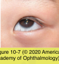
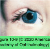
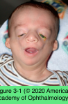
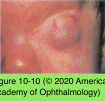

# 7.10.2. Congenital Eyelid Anomalies (II)

## Images

## Hierarchy

- Congenital Entropion
  - eyelid margin inversion
  - pathogenesis
    - lower eyelid retractor dysgenesis
    - structural defects in the tarsal plate
    - relative shortening of the posterior lamella
  - management
    - unlikely to improve spontaneously
    - may need surgical correction
      - removal of a small amount of skin and orbicularis along the subciliary portion of the eyelid
        - +.
          - advancement of the lower eyelid retractors to the tarsus
  - tarsal kink
    - unusual form of congenital entropion
    - tarsal plate of the upper eyelid is folded
    - treatment
      - removal of the kink in combination with a margin rotation
      - ± skin grafting for the anterior lamella
- Congenital Coloboma
  - true coloboma
    - includes defect in the eyelid margin
  - associations
    - medial upper eyelid
      - isolated
        - ?
    - lower eyelid
      - facial clefts (eg, Goldenhar syndrome)
        - Goldenhar syndrome (oculoauriculovertbebral dysgenesis)
          - Upper lid coloboma
          - Epibulbar dermoid
          - Preauricular skin tags
          - Vertebral anomalies
          - oculoauriculovertbebral dysgenesis)
        - mandibulofacial dysostosis (Treacher Collins– Franceschetti syndrome)
          - Lower lid coloboma
          - downward palpebral fissure
      - lacrimal deformities
  - management
    - full-thickness defects ≤ 1/3 of eyelid
      - creating raw vertical margins and sliding flaps along the eyelid crease
      - ± lateral cantholysis
    - large defects
      - variation of lateral canthal semicircular flap
    - eyelid-sharing procedures that occlude the visual axis are avoided
      - risk of amblyopia !
- Congenital Distichiasis
  - rare
  - ± hereditary
  - embryonic pilosebaceous units differentiate into hair follicles
  - extra row of eyelashes in place of the orifices of the meibomian glands
  - treatment
    - indications
      - symptomatic patient
      - keratopathy
    - lubricants
    - soft contact lenses
    - electrolysis
    - cryoepilation
    - eyelid splitting with removal of the follicles
- Infantile (Capillary) Hemangioma
  - natural course
    - usually appear weeks or months after birth
      - most are not apparent at birth
    - increase in size until age 1 year
    - decrease over the next 3–7 years
  - ± involve the orbit
  - associated with a high incidence of amblyopia
  - indications for treatment
    - occlusion of the visual axis
    - anisometropia
    - strabismus
    - significant disfigurement
  - treatment
    - lesions limited to the eyelid
      - topical timolol gel
        - fewest adverse effects
      - intralesional steroids
        - for patients who cannot take β-blockers or do not respond to timolol
        - act by rendering the tumor’s vascular bed more sensitive to the body’s circulating catecholamines
        - relatively safe, simple, and repeatable
        - rare complications
          - eyelid necrosis
          - embolic retinal vascular occlusion
          - systemic adrenal suppression
    - more widespread
      - systemic propranolol
      - oral corticosteroids
        - eliminates the risks attributed to intralesional injection
        - systemic adverse effects
    - other treatment options
      - topical clobetasol propionate
        - does not eliminate the systemic side effects
      - interferon-α
        - for life-threatening or sight-threatening lesions unresponsive to other forms of treatment
        - serious adverse effects
      - surgical excision
        - rare well-circumscribed lesions
      - carbon-dioxide laser
        - for controlling bleeding when lesions must be removed
      - topical skin lasers
        - superficial (1–2 mm) layers of the skin to diminish lesion redness
        - do not penetrate deeply enough to shrink a visually disabling lesion
- Cryptophthalmos
  - rare
  - forms
    - isolated
    - recessive syndromic
      - Fraser syndrome
        - autosomal recessive
        - acrofacial malformations
          - partial syndactyly
        - genitourinary anomalies
        - +- cryptophthalmos
      - mutations in the FRAS1 gene
        - 4q21
        - encodes a putative extracellular matrix protein
  - clinical presentation
    - unilateral or bilateral
      - usually bilateral
    - severe ocular defects are present in the underlying eye
    - eyelids and associated structures of the brows and lashes fail to form (ablepharon)
      - partial or complete absence of
        - eyebrow
        - palpebral fissure
        - eyelashes
        - conjunctiva
        - levator
        - orbicularis oculi muscle
        - tarsus
        - meibomian glands
    - cornea is merged with the epidermis
    - conjunctiva is typically absent
    - anterior chamber, iris, and lens are variably formed or are absent
    - associated ocular findings
      - absence of the lacrimal glands and canaliculi
      - corneal and conjunctival dermoid
  - pseudocryptophthalmos
    - eyelids and associated structures form but fail to separate (ankyloblepharon)
  - treatment
    - surgical intervention
      - cosmesis
      - relief of pain from absolute glaucoma
    - pseudocryptophthalmos
      - eyelid reconstruction
      - fornix reconstruction
    - attempts at reconstruction are difficult
