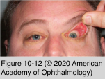
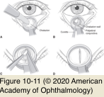

# 7.10.3. Acquired Eyelid Disorders (I)

## Images

## Hierarchy

- Trichotillomania
  - impulse-control disorder
    - repeated desire to pull out hairs, frequently eyebrows or eyelashes
  - preteen or teenaged girls
  - affected patients usually deny the cause
  - multiple hairs are broken off and regrow at different lengths
- Chalazion
  - "internal posterior hordeolum"
  - pathogenesis
    - obstruction of meibomian glands orifices
    - contents of glands (sebum) are released into tarsus and surrounding soft tissues
    - acute inflammatory response
    - role of bacterial agents (most commonly Staphylococcus aureus) is not clear
  - predisposing conditions
    - rosacea
    - chronic blepharitis
  - clinical presentation
    - pain
    - erythema
  - treatment
    - acute phase
      - warm compresses
      - eyelid hygiene
      - topical antibiotic
      - topical anti-inflammatory medications
    - acute secondary infection
      - antibiotic directed at skin flora
    - for long-term suppression of meibomian gland inflammation or ocular rosacea
      - oral doxycycline or tetracycline
    - chronic phase
      - surgical management
        - greatest inflammatory response posteriorly
          - incision through tarsus and conjunctiva
          - sharp dissection and excision of all necrotic material, including cyst wall
          - posterior marsupialization of chalazion
        - greatest inflammatory response anteriorly
          - rare
          - skin incision
        - exert caution in removing chalazia at eyelid margin or adjacent to punctum
      - local injection of corticosteroids
        - not as effective as surgical treatment
        - depigmentation of overlying skin
      - excision + steroid injection
        - 95% resolution rate
  - pathology
    - chronic lipogranulomatous inflammation
    - pathologic examination is appropriate for atypical or recurrent chalazia
      - r/o sebaceous cell carcinoma
- Floppy Eyelid Syndrome
  - clinical presentation
    - superior tarsal plate is soft, rubbery, flaccid, and easily everted
      - upper eyelid everts, especially laterally, when pulled up toward the forehead
    - ocular irritation
    - mild mucus discharge
    - chronic papillary conjunctivitis
    - worse on awakening
  - associations
    - obesity
    - sleep apnea
    - eyelid rubbing
    - keratoconus
    - hyperglycemia
    - history of sleeping prone
      - mechanical upper eyelid eversion
        - rubbing of superior palpebral conjunctiva against pillow or bedding
  - histology
    - marked decrease in the number of elastin fibers in the tarsal plate
  - management
    - viscous lubrication + patch/shield at night
    - surgical correction
      - horizontal tightening of the eyelid
    - sleep studies to rule out sleep apnea
  - eyelid imbrication syndrome
    - lax upper eyelid with a normal tarsal plate overrides the lower eyelid margin during closure
    - chronic conjunctivitis
    - management
      - topical lubrication
      - horizontal tightening of the upper eyelid
        - for more severe cases
- Eyelid Edema
  - local conditions
    - insect bites
    - allergy
  - systemic conditions
    - cardiovascular disease
    - renal disease
    - collagen vascular diseases
    - thyroid eye disease
  - differential diagnosis
    - CSF leakage into orbit or eyelids following trauma
    - lymphedema
      - obstruction of lymphatic drainage
