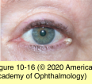
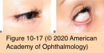
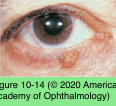
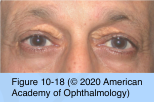
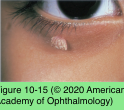

# 7.10.4. Eyelid Neoplasms (I): Benign eyelid lesions

## Images

## Hierarchy

- Introduction
  - Predisposing factors in development of skin cancer
    - prior skin cancer
    - excessive sun exposure, especially blistering sunburn
    - previous radiation therapy
    - history of smoking
    - Celtic or Scandinavian ancestry, with fair skin, red hair, and blue eyes
    - immunosuppression
  - examination
    - Signs suggesting skin cancer
      - slow, painless growth of a lesion
      - ulceration, drainage, bleeding, and crusting
      - pigmentary changes
      - destruction of normal eyelid margin architecture (especially meibomian orifices) and loss of cilia
      - heaped-up, pearly, translucent margins with central ulceration
      - fine telangiectasias
      - loss of fine cutaneous wrinkles or vellus hair
    - Palpable induration beyond visibly apparent margins suggests tumor infiltration into the dermis and subcutaneous tissue
    - Large lesions should be palpated for evidence of fixation to deeper tissues or bone
    - Lesions near the puncta should be evaluated for punctal/canalicular involvement
      - Probing and irrigation may be required
    - regional lymph nodes should be palpated
      - rubbery swelling along the line of the jaw or in front of the ear
        - squamous cell carcinoma
        - sebaceous carcinoma
        - melanoma
        - Merkel cell carcinoma
    - Restriction of ocular motility and proptosis suggest orbital extension
    - examine cranial nerves V and VII
      - Perineural invasion
        - squamous cell carcinoma
    - Systemic metastasis (liver, pulmonary, bone, or neurological)
      - sebaceous adenocarcinoma
      - melanoma of the eyelid
    - obtain photographs and measurements prior to treatment
- Benign epithelial lesions
  - Cysts of the epidermis
    - second most common type of benign periocular cutaneous lesions
      - 18% of excised benign lesions
    - epidermal inclusion cyst
      - arise from infundibulum of hair follicle
        - spontaneous
        - traumatic
      - clinical presentation
        - slow-growing
        - elevated
        - round and smooth
        - central pore
          - indicates the remaining pilar duct
      - filled with keratin
        - "sebaceous cysts"
      - complications
        - Rupture of the cyst wall may cause an inflammatory foreign-body reaction
        - secondary infection
      - treatment
        - small cysts
          - marsupialization
        - Larger or deeper cysts
          - complete excision
            - cyst wall should be removed intact to reduce the possibility of recurrence
    - milia
      - Multiple tiny epidermal inclusion cysts
      - common in newborn infants
      - generally resolve spontaneously
      - may be marsupialized with a sharp blade or needle
      - topical retinoic acid cream
        - for multiple confluent milia
    - pilar cyst
      - trichilemmal cyst
        - less common
        - clinically indistinguishable from epidermal inclusion cysts
        - occur in areas containing large and numerous hair follicles
          - scalp
            - 90%
          - eyebrows
        - filled with desquamated epithelium
        - calcification
          - 25%
  - Molluscum contagiosum
    - viral infection
    - epidemiology
      - children
      - adult patients with AIDS
    - clinical presentation
      - waxy and nodular
      - central umbilication
      - associated follicular conjunctivitis
    - Treatment
      - observation
      - oral cimetidine
      - excision
      - controlled cryotherapy
      - curettage
  - Xanthelasmas
    - pathogenesis
      - hypercholesterolemia
      - congenital disorders of lipid metabolism,
      - check serum lipid levels
    - clinical presentation
      - yellowish plaques
      - medial canthal areas of the upper and lower eyelids
    - pathology
      - lipid-laden macrophages
      - superficial dermis and subdermal tissues
        - ± Deep extension into the orbicularis oculi muscle
    - treatment
      - excision
        - be careful to avoid cicatricial ectropion or eyelid retraction
      - serial excision
      - laser ablation
      - topical trichloroacetic acid
      - may recur
- Epithelial hyperplasias
  - "benign epithelial proliferations"
    - "papillomas"
      - does not necessarily imply association with papillomavirus
  - Seborrheic keratosis
    - middle-aged and elderly
    - sessile or pedunculated
      - facial skin
        - smooth, greasy, stuck-on lesion
      - eyelid skin
        - lobulated, papillary, or pedunculated
          - visible surface excrescences
    - varying degrees of pigmentation and hyperkeratosis
    - shave excision
  - Pseudoepitheliomatous hyperplasia
    - a pattern of reactive changes in the epidermis that may develop over areas of inflammation or neoplasia
  - Verruca vulgaris
    - rarely occurs in thin eyelid skin
      - human papillomavirus (type 6 or 11)
    - Cryotherapy
  - Cutaneous horn
    - descriptive, nondiagnostic term
    - exuberant hyperkeratosis
    - may be associated with various benign or malignant histologic processes
      - seborrheic keratosis
      - verruca vulgaris
      - squamous or basal cell carcinoma
    - Biopsy of base of cutaneous horn is recommended
