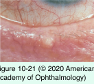
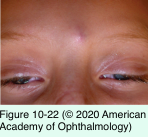
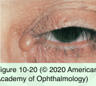
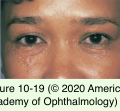

# 7.10.5. Eyelid Neoplasms (II): Benign Adnexal Lesions

## Images

## Hierarchy

- adnexa
  - skin appendages that are located within the dermis but communicate through the epidermis to the surface
  - Periocular adnexal oil glands
    - meibomian glands
      - tarsal plate
    - glands of Zeis
      - eyelash follicles
    - sebaceous glands
      - pilosebaceous units
  - Periocular adnexal sweat glands
    - eccrine sweat glands
      - general distribution throughout the body
      - for thermal regulation
    - apocrine sweat glands
      - "glands of Moll"
      - eyelid margin
- Tumors of hair follicle origin
  - Trichoepithelioma
    - papules
      - small
      - flesh-colored
      - occasional telangiectasias
      - on the eyelids or forehead
    - histology
      - basaloid islands
        - may be difficult to differentiate from basal cell carcinoma
      - keratin cysts
        - if keratin is abundant, may clinically resemble an epidermal inclusion cyst
      - immature hair follicle structures
        - similar to sebaceous hyperplasia
    - simple excision
  - Trichofolliculoma
    - mainly in adults
    - single
    - ± umbilicated
    - histology
      - squamous cystic structure containing keratin and hair shaft components
        - epidermal inclusion cyst Has central pore
          - similar to molluscum contagiisum
  - Trichilemmoma
    - mainly in adults
    - solitary
      - resemble verrucae
    - histology
      - glycogen-rich cells oriented around hair follicles
  - Pilomatricoma
    - "pilomatrixoma"
    - young adults
    - reddish purple subcutaneous mass
      - eyebrow and central upper eyelid
      - attached to the overlying skin
      - may become quite large
    - histology
      - islands of epithelial cells surrounded by basophilic cells with shadow cells
    - excision
- Lesions of oil gland origin
  - Chalazion and hordeolum
  - Sebaceous hyperplasia
    - multiple small yellow papules
      - ± central umbilication
      - forehead and cheeks
    - .>age 40 years
    - may be mistaken for basal cell carcinoma
      - central umbilication
      - fine telangiectasias
    - Muir-Torre syndrome
      - autosomal dominant
      - multiple acquired
        - sebaceous gland adenomas
        - adenomatoid sebaceous hyperplasia
        - basal cell carcinomas with sebaceous differentiation
      - increased incidence of visceral malignancy
        - especially colorectal
  - Sebaceous adenoma
    - rare
    - yellowish papule on the face, scalp, or trunk
    - differential diagnosis
      - basal cell carcinoma
      - seborrheic keratosis
- Tumors of eccrine sweat gland origin
  - Eccrine hidrocystoma
    - common
    - cystic lesions
      - ductal retention cysts
    - 1–3 mm in diameter
    - occur in groups
      - around the lower eyelids, canthi, and face
    - enlarge in conditions that stimulate perspiration
      - heat
      - increased humidity
    - treatment
      - surgical excision
  - Syringoma
    - rare
    - young females
    - more apparent during puberty
    - small, waxy, elevated nodules
      - multiple
      - 1–2 mm in diameter
      - lower eyelids
      - axilla
      - sternal region
    - treatment
      - located within the dermis
        - too deep for shave excision
      - complete surgical excision
        - staged fashion
  - Pleomorphic adenoma
    - rare
    - head and neck region
      - may involve the eyelids
    - histology
      - identical to the pleomorphic adenoma of the salivary and lacrimal glands
    - treatment
      - complete surgical excision
- Tumors of apocrine sweat gland origin
  - Apocrine hidrocystoma
    - very common
    - pathogenesis
      - from the glands of Moll along the eyelid margin
      - adenoma of the secretory cells of Moll
        - not a retention cyst!
          - eccrine hidrocystomas are retention cysts!
    - clinical presentation
      - solitary smooth cyst
        - ± multiple
      - translucent or bluish
      - transilluminate
      - often extend deep
        - especially in the canthal regions
    - treatment
      - superficial cysts
        - marsupialization
      - deep cysts
        - complete excision
  - Cylindroma
    - rare
    - solitary or multiple
    - may be dominantly inherited
    - flesh-colored nodules
      - smooth
      - dome-shaped
      - varying size
      - affect the scalp and face
        - may occur profusely in the scalp
          - "turban tumors"
    - treatment
      - surgical excision
  - syringomas are of eccrine origin!
