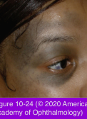
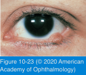

# 7.10.6. Eyelid Neoplasms (III): Benign Melanocytic Lesions

## Images

## Hierarchy

- Introduction
  - Melanocytic lesions of the skin arise from 3 sources
    - nevus cells
      - are arranged in clusters
      - nevus cells are similar to melanocytes
        - have ultrastructural differences with melanocytes
    - dermal melanocytes
    - epidermal melanocytes
  - any benign or malignant lesion may be pigmented
    - seborrheic keratoses are frequently pigmented
    - basal cell carcinomas are occasionally pigmented
      - especially in patients with darker skin
  - lesions of melanocytic origin do not necessarily have visible pigmentation
    - dermal nevi typically have no pigmentation in white individuals
- Diffuse eyelid skin hyperpigmentation
  - melasma
    - chloasma
  - predisposing conditions
    - pregnancy
    - oral contraceptive use
    - autosomal dominant trait
    - chronic atopic eczema
    - rosacea
    - other inflammatory dermatoses
- Dermal melanocytosis
  - "nevus of Ota"
  - congenital
  - most often affects persons of African, Hispanic, or Asian descent
  - female>male
  - 5% bilateral
  - proliferation of dermal melanocytes
  - diffuse, blue nevus of the periocular skin
    - eyelid skin is diffusely brown, gray, or blue
    - pigmentation may extend to the adjacent forehead
    - first and second dermatomes of cranial nerve V
  - malignant transformation may occur, especially in white patients
  - no prophylactic treatment is recommended
  - oculodermal melanocytosis
    - 2/3 of affected patients
    - patchy slate-gray pigmentation affects eyelid, episclera, and uvea
    - 10% develop glaucoma and pigmentation of the trabecular meshwork
    - 0.25% develop a uveal melanoma
- Nevi
  - third most common benign lesions in the periocular region
    - after papillomas and epidermal inclusion cysts
  - arise from nevus cells
    - incompletely differentiated melanocytes in the epidermis, dermis, and in junction zone between these 2 layers
  - natural course
    - not apparent clinically at birth
    - appear during childhood
    - increased pigmentation during puberty
  - all nevi undergo through 3 stages
    - junctional
      - basal layer of the epidermis at the dermal– epidermal junction
      - in children, nevi arise initially as junctional nevi
      - flat, pigmented macules
    - compound
      - extending from the junctional zone up into the epidermis and down into the dermis
      - after second decade
      - elevated, pigmented papules
      - later in life, pigmentation is lost
        - become minimally pigmented or amelanotic
    - dermal
      - involution of the epidermal component and persistence of the dermal component
      - by age 70 years, virtually all nevi have become dermal nevi and have lost pigmentation
  - nevi are frequently found on the eyelid margin
    - molded to the ocular surface
  - symptomatic nevi
    - rub on the ocular surface
    - enlarge and obstruct vision
  - malignant transformation of a junctional or compound nevus can occur
    - rare
  - treatment
    - observation
      - asymptomatic nevi
    - shave excision
    - wedge resection
- Blue nevi
  - ± congenital
  - ± develop during childhood
  - arise from a localized proliferation of dermal melanocytes
  - clinical presentation
    - beneath the epidermis
    - slightly elevated
    - dark blue-gray to blue-black
    - 10 mm or less in diameter
  - malignant potential is extremely low
  - generally excised
- Freckle
  - "ephelis"
  - small, flat, brown spot on the skin
  - common in fair-skinned persons
  - darken with sunlight exposure
  - hyperpigmentation of the basal layer of the epidermis
  - treatment
    - sun protection
- similar to lentigo simplex
  - Solar lentigo
    - older persons
      - senile lentigo
    - chronic sun exposure
    - pigmented macules
      - multiple
      - uniformly hyperpigmented
      - somewhat larger than simple lentigines
    - dorsum of the hands and the forehead
      - increased number of melanocytes
    - management
      - no treatment is necessary
      - sun protection is recommended
      - methods to fade the pigmentation
        - melanin-bleaching preparations
        - intense pulsed light treatment
        - cryotherapy
  - unlike ephelis
- Lentigo simplex
  - occurs throughout life
  - not related to sun exposure
  - may be associated with Peutz-Jeghers syndrome
    - autosomal dominant
    - polyposis of the intestinal tract
  - flat, pigmented spot
    - larger in diameter than ephelides
      - few millimeters in diameter
    - evenly pigmented
  - histology
    - number of epidermal melanocytes is increased
      - number of epidermal melanocytes is not increased!
        - they extrude more than the usual amount of pigment into the epidermal basal cell layer
    - melanin is found in adjacent basal keratinocytes
  - no treatment is necessary
