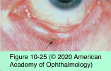
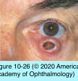

# 7.10.7. Eyelid Neoplasms (IV)

## Images

## Hierarchy

- Premalignant Epidermal Lesions: Actinic Keratosis
  - most common precancerous skin lesion
  - predisposing conditions
    - fair skin
    - old age
    - chronic sun exposure
  - clinical presentation
    - round, scaly, keratotic plaques
      - face
      - head
      - neck
      - forearms
      - dorsum of the hands
    - sandpaper texture
  - natural course
    - are in a state of continual flux
      - increase in size
      - new lesions develop continually
      - darken in response to sunlight exposure
      - remit with reduced sun exposure
        - up to 25% of individual actinic keratoses spontaneously resolve over a 12-month period
    - malignant transformation (squamous cell carcinoma)
      - single actinic keratosis
        - 0.24%/year
      - over extended follow-up with multiple actinic keratoses
        - 12%–16%
      - squamous cell carcinomas arising from actinic keratoses are thought to be less aggressive than those developing de novo
  - treatment
    - excisional biopsy
    - topical 5-fluorouracil or imiquimod cream
      - for extensive lesions
- Premalignant Melanocytic Lesions: Lentigo Maligna
  - precancerous melanosis
  - older white persons
  - clinical presentation
    - malar regions
    - flat pigmented lesion
      - characterized by
        - significant pigmentary variation
        - irregular borders
        - progressive enlargement
  - area of histologic abnormality frequently extends beyond the visible pigmented borders of the lesion
    - eyelid lentigo maligna may extend onto the conjunctival surface
      - appears identical to primary acquired melanosis
  - progression to nodules of vertically invasive melanoma
    - 30%–50%
      - only 5% of SCC in-situ may progress to vertically invasive squamous cell carcinoma
  - management
    - excision with adequate surgical margins
    - close observation for recurrence
- In Situ Epithelial Malignancies
  - Squamous cell carcinoma in situ
    - Bowen disease
    - elevated, nonhealing, erythematous lesions
      - scaling
      - crusting
      - pigmented keratotic plaques
    - histology
      - full-thickness epidermal atypia without dermal invasion
    - treatment
      - complete surgical excision is advised
        - 5% may progress to vertically invasive squamous cell carcinoma
      - cryotherapy
        - especially for larger lesions
  - Keratoacanthoma
    - low-grade squamous cell carcinoma
      - was previously considered to be a benign, self-limiting lesion
    - middle-aged and elderly patients
    - increased incidence in immunosuppressed patients
    - clinical presentation
      - lower eyelid
      - begins as a flesh-colored papule
        - develops rapidly into a dome-shaped nodule
          - central keratin-filled crater
          - elevated rolled margins
          - ± surrounding inflammatory reaction
            - may play a role in ultimate resolution
      - ± gradual involution over 3–6 months
    - management
      - incisional biopsy followed by complete surgical excision is recommended
