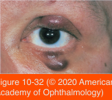

# 7.10.9. Eyelid Neoplasms (VI)

## Images

## Hierarchy

- Merkel cell carcinoma
  - dendritic (neuroendocrine) skin cells
    - role in mediating sense of touch
    - can give rise to malignant neoplasms
      - 10% occur in the eyelid and periocular area
  - clinical presentation
    - painless, erythematous nodules
    - overlying telangiectatic blood vessels
    - can mimic other malignant lesions
      - diagnosis can be difficult
  - 1/3 of tumors recur after excision
  - estimated 5-year survival rate
    - 50%
  - treatment
    - should be aggressive
    - wide surgical resection
    - ±postoperative radiation and/or chemotherapy
- Squamous cell carcinoma
  - 40 times less common than basal cell carcinoma
  - predisposing factors
    - spontaneous
    - from areas of solar injury and actinic keratosis
    - immunodeficiency
  - more aggressive
    - may metastasize
      - lymphatic transmission
      - blood-borne transmission
      - direct extension, often along nerves
  - treatment
    - similar to those for basal cell carcinoma
    - Mohs micrographic resection
    - surgical excision with wide margins and frozen sections
    - recurrent squamous cell carcinoma
      - wide surgical resection
      - orbital exenteration
      - ± neck dissection
        - may require collaboration with a head and neck cancer surgeon
    - hedgehog pathway and epidermal growth factor receptor (EGFR) inhibitors
      - for patients who are not candidates for surgery
- Kaposi sarcoma
  - rare
  - manifestation of AIDS
  - chronic reddish dermal mass
  - conjunctival lesions can be mistaken for foreign-body granuloma or cavernous hemangioma
  - composed of spindle cells of probable endothelial origin
  - treatment
    - cryotherapy
    - excision
    - radiation
    - intralesional chemotherapeutic agents
    - may regress with adequate antiviral treatment of the HIV infection
