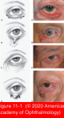
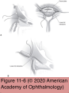
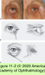

# 7.11. 1. Periocular Malpositions and Involutional Changes (I)

## Images

## Hierarchy

- congenital
- involutional
- cicatricial
  - acute spastic
- entropion
  - inversion of the eyelid margin
  - lower eyelid entropion (usually involutional) is much more common than upper eyelid entropion (usually cicatricial)
  - types
  - involutional entropion
    - lower eyelids
    - causative factors
      - horizontal laxity of the eyelid
        - caused by involutional stretching of the eyelid and canthal tendons
        - snapback and distraction testing
      - attenuation or disinsertion of eyelid retractors
        - capsulopalpebral fascia and inferior tarsal muscle
        - signs
          - a white subconjunctival line several millimeters below the inferior tarsal border caused by the leading edge of the detached retractors
          - a deeper-than-normal inferior fornix
          - reverse ptosis of the lower eyelid (lower eyelid margin sits higher than normal)
          - little or no inferior movement of the lower eyelid on downgaze (diminished lower eyelid excursion)
      - overriding by the preseptal orbicularis oculi muscle
        - detected by observation of the preseptal orbicularis as the patient squeezes his or her eyes closed
    - treatment
      - temporizing measures for acute intervention
        - lubrication
        - bandage contact lens
        - suture techniques (Quickert sutures)
          - recurrence is anticipated
      - surgical techniques
        - to stabilize the inferior border of the tarsus
        - reinsertion of the eyelid retractors
          - skin incision
          - transconjunctival approach
        - limited myectomy of the orbicularis
          - a small amount of preseptal orbicularis oculi muscle can be removed in selected patients
        - lower eyelid shortening procedure
          - lateral tarsal strip
          - wedge resection
  - Acute Spastic Entropion
    - pathogenesis
      - ocular irritation or inflammation
        - sustained orbicularis oculi muscle contraction
        - most commonly after intraocular surgery
      - unrecognized underlying involutional eyelid changes are often present preoperatively
    - usually resolves when the irritation–entropion cycle is broken by treatment
      - taping of the inturned eyelid
      - cautery
      - various suture techniques
        - Quickert sutures
      - botulinum toxin injection
      - definitive surgical repair may be required for underlying involutional changes
  - Cicatricial Entropion
    - vertical tarsoconjunctival contracture and internal rotation of the eyelid margin
    - etiology
      - autoimmune
        - ocular cicatricial pemphigoid
      - inflammatory
        - Stevens-Johnson syndrome
      - infectious
        - trachoma
        - herpes zoster
      - surgical
        - enucleation
        - posterior-approach ptosis correction
        - transconjunctival surgery
      - traumatic
        - thermal or chemical burns
        - scarring
      - long-term use of topical glaucoma medications
        - especially miotics
    - examination
      - digital eversion test
        - distinguishes cicatricial entropion from involutional entropion
      - inspection of the posterior lamella reveals subtle to severe scarring
    - prognosis
      - autoimmune or inflammatory
        - guarded
          - frequent disease progression!
      - prior surgery or trauma
        - generally good
      - Infectious causes
        - in between
    - management
      - surgery is contraindicated during the acute phase of autoimmune diseases
        - maximal inflammatory suppression should be achieved with pulsed systemic anti- inflammatory medications (corticosteroids and immunosuppressive agents)
      - mild to moderate cicatricial entropion
        - lashes abrade the cornea
        - eyelid margin has lost its square edges and is rotated posteriorly
        - tarsal fracture operation
          - technique
            - posterior horizontal tarsal incision 2 mm distal to the eyelid margin
              - incision through the full thickness of the tarsus
            - eyelid position is stabilized with everting sutures
      - severe cicatricial entropion
        - involved tarsus generally needs to be replaced
          - upper eyelid
            - tarsoconjunctival and other mucosal grafts
          - lower eyelid
            - autogenous ear cartilage
            - preserved scleral grafts
            - hard-palate mucosa
- ectropion
  - outward turning of the eyelid margin
  - types
    - congenital
    - involutional
    - paralytic
    - cicatricial
    - mechanical
  - involutional ectropion
    - lower eyelid
    - horizontal eyelid laxity in medial or lateral canthal tendons
      - loss of eyelid apposition to the globe
        - drying of the conjunctival surface
          - chronic conjunctival inflammation with hypertrophy and keratinization
    - examination
      - snapback test
        - poor orbicularis tone
      - distraction test
        - ability to pull the eyelid >6 mm from the globe
      - lateral stretching of the eyelid to assess whether lateral canthal resuspension would return the eyelid to its normal anatomical position
      - excessive lateral movement of the lower punctum with lateral eyelid traction
        - laxity of lower limb of medial canthal tendon
    - horizontal eyelid tightening
      - lateral tarsal strip procedure
        - lateral tarsus is sutured & reattached to the lateral orbital rim periosteum
        - Video 11-1
      - Bick procedure
        - full-thickness excision of the eyelid just medial to the lateral canthal angle
        - may cause rounding and medial displacement of the lateral canthal angle
      - repair of medial canthal laxity is more challenging than repair of horizontal lower eyelid laxity
        - anterior and posterior limbs of medial canthal tendon surround lacrimal sac
        - repair may be complicated by
          - kinking of the canaliculus
          - distraction of punctum away from globe
    - medial spindle procedure
      - for mild medial ectropion with punctal eversion
      - horizontal fusiform excision of conjunctiva and eyelid retractors 4 mm inferior to the puncta
      - closure performed with inverting sutures
      - ± lateral canthal tightening if associated horizontal eyelid laxity
    - repair of lower eyelid retractors
      - tarsal ectropion
        - lower lid eversion which is limited to the tarsal- containing portion only
        - retractor laxity, disinsertion, or dehiscence
        - ± isolated defect
          - advance and reattach the lower eyelid retractors to the inferior border of the tarsus
        - may accompany horizontal laxity
          - when both defects are present, repair of the retractors is combined with horizontal tightening of the eyelid
  - cicatricial ectropion
    - deficiency of skin secondary to
      - thermal or chemical burn
      - mechanical trauma
      - surgical trauma
      - chronic actinic skin damage
      - chronic inflammation of the eyelid from dermatologic conditions
        - rosacea
        - atopic dermatitis
        - eczematoid dermatitis
        - herpes zoster infections
    - 3-step procedure
      - lower eyelid
        - release of vertical cicatricial traction
        - horizontal eyelid tightening with a lateral tarsal strip procedure
        - vertical lengthening of the anterior lamella
          - midface-lift
          - full-thickness skin graft
            - eyelid may be placed on superior traction with a frost suture
            - source of skin
              - opposite upper eyelid
                - ideal match
                - usually inadequate except in patients with significant dermatochalasis
              - postauricular
              - preauricular
              - supraclavicular
              - medial upper arm
      - upper eyelid
        - release of traction
        - augmentation of the vertically shortened anterior lamella with a full-thickness skin graft
  - mechanical ectropion
    - bulky tumors of the eyelid
    - fluid accumulation
    - herniated orbital fat
    - poorly fitted spectacles
