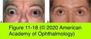

# 7.11.2. Periocular Malpositions and Involutional Changes (II)

## Images

## Hierarchy

- Symblepharon
  - adhesion between conjunctival surfaces
  - treatment
    - localized linear adhesions
      - conjunctival Z-plasties
        - when vertical lengthening of the involved tissue is the primary objective
    - extensive adhesions
      - full-thickness conjunctival graft or flap
      - partial-thickness buccal mucous membrane graft
      - amniotic membrane graft
- Eyelid Retraction
  - clinical presentation
    - upper eyelid is displaced superiorly or the lower eyelid inferiorly
      - exposes sclera between the limbus and the eyelid margin
    - lagophthalmos
    - exposure keratitis
    - ocular irritation and discomfort
    - vision-threatening corneal decompensation
  - lower eyelid retraction
    - may be a normal anatomical variant in patients with shallow orbits
  - etiology
    - thyroid eye disease (TED)
      - most common cause of both upper and lower eyelid retraction
      - most common cause of unilateral or bilateral proptosis
        - proptosis commonly coexists with and may mimic eyelid retraction
      - temporal flare
        - eyelid retraction is more severe laterally than medially
      - histology
        - inflammatory infiltration and fibrous contraction of the eyelid retractors
          - sympathetically innervated eyelid retractor muscles are preferentially affected
            - abnormal upper eyelid contour that appears to flare upward along the lateral half of the eyelid margin
    - recession of the vertical rectus muscles
      - anatomical connections between the superior (inferior) rectus and levator muscles in upper eyelid (capsulopalpebral fascia in lower eyelid)
    - cosmetic lower blepharoplasty
      - pathogenesis
        - excessive skin resection in blepharoplasty
        - middle lamellar scarring
        - untreated lower eyelid laxity
      - treatment
        - midface-lifting
        - full-thickness skin grafting
        - spacer grafting
    - overcompensation for a contralateral ptosis
      - observe the position of the supposedly retracted eyelid while the contralateral eyelid is manually elevated or occluded
    - Parinaud syndrome
      - eyelid retraction caused by a central nervous system lesion
    - congenital eyelid retraction
      - rare, isolated entity
  - treatment
    - corneal lubrication
      - for mild eyelid retraction
      - mild eyelid retraction following lower blepharoplasty or in TED often resolves spontaneously with time
    - surgical intervention
      - indications
        - persistent eyelid retraction
        - immediate threat to vision or cornea
      - indicated only after serial measurements have established stability of the disease over at least 6 months
      - upper eyelid retraction
        - excision or recession of the Müller muscle
        - recession of the levator aponeurosis
          - ± hang-back sutures
          - ± spacer graft
            - fascia lata
            - donor sclera
            - ear cartilage
            - alloplastic materials
        - measured myotomy of the levator muscle
        - full-thickness transverse blepharotomy
        - lateral flare (common in TED)
          - small eyelid-splitting lateral tarsorrhaphy + recession of the upper and lower eyelid retractors
            - may limit the patient’s lateral visual field
      - lower eyelid retraction
        - anterior lamellar deficiency
          - eg, excess skin resection from blepharoplasty
          - midface-lift
          - full-thickness skin graft
            - eg, posttraumatic septal scarring
        - middle lamellar deficiency
          - scar release
          - possible placement of a spacer graft
        - posterior lamellar deficiency
          - e.g. conjunctival scarring
          - full-thickness mucous membrane graft
        - severe retraction of lower eyelids (common in TED)
          - spacer graft between lower eyelid retractors and inferior tarsal border
            - auricular cartilage
            - hard-palate mucosa
            - dermis fat
            - preserved sclera and fascia lata
            - processed collagens
          - horizontal eyelid or lateral canthal tightening/ elevation is also often necessary
            - horizontal tightening of lower eyelid in patients with proptosis may exacerbate eyelid retraction!
- Trichiasis
  - acquired misdirection of the eyelashes
  - usually seen in cases of posterior lamellar scarring (marginal cicatricial entropion)
  - If the eyelid margin is misdirected, treatment should be directed at correcting the entropion
  - mechanical epilation
    - ± recurrence 3–8 weeks later
    - broken cilia are often more irritating to the cornea than mature longer lashes
  - standard electrolysis
    - definitive treatment
    - delivered with an insulated needle to destroy the hair follicle
    - when the needle tip is removed, the lash is easily extracted
    - disadvantages
      - recurrence rate is high
      - adjacent normal lashes may be damaged
      - scarring of the adjacent eyelid margin tissue can worsen the problem
  - cryotherapy
    - for segmental trichiasis
    - requires only local infiltrative anesthesia
    - double freeze–thaw technique
      - frozen x25 seconds
        - allowed to thaw
          - refrozen x20 seconds
    - lashes are mechanically removed with forceps after treatment
    - disadvantages
      - edema lasting several days
      - loss of skin pigmentation
      - notching of the eyelid margin
      - interference with goblet cell function
    - may be combined with various surgical techniques and repeated if offending lashes persist or recur
  - argon laser
    - when only a few scattered eyelashes require ablation
    - some pigment is required in the base of the lash to absorb the laser energy
  - full-thickness pentagonal resection
    - when trichiasis is confined to a segment of the eyelid
    - with primary closure
