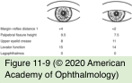
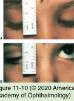

# 7.11.3. Blepharoptosis (I)

## Images

## Hierarchy

- Introduction
  - drooping or inferior displacement of the upper eyelid
  - symptoms
    - peripheral vision loss
      - superior visual field is most often involved
    - central vision loss/reduced visual acuity
      - decreased light reaching the macula
    - difficulty with reading
      - ptosis worsens in downgaze
  - classification
    - by onset
      - congenital
        - most common type of congenital ptosis is myogenic
      - acquired
        - most common type of acquired ptosis is aponeurotic
  - by cause
    - myogenic
    - neurogenic
    - aponeurotic
    - mechanical
    - traumatic
- history
  - onset
  - suggest ocular myasthenia gravis (MG)
    - marked variability in the degree of ptosis during the day
    - diplopia
  - suggest sysetemic myasthenia gravis
    - dysphonia
    - dyspnea
    - dysphagia
    - proximal muscle weakness
- Additional considerations
  - head position
  - chin elevation
  - brow position
    - brow action in attempted upgaze
  - tear film
  - presence or absence of Bell phenomenon
  - corneal sensation
  - synkinesis
    - variation in the amount of ptosis with extraocular muscle or jaw muscle movements
    - attempt to elicit synkinesis as part of evaluation of patients with congenital blepharoptosis or those with possible aberrant regeneration
    - etiology
      - Marcus Gunn jaw-winking ptosis
      - aberrant regeneration of the oculomotor nerve or the facial nerve
      - some types of Duane retraction syndrome
  - position of the ptotic eyelid in downgaze
    - congenitally ptotic eyelid is typically higher in downgaze than the contralateral normal eyelid
      - congenitally ptotic eyelid may manifest lagophthalmos
    - in acquired involutional ptosis the affected eyelid remains ptotic in all positions of gaze
      - may even worsen in downgaze with relaxation of the frontalis muscle!
  - visual function and refractive error
    - exclude amblyopia in all cases of congenital or childhood ptosis
      - pathogenesis
        - anisometropia
        - high astigmatism
        - strabismus
        - occlusion of the pupil
      - 20% of patients with congenital ptosis
  - extraocular muscle function
    - congenital conditions
      - combined superior rectus/levator muscle maldevelopment
      - congenital oculomotor palsy
    - acquired conditions
      - ocular or systemic MG
      - chronic progressive external ophthalmoplegia
      - oculopharyngeal dystrophy
      - oculomotor palsy with or without aberrant regeneration
  - pupillary examination
    - Horner syndrome
      - miosis that is most apparent in dim illumination
      - first or second order neuron dysfunction may be associated with
        - malignant neoplasms
          - apical lung (Pancoast) tumor
        - aneurysm
        - dissection of the carotid artery
      - third-order neuron dysfunction is typically benign
    - cranial nerve III palsy
      - ± mydriasis
  - external examination
    - severe bilateral congenital ptosis may be associated with
      - telecanthus
      - epicanthus inversus
      - hypoplasia of the superior orbital rims
      - horizontal shortening of the eyelids
      - ear deformities
      - hypertelorism
      - hypoplasia of the nasal bridge
      - blepharophimosis–ptosis–epicanthus inversus syndrome (BPES)
    - fluctuating ptosis that seems to worsen with fatigue or prolonged upgaze
      - myasthenia gravis
        - especially when accompanied by diplopia or other clinical signs of systemic MG
  - pharmacologic testing
    - Horner syndrome
  - visual field testing
    - with the eyelids untaped (in the natural, ptotic state)
    - with the eyelids taped (artificially elevated)
    - estimate of the superior visual field improvement following surgery
- Physical Examination
  - 5 clinical measurements
    - margin–reflex distance (MRD)
    - vertical palpebral fissure height
    - upper eyelid crease position
    - levator function (upper eyelid excursion)
    - presence of lagophthalmos
  - margin–reflex distance (MRD)
    - MRD 1
      - distance from upper eyelid margin to corneal light reflex
        - in primary position
          - single most important measurement
          - may have a zero or negative value!
        - in reading position
          - if the patient reports visual obstruction while reading
    - MRD2
      - distance from corneal light reflex to lower eyelid margin
        - lower eyelid retraction (or scleral show)
  - vertical palpebral fissure
    - widest point between the lower and upper eyelid
      - = MRD1 + MRD2
    - patient fixating on a distant object in primary gaze
  - upper eyelid crease position
    - distance from the upper eyelid crease to the eyelid margin
      - 8–9 mm in males
      - 9–11 mm in females
      - lower or obscured in Asian eyelid
    - high, duplicated, or asymmetric creases may indicate an abnormal position of the levator aponeurosis
    - usually elevated in patients with involutional ptosis
    - shallow or absent in patients with congenital ptosis
  - levator function
    - upper eyelid excursion
      - from downgaze to upgaze with frontalis muscle function negated and with head positioned in frontal or Frankfort plane
        - frontal plane: plane determined when line intersecting highest point on the upper margin of each external auditory canal and the lowest point on the lower margin of the left orbit is parallel to the ground
        - failure to negate the influence of the frontalis muscle results in overestimation of levator function
  - lagophthalmos
    - a space remains between the upper and lower eyelid margins in extreme downgaze
      - in millimeters
    - lagophthalmos & poor tear film quantity/quality predispose the patient to complications of ptosis repair
