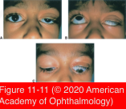
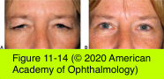

# 7.11.4. Blepharoptosis (II): Classification

## Images

## Hierarchy

- Pseudoptosis
  - hypertropia
  - enophthalmos
  - microphthalmia
  - anophthalmia
  - phthisis bulbi
  - superior sulcus defect secondary to trauma or other causes
  - contralateral upper eyelid retraction
  - dermatochalasis
    - excess upper eyelid skin overhangs the eyelid margin
- Myogenic ptosis
  - Congenital myogenic ptosis
    - dysgenesis of the levator muscle
      - fibrous or adipose tissue is present in the muscle belly
    - decreased levator function
      - amount of levator function is an indication of the amount of normal muscle
    - lid lag
    - lagophthalmos
    - upper eyelid crease is often absent or poorly formed
    - monocular elevation deficiency
      - congenital myogenic ptosis + poor Bell phenomenon or vertical strabismus
        - may indicate concomitant maldevelopment of the superior rectus and levator muscles
  - Acquired myogenic ptosis
    - etiology
      - muscular dystrophy
      - chronic progressive external ophthalmoplegia
      - MG
      - oculopharyngeal dystrophy
    - treatment
      - frontalis sling procedures
- Traumatic ptosis
  - pathogenesis
    - myogenic
    - aponeurotic
      - eyelid lacerations exposing preaponeurotic fat indicate that orbital septum has been transected and suggest possible damage to the levator aponeurosis
        - exploration of levator muscle or aponeurosis may be indicated in these patients if levator function is diminished or ptosis is present
    - neurogenic
    - mechanical
  - orbital and neurosurgical procedures may also lead to traumatic ptosis
  - management
    - may resolve or improve spontaneously
      - observe the patient for 6 months before considering surgical intervention
- Aponeurotic ptosis (acquired)
  - most common form of ptosis
  - pathogenesis
    - stretching or dehiscence of the levator aponeurosis or disinsertion from its normal position
  - etiology
    - involutional
    - repetitive traction on the eyelid
      - frequent eye rubbing
    - prolonged use of rigid contact lenses
    - intraocular surgery
    - eyelid surgery
  - clinical presentation
    - high or an absent upper eyelid crease
      - upward displacement or loss of the insertion of levator fibers into the skin
    - thinning of the eyelid superior to the upper tarsal plate
    - normal levator function (12–15 mm)
    - limits the superior visual field
    - worse in downgaze
      - interferes with patient’s ability to read
- Mechanical ptosis
  - eyelid or orbital mass weighs or pulls down the upper eyelid
  - congenital abnormality
    - plexiform neurofibroma
    - hemangioma
  - acquired neoplasm
    - large chalazion
    - skin carcinoma
    - postsurgical/posttraumatic edema
