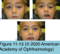

# 7.11.5. Blepharoptosis (III): Classification/Neurogenic Ptosis

## Images

## Hierarchy

- Congenital neurogenic ptosis
  - innervational defects that occur during embryonic development
  - rare
  - etiology
    - congenital oculomotor nerve III (CN III) palsy
      - ptosis
        - very rarely an isolated finding
      - inability to elevate, depress, or adduct the globe
        - palsy may be partial or complete
      - ± dilated pupils
      - aberrant innervation uncommon
      - management
        - management of strabismus, amblyopia, and ptosis is difficult
        - frontalis suspension
          - leads to some degree of lagophthalmos
          - postoperative management may be complicated by
            - diplopia
            - exposure keratitis
            - corneal ulceration
    - congenital Horner syndrome
      - pathogenesis
        - due to an innervational deficit to the sympathetic Müller muscle
      - clinical presentation
        - mild ptosis
        - lower eyelid reverse ptosis
        - decreased vertical palpebral fissure
          - may falsely suggest enophthalmos
        - miosis
          - most apparent in dim illumination
        - anhidrosis
        - decreased pigmentation of the iris
    - Marcus Gunn jaw-winking syndrome
      - most common form of congenital synkinetic neurogenic ptosis
      - pathogenesis
        - aberrant connections between the motor division of CN V and the levator muscle
        - abnormal connections between CN III and other cranial nerves
      - unilaterally ptotic eyelid elevates with jaw movements
        - lateral mandibular movement to the contralateral side
        - noticed by the mother when she is feeding/ nursing the baby
      - some forms of Duane retraction syndrome
        - elevation of a ptotic eyelid with movement of the globe
- myasthenia gravis (MG)
  - autoimmune
    - autoantibodies attack the acetylcholine receptors of the neuromuscular junction
    - ± other autoimmune disorders
      - thyroid eye disease
        - 5%–10%
  - generalized MG
    - most common
    - associated thymoma
      - 10%
        - chest CT should be considered for all patients with MG
    - surgical thymectomy
      - clinical improvement in 75%
      - complete remission in 35%
    - early manifestations of MG are often ophthalmic
      - ptosis
        - most common
      - diplopia
  - ocular MG
    - effects of MG are isolated to the periocular musculature
    - marked variability in the degree of ptosis during the day and complaints of diplopia
  - diagnostic workup
    - no single test for MG will detect all cases
    - serum assays
      - acetylcholine receptor antibody tests
        - 3 types
          - binding antibodies
            - 90% of patients with generalized MG
            - 50-70% of patients with ocular MG
              - antibody levels are lower in ocular MG
                - acetylcholine receptor antibody levels below the abnormal reference range may be suggestive of ocular MG
          - blocking antibodies
            - rarely present (1%) without binding antibodies
          - modulating antibodies
            - present as frequently as binding antibodies
          - blocking and modulating antibody testing is for patients who test negative for the binding antibody and for whom evidence of autoimmune MG is necessary
      - anti–muscle-specific kinase (MuSK) antibodies
        - may detect MG in some patients who do not have anti–acetylcholine receptor antibodies
      - antibodies against low-density lipoprotein receptor–related protein (LRP4)
        - a novel diagnostic marker
        - additional studies will need to be performed to fully characterize this antibody
    - acetylcholine receptor antibody test
    - edrophonium chloride test
      - acetylcholinesterase inhibitor
      - short-acting
        - causes a brief improvement in ptosis or ocular motility
      - rare but serious adverse effects
        - bradycardia
        - respiratory arrest
        - bronchospasm
        - syncopal episodes
        - cholinergic crisis
          - other adverse effects
            - sweating
            - lacrimation
            - salivation
            - nausea
            - vomiting
            - fasciculations
            - abdominal cramping
        - not commonly performed in eye clinics
        - atropine sulfate (0.4–0.6 mg) should be available
          - some physicians pretreat with atropine (0.4 mg subcutaneously)
        - consult the primary physician for patients with a history of cardiac or pulmonary disease
      - technique
        - initial test dose of 2 mg (0.2 mL) intravenously
          - if no response, inject additional doses of 4 mg
            - up to a total of 10 mg
        - patient is observed for 60 seconds after injection
      - positive test result
        - symptoms disappear or decrease
          - eyelid elevates or motility improves
            - when the ocular symptom is marked, the endpoint is often dramatic
            - when the ocular symptom is subtle
              - Maddox rod tests with prisms
              - diplopia fields
      - false-positive responses are rare
      - a negative test result does not exclude the diagnosis of MG
        - repeat testing at a later date
    - neostigmine methylsulfate test
      - for children and for adults without ptosis who may require a longer observation period for ocular alignment measurements
      - adverse reactions
        - similar to those for edrophonium
        - salivation
        - fasciculations
        - gastrointestinal discomfort
      - intramuscular neostigmine and atropine are injected concurrently
      - positive test result produces improvement of signs within 30–45 minutes
    - ice-pack test
      - cold inhibits acetylcholinesterase
        - enhances neuromuscular transmission
      - ice pack is placed over lightly closed eyes x 2-3 minutes
        - improvement of ptosis occurs in most patients
        - cooling effect may be insufficient to overcome complete myasthenic ptosis
      - fewer side effects
      - only if the patient has ptosis
    - sleep or rest test
      - patient lies (with eyes closed) in a darkened room for ≈ 20 minutes
      - measurements are repeated immediately after the patient “wakes up”
    - electromyographic repetitive nerve stimulation
      - characteristic decremental response in many patients with systemic MG
      - single-fiber EMG
    - single-fiber electromyography
      - most sensitive for MG
    - all patients with MG must be investigated radiologically for thymomas
      - 10% on CT
      - malignant thymomas
        - in a small percentage
    - serologic testing for thyroid dysfunction and pernicious anemia
      - high coexistence of MG with other autoimmune disorder
  - treatment
    - neuro-ophthalmologic consultation
    - ptosis of ocular MG often responds poorly to systemic anticholinesterase medication alone
      - response may improve with addition of corticosteroids
    - surgical treatment of ptosis
      - frontalis suspension
      - should be delayed until medical management is maximized
- etiology of acquired neurogenic ptosis
  - most common causes
    - acquired oculomotor (CN III) palsy
    - acquired Horner syndrome
    - MG
  - less common causes
    - myotonic dystrophy
    - chronic progressive external ophthalmoplegia
    - Guillain-Barré syndrome
    - oculopharyngeal dystrophy
    - iatrogenic botulism
      - botulinum toxin injection in the forehead or orbital region to ameliorate benign essential blepharospasm or to reduce facial rhytids may result in diffusion of the neurotoxin into the levator muscle complex
      - resolves after a few weeks
- acquired oculomotor (CN III) palsy
  - types
    - ischemic
      - most acquired oculomotor palsies are ischemic
        - diabetes mellitus
        - hypertension
        - arteriosclerotic disease
      - pupil-sparing
      - ± pain
      - resolve spontaneously with satisfactory levator function within 3 months
        - if a pupil-sparing CN III palsy fails to resolve spontaneously within 3–6 months, further workup for a compressive lesion is indicated
    - compressive
      - CN III palsy involving the pupil
        - needs immediate workup (including neuroimaging)
          - rule out a compressive neoplastic or aneurysmal lesion
  - surgical correction of ptosis related to CN III palsy
    - frontalis suspension
      - should be reserved for patients in whom strabismus surgery allows single binocular vision in a useful field of gaze
