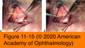
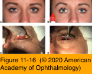

# 7.11.6. Blepharoptosis (IV): Treatment

## Images

## Hierarchy

- History
  - symptoms of dry eye
    - temper blepharoptosis repair in presence of significant dry eye problems
  - thyroid eye disease
  - previous eye or eyelid surgery
  - prior periorbital trauma
- Indications for treatment
  - functional
    - significant superior visual field loss
    - difficulty with reading
  - cosmetic
    - tired or sleepy appearance
- frontalis suspension surgery
  - indication
    - poor or absent levator function
  - technique
    - eyelid is suspended directly from frontalis muscle
      - movement of the brow is efficiently transmitted to the eyelid
    - there is controversy about whether bilateral frontalis suspension should be performed in patients with unilateral congenital ptosis
      - may improve patient’s symmetry and stimulate the need to utilize frontalis muscle to lift eyelids
      - subjects normal eyelid to surgical risks
  - autogenous fascia lata
    - best long-term results
    - requires harvesting and additional surgery
    - patients ≥ 3 years old or ≥35 pounds in weight
  - banked fascia lata
    - may incite inflammation
    - has the theoretic potential to transmit infectious agents
    - poorer long-term outcomes
  - synthetic materials
    - silicone rods
    - allow easier adjustment or removal if necessary
- 3 categories of surgical procedures
  - external (transcutaneous) levator advancement
    - In patients with good levator function, surgical correction is generally directed toward the levator aponeurosis
  - internal (transconjunctival) levator/tarsus/ Müller muscle resection approaches
  - frontalis muscle suspensions
    - if levator function is poor or absent, frontalis muscle suspension techniques are the preferred repair procedures
- External (transcutaneous) levator advancement surgery
  - indications
    - levator function is normal
    - upper eyelid crease is high
      - levator aponeurosis (its tendinous attachment to the tarsal plate) is stretched or disinserted
  - ideally performed under local anesthesia
    - patient cooperation is elicited to obtain optimal lid height and contour
  - upper eyelid crease incision
  - levator aponeurosis is advanced to the superior tarsal border
- Complications
  - undercorrection
    - most common complication
    - differentiate true undercorrection from apparent undercorrection resulting from postoperative edema
    - creating symmetry between the two eyelids is the most difficult aspect of ptosis repair
      - adjustable suture techniques
        - early adjustment in the office during the first 2 postoperative weeks
  - overcorrection
  - unsatisfactory eyelid contour
  - scarring
  - wound dehiscence
  - eyelid crease asymmetry
  - conjunctival prolapse
  - tarsal eversion
  - lagophthalmos with exposure keratitis
    - most common in patients with decreased levator function
    - usually temporary
    - lubricating drops or ointments
- internal (transconjunctival) approach
  - directed toward
    - Müller muscle
      - Müller muscle–conjunctival resections (MMCRs)
        - indications
          - minimal ptosis (≤2 mm)
          - adequate upper eyelid position following instillation of a drop of 2.5% phenylephrine hydrochloride
          - useful for maintaining preoperative eyelid contour
    - tarsus
      - Fasanella-Servat procedure
        - for small amounts of ptosis
        - removal of the superior tarsus with the conjunctiva and Müller muscle
    - levator aponeurosis or muscle
