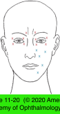

# 7.11.7. Facial Dystonia

## Images

## Hierarchy

- Hemifacial Spasm (HFS)
  - intermittent synchronous gross contractures of the entire side of the face
    - begins in periocular region and progresses to involve entire face
  - etiology
    - vascular compression of the facial nerve at the brain stem
    - other cerebellopontine angle lesions
      - <1%
      - unlike BEB
        - unlike BEB
  - rarely bilateral
  - spasms are present during sleep
  - associated with ipsilateral facial nerve weakness
  - MRI
    - documents the ectatic vessel
    - rules out other cerebellopontine angle lesions
  - treatment
    - neurosurgical decompression of the facial nerve
      - exposes patient to relative risk of neurosurgical intervention
    - periodic injection of botulinum toxin
    - oral medications
      - carbamazepine
      - clonazepam
      - low efficacy
  - differential diagnosis
    - aberrant regeneration after facial nerve palsy
      - history
        - previous Bell palsy
        - trauma
      - hemifacial contracture
      - aberrant synkinetic facial movements
      - respond well to botulinum toxin injection at very low doses
- Benign Essential Blepharospasm (BEB)
  - General
    - epidemiology
      - .>40 years
      - F>M
      - 30/100,000 people
    - pathogenesis
      - basal ganglia disease
    - clinical presentation
      - bilateral
        - unlike HFS
      - increased blinking
      - involuntary spasms of the periocular protractor muscles
        - start as mild twitches
          - progress to forceful contractures
      - other muscles of the face may also be involved
      - spasms typically abate during sleep
        - unlike HFS
      - may severely limit patient’s ability to perform activities of daily living
      - can progress until the patient is functionally blind
    - diagnostic workup
      - clinical diagnosis
      - neuroimaging is generally unrevealing and rarely indicated
    - differential diagnosis
      - reflex blepharospasm
        - dry eye syndrome
      - hemifacial spasm
    - medical treatment
      - eyelid crutches
        - attached to eyeglass frames
      - oral medications
        - limited usefulness
      - neurotoxin injections
        - primary treatment for blepharospasm
    - references
  - Botulinum toxin injection
    - treatment of choice for BEB
    - botulinum toxin type A
    - improvement is temporary
      - onset of action
        - 2–3 days
      - average peak effect
        - 7–10 days
      - duration of effect
        - 3–4 months
    - complications
      - bruising
      - blepharoptosis
      - ectropion
      - epiphora
      - diplopia
      - lagophthalmos
      - corneal exposure
    - references
  - Surgical myectomy
    - indications
      - poorly responsive to botulinum therapy
      - incapacitated by spasms
    - technique
      - meticulous removal of orbital and palpebral orbicularis muscle in upper (and sometimes lower) eyelids
    - complications
      - lagophthalmos
      - chronic lymphedema
      - recurrence of spasm
      - periorbital contour deformities
    - more limited myectomy
      - helpful in patients with less severe disease
      - may result in improved responsiveness to botulinum toxin therapy
    - many patients with BEB have an associated dry eye
      - may be aggravated by any treatment modality that decreases eyelid closure
      - artificial tears
      - ointments
      - punctal plugs or occlusion
      - moisture chamber shields
      - tinted spectacle lenses
      - minimize discomfort
  - surgical ablation of the facial nerve
    - has been largely abandoned
      - recurrence rates ≤ 30%
      - frequent hemifacial paralysis from facial nerve dissection
    - microsurgical ablation of selected branches of the facial nerve
      - some surgeons have had greater success
  - muscle relaxants and sedatives
    - orphenadrine, lorazepam, or clonazepam
    - rarely effective in primary treatment of BEB
      - sometimes prolong interval between botulinum toxin injections in mild BEB
    - dampen lower facial dystonia (Meige syndrome) associated with BEB
    - psychotherapy
      - little or no value
