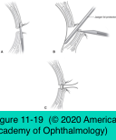

# 7.11.8. Facial Paralysis

## Images

## Hierarchy

- Upper Eyelid Paralysis
  - placement of a weight in upper eyelid
    - most commonly performed procedure for treatment of paralytic lagophthalmos
    - preoperative taping of gold weights of different sizes to the upper eyelid skin
      - aim for adequate relaxed eyelid closure with minimal eyelid ptosis in primary gaze
    - technique
      - upper eyelid crease incision through skin and orbicularis muscle
      - gold weight is sutured to anterior surface of tarsal plate
      - average weight, 0.8–1.6 g
      - weight can be easily removed
      - 1.2–2.2-g gold weight can also be placed behind the orbital septum, superior to the tarsus
        - to avoid thickening of the pretarsal area if cosmesis is a concern
      - platinum weight
      - implanted eyelid springs
        - long-term extrusion
        - provide dynamic eyelid closure
      - reduces but does not usually eliminate lagophthalmos and corneal exposure
- Paralytic Ectropion
  - pathogenesis
    - CN VII paralysis or palsy
  - clinical presentation
    - lower eyelid ectropion
    - upper eyelid lagophthalmos
      - corneal exposure
    - poor blinking
      - poor tear film replenishment and distribution
      - lacrimal pump failure
    - chronic ocular surface irritation
      - reflex tearing
  - management
    - neurologic evaluation may be indicated
    - evaluate corneal sensation
      - neurotrophic keratitis combined with paralytic lagophthalmos results in increased risk of corneal decompensation
        - stroke
        - intracranial surgery
    - temporary paralysis
      - lubricating drops
      - viscous tear supplementation/ointments
      - taping of the temporal half of the lower eyelid
      - moisture chambers
      - temporary tarsorrhaphy
        - 1–3 weeks
        - nonabsorbable sutures between the upper and lower eyelid margins
      - injection of botulinum toxin to the levator muscle
    - long-term or permanent paralysis
      - permanent tarsorrhaphy
        - medially or laterally
        - de-epithelialization of the upper and lower eyelid margins, with the lash follicles avoided
        - absorbable or nonabsorbable sutures are then placed to unite the raw surfaces of the upper and lower eyelids
        - patients dislike the permanent tarsorrhaphy from a functional and cosmetic perspective
          - should be avoided, except in patients with recalcitrant corneal disease from exposure
      - medial or lateral canthoplasties
      - placement of a gold weight in the upper eyelid
      - vertical elevation of the lower eyelid
        - recession of the lower lid retractors
          - combined with use of a spacer graft
            - full-thickness hard-palate mucosal
            - ear cartilage graft
        - fascia lata or silicone suspension sling of the lower eyelid
      - repair of horizontal eyelid laxity (horizontal tightening procedures) or ectropion of the lower lid
      - surgical midface elevation
