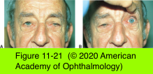

# 7.11.9. Involutional Periorbital Changes

## Images

## Hierarchy

- Dermatochalasis
  - familial predisposition
  - more common in elderly
    - also occurs in middle-aged persons
  - symptoms
    - heavy feeling around the eyes
    - brow ache
    - eyelashes in the visual axis
    - reduction in the superior visual field
  - redundancy of eyelid skin
  - ± associated orbital fat prolapse
  - ± associated brow ptosis
  - ± true ptosis of upper eyelids
  - lower eyelid dermatochalasis is a cosmetic issue
    - except when patient cannot be fitted with bifocals
- Brow Ptosis
  - etiology
    - involutional changes of the forehead skin
      - loss of elastic tissues
      - loss of facial volume
    - facial nerve palsy
  - drooping of the forehead and eyebrows
    - eyebrow falls below the superior orbital rim
      - normal brow is located above the superior orbital rim
        - female brow is higher and more arched
    - frequently accompanies dermatochalasis
    - may become severe enough to affect the superior visual field
  - patient uses frontalis muscle to elevate eyebrows
    - brow ache
    - headache
    - prominent transverse forehead rhytids
  - treatment
    - must be treated prior to or concomitant with the surgical repair of coexisting dermatochalasis
      - upper blepharoplasty alone in a patient with concomitant brow ptosis leads to further depression of the brow
    - browpexy
      - for mild brow ptosis
        - provides minimal improvement in brow position
        - may prevent retro-orbicularis oculi fat (ROOF) from descending into eyelid
      - technique
        - upper eyelid blepharoplasty incision
        - sub-brow tissues are resuspended with sutures to the frontal bone periosteum
      - references
    - direct eyebrow elevation
      - incision at upper edge of eyebrow
      - particularly useful for lateral brow ptosis
        - when used across the entire brow, it may result in an arch or scar
      - ± cause paresthesia
- Blepharochalasis
  - epidemiology
    - rare
    - familial
    - younger persons
    - F>M
  - not an involutional change!
    - variant of angioneurotic edema
  - clinical presentation
    - idiopathic episodes of inflammatory edema of the eyelids
    - eyelid skin becomes thin and wrinkled
      - simulates dermatochalasis
    - true ptosis
    - herniation of the orbital lobe of lacrimal gland
    - atrophy of orbital fat pads
    - prominent eyelid vascularity
  - surgical repair of eyelid-skin changes and ptosis
    - complicated by repeated episodes of inflammation and edema
