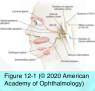
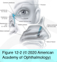
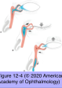
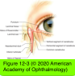

# 7.12.1. Lacrimal System: Anatomy, Development, and Physiology

## Images

## Hierarchy

- Physiology
  - tear evaporation
    - 10% of tear elimination in young
    - ≥20% in elderly
  - most of tear is actively pumped from tear lake by actions of the orbicularis oculi muscle
    - blinking pushes the tears from lateral to nasal on the eyelid margin
    - action of the orbicularis muscle on the canaliculi and the lacrimal sac also promotes drainage
    - weakened blink interferes with normal pumping mechanism
- Normal Anatomy
  - Secretory System
    - precorneal tear film has 3 layers
      - middle aqueous layer
        - sources
          - main lacrimal gland
            - exocrine gland
            - superior lateral quadrant of the orbit
            - lacrimal gland fossa
            - lateral horn of levator aponeurosis divides lacrimal gland into 2 lobes
              - orbital lobe
              - palpebral lobe
            - superior transverse ligament (Whitnall ligament)
              - forms septa through the stroma of the gland
              - some fibers project onto the lateral orbital tubercle
            - major lacrimal ducts
              - pass through the palpebral portion of the gland
                - removal of the palpebral lobe may reduce secretion from the entire gland
                  - biopsy of the lacrimal gland is preferentially performed on the orbital lobe
              - 8–12
              - empty into the superior cul-de-sac
                - ≈ 5 mm above the lateral tarsal border
          - accessory lacrimal glands
            - exocrine glands
            - types
              - glands of Krause
                - deep within the superior fornix
              - glands of Wolfring
                - just above the superior border of the tarsus
        - types
          - basal secretion
          - reflex secretion
            - reflex tear arc
              - sensory (afferent) pathway
                - ophthalmic branch of the trigeminal nerve (CN V)
              - efferent pathway
                - superior salivatory nucleus of pons
                  - parasympathetic fibers
                    - exit brainstem with facial nerve (CN VII) (via nervus intermedius)
                - lacrimal fibers leave CN VII as the greater superficial petrosal nerve
                  - pass to sphenopalatine ganglion
                    - enter zygomaticotemporal nerve (branch of V2)
                      - enter lacrimal nerve via an anastomosis (branch of V1)
                        - enter lacrimal gland
      - superficial oily layer
        - produced by meibomian glands
      - deep mucin layer
        - secreted by goblet cells within the conjunctiva
  - Drainage System
    - puncta
      - located medially on margin of both upper and lower eyelids
      - lower puncta lie slightly farther lateral
      - are slightly inverted and apposed to the globe within the tear lake
        - nasal mucosa is pseudostratified
      - ampulla
    - lacrimal canaliculi
      - lined with nonkeratinized, non–mucin- producing stratified squamous epithelium
      - run roughly 2 mm vertically from the punctum
        - turn 90°
          - continue 8–10 mm medially
            - join at the common canaliculus
              - in some individuals there is a unique configuration in which 2 independent canaliculi lead to the lacrimal sac
                - 10%
              - bends from posterior to anterior behind medial canthal tendon before entering lacrimal sac at an acute angle
              - valve of Rosenmüller
                - 1-way valve
                - prevent reflux of tears from the sac into the canaliculi
    - lacrimal sac
      - bony lacrimal sac fossa
        - anterior medial orbit
        - anterior and posterior lacrimal crests
        - medial wall of the fossa
          - composed of the lacrimal bone posteriorly and the frontal process of the maxilla anteriorly
          - adjacent to middle meatus of the nose
            - sometimes with intervening ethmoid air cells
      - medial canthal tendon
        - anterior and posterior crura
          - superficial head attaches to anterior lacrimal crest
          - deep head (with the Horner muscle), attaches to posterior lacrimal crest
          - wrap around the anterior and posterior aspects of the lacrimal sac
      - dome of sac extends several millimeters above medial canthal tendon
    - angular artery and vein
      - lie 7–8 mm medial to the medial canthal angle
      - anastomose with vascular systems of face and orbit
      - if cut during dacryocystorhinostomy, may cause troublesome bleeding
    - nasolacrimal duct (NLD)
      - within the bony nasolacrimal canal
      - 12–18 mm in length
        - interosseous portion
          - 12 mm
        - meatal portion
          - 5–6 mm inferior to the bony ostium
      - curves in an inferior and slightly lateral and posterior direction from the lacrimal sac
      - opens into the nose under the inferior turbinate
        - inferior meatus
      - mucosal ostium
        - partially covered by a mucosal fold (valve of Hasner)
        - located 30–35 mm from external nares
- Development
  - Secretory System
    - lacrimal gland develops from multiple solid ectodermal buds (in anterior superolateral orbit)
    - buds branch, canalize, and form ducts and alveoli
    - lacrimal glands are small and do not function fully until approximately 6 weeks after birth
      - newborn infants do not produce tears when crying
  - Drainage System
    - end of fifth week of gestation
    - nasolacrimal groove
      - forms as a furrow between nasal and maxillary prominence
      - solid cord from ectoderm
        - cord canalizes, forming the NLD and the lacrimal sac
          - canalicular system is an outgrowth of the lacrimal sac
          - failure of opening of distal aspect of duct is the most common cause of congenital NLD obstruction
            - symptomatic in approximately 5% of infants at birth
              - excessive tearing may not occur until around age 6 weeks
              - patency usually occurs spontaneously within first few months of life
          - canalization of NLD is usually complete around time of birth
    - lacrimation does not function normally until around age 6 weeks
