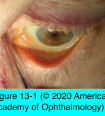
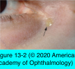
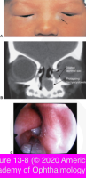

# 7.12.2. Lacrimal System: Congenital Lacrimal Drainage Obstruction (I)

## Images

## Hierarchy

- Developmental abnormalities
  - Lacrimal Secretory System
    - hypoplasia and agenesis of the lacrimal gland
      - associations
        - isolated
        - with congenital abnormalities of salivary glands
      - genetics
        - sporadic
          - most common
        - autosomal dominant
    - lacrimal gland prolapse
      - with craniosynostosis syndromes
    - ectopic lacrimal gland tissue
      - within the orbit and eyelids
    - aberrant ductule
      - "lacrimal gland fistula"
      - exits externally through the lateral eyelid several millimeters above the eyelash line
      - usually accompanied by adjacent cluster of eyelashes
      - simple excision
  - Lacrimal Drainage System
    - Duplication
      - multiple puncta/canaliculi
      - types
        - extra opening on eyelid margin
          - asymptomatic
        - extra opening through skin
          - "congenital lacrimal–cutaneous fistula"
          - infranasal to the medial canthus
          - ± associated with tears that appear on skin
          - ≈1/3 have NLDO
            - chronic mucoid discharge
          - treatment
            - direct surgical excision of epithelium-lined fistulous tract with direct suture closure
            - silicone intubation or dacryocystorhinostomy
              - for underlying NLDO and chronic dacryocystitis
    - Aplasia and hypoplasia
    - Lacrimal drainage obstruction
- Dacryocystocele
  - pathogenesis
    - congenital NLDO
      - +.
        - functional block above lacrimal sac
    - amniotic fluid or mucus (secreted by lacrimal sac goblet cells) is trapped in tear sac
      - mucoceles
      - amniotocele
  - within lacrimal sac
    - present at birth or within 1-4 weeks
    - inferior to medial canthal tendon
      - congenital swelling above the medial canthal tendon suggests alternate etiologies
        - meningoencephalocele
        - dermoid cyst
        - CT or MRI
    - management
      - conservative
        - prophylactic topical antibiotics
        - massage
        - initially sterile
      - probing of the lacrimal drainage system
        - indications
          - infection develops
            - no response in 1–2 weeks
  - within nasal cavity
    - can be observed during nasal examination
    - at the level of occluded valve of Hasner
      - under the inferior turbinate
    - treatment
      - excision or marsupialization of duct
        - urgent treatment may be needed if the condition is bilateral and causes airway obstruction
- Punctal/canalicular agenesis and dysgenesis
  - punctal hypoplasia/dysgenesis
    - more common
  - punctal aplasia/agenesis
    - magnification may reveal intact punctum with thin overlying membrane
      - can usually be opened with a sharp probe
      - ± temporary intubation or placement of silicone plug
    - truly absent punctum
      - determine canalicular status
        - technique
          - cut down medial to expected punctum location to identify canaliculus
          - retrograde probing through an open lacrimal sac with direct visualization of common canalicular opening
        - canalicular system & nasolacrimal sac/duct are patent
          - intubation
        - complete absence of the puncta and the canalicular system
          - conjunctivodacryocystorhinostomy (CDCR) with Jones tube
        - symptomatic patients with a single punctum may require surgery to relieve NLDO rather than canalicular obstruction
- Evaluation
  - history
    - tearing or mucopurulent discharge
      - beginning shortly after birth
        - constant tearing with minimal mucopurulence
          - blockage of the upper system (puncta, canaliculi, and common canaliculus)
        - constant tearing with frequent mucopurulence and matting of the eyelashes
          - complete obstruction of the NLD
        - intermittent tearing with mucopurulence
          - intermittent obstruction of the NLD
  - examination
    - inspection of the eyelid margins
      - puncta
      - extrinsic causes of reflex hypersecretion
        - ocular surface irritation
        - infectious conjunctivitis
        - epiblepharon
        - trichiasis
        - congenital glaucoma
    - inspection of the medial canthal region
      - distended lacrimal sac
        - below the tendon
      - encephalocele
        - above the tendon
      - inflammation
    - application of digital pressure over the tear sac
      - if mucoid reflux is present, complete obstruction at the level of the NLD becomes the working diagnosis
