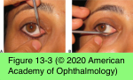
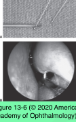
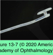

# 7.12.3. Lacrimal System: Congenital Lacrimal Drainage Obstruction (II): Congenital NLDO

## Images

## Hierarchy

- Dacryocystorhinostomy
  - indications
    - persistent epiphora following intubation and/or balloon dacryoplasty
    - recurrent dacryocystitis
    - extensive developmental abnormalities of the nasolacrimal drainage system
      - prevent probing and intubation
- General
  - pathogenesis
    - membrane blocking the valve of Hasner at the nasal end of the NLD
  - epidemiology
    - clinically evident in 2%–6% of full-term infants at 3–4 weeks of age
    - 1/3 bilateral
    - 90% of all symptomatic congenital NLDO resolve in the first year of life
      - including infants with clinical symptoms at 6 months!
  - nonsurgical management
    - observation
    - lacrimal sac massage
    - topical or even oral antibiotics
      - to suppress chronic mucoid discharge
  - surgical management
    - probing of the NLD
      - in cases with airway obstruction secondary to nasal extension of an enlarged lacrimal sac or dacryocystitis, prompt treatment may be required
      - timing
        - at 1 year
          - delaying probing past 13 months of age may be associated with a decreased success rate
          - most cases of congenital NLDO—including infants with clinical symptoms at 6 months— resolve in the first year of life
          - usually require general anesthesia
        - at 6 months
          - in the office
            - with topical anesthesia and swaddling
          - advantages
            - inexpensive
            - avoids general anesthesia
            - relatively safe in well-trained hands
          - limits the acquisition of information about the nature of the obstruction!
  - dacryocystitis
    - acutely inflamed lacrimal sac with cellulitis of the overlying skin
    - systemic antibiotics
      - should be started promptly
    - following resolution of the infectious process, elective probing should be performed promptly
- Turbinate medial infracture
  - if inferior turbinate appears to be lateralized against NLD at time of probing and irrigation
  - should be suspected in patients with recurrent intermittent obstruction
    - related to infections of upper respiratory tract
  - blunt end of periosteal elevator is placed within the inferior meatus along lateral surface of inferior turbinate
    - inferior turbinate is then rotated medially toward the septum
  - fracturing turbinate at its base significantly enlarges inferior meatus
- Balloon dacryoplasty
  - indications
    - complicated cases
    - recurrence following standard probing techniques
  - collapsed balloon catheter is placed in a manner similar to probing
    - inflated inside the NLD at multiple levels
  - necessary catheter equipment is expensive
- Intubation
  - indications
    - recurrent epiphora following nasolacrimal system probing
      - success rate >70%
    - older children with significant stenosis or scarring
    - upper-system abnormalities
      - canalicular stenosis
      - trauma
      - agenesis of the puncta
  - silicone stent
    - Crawford stent
  - shrinkage of nasal mucosa with a topical vasoconstrictor
  - adequate lighting with a fiber-optic headlight
  - endoscope for more difficult cases
    - medialization of the inferior turbinate is sometimes performed
  - securing the tube in the nose
    - square knot
    - direct suturing to lateral wall of nose (without tension)
    - passing limbs of the stent through either a silicone band or a sponge in the inferior meatus of the nose
  - monocanalicular stents
    - for patients with only one patent canaliculus
    - passed through a single punctum to the nasal cavity
      - the end of the stent is simply cut and allowed to retract loosely into the nose
    - proximal end has a punctal plug and is self- secured at the punctum
- Probing and irrigation
  - facilitated by
    - immobilization of patient
    - contraction of nasal mucosa with topical vasoconstrictor
      - oxymetazoline hydrochloride
  - punctal dilation
  - size 00 Bowman lacrimal probe
  - insert into punctum perpendicular to eyelid margin
  - turn parallel to lid margin
    - manual lateral traction of the eyelid with the opposite hand to straighten the canaliculus
    - resistance to passage of probe, along with medial movement of eyelid soft tissue (“soft stop”) causing wrinkling of overlying skin
      - canalicular kinking
        - withdraw and reinsert while lateral horizontal traction is maintained
        - most common cause
      - canalicular obstruction
  - medial wall of the lacrimal sac will be encountered resulting in a tactile “hard stop”
  - probe is then rotated 90° superiorly toward the brow until it lies adjacent to the supraorbital notch
    - directed posteriorly and slightly laterally
    - if significant resistance is encountered probe should be repositioned and passage attempted again
    - creation of false passage makes it difficult to redirect the probe back into native lacrimal system
    - at some points of narrowing, particularly at the distal end of the NLD, gentle pressure may be necessary to push through the blockage
  - confirming duct patency
    - direct visualization of probe tip
      - nasal speculum and fiber-optic headlight or endoscope
      - under the inferior turbinate
      - in children opening of the NLD is usually 20– 22 mm back from the nostril
        - 30-35 mm in adults
    - metal-on-metal contact with another probe inserted through the naris
    - NLD irrigation with saline mixed with fluorescein
      - fluorescein can be retrieved from inferior meatus and visualized with a transparent suction catheter
  - single lacrimal probing successfully resolves congenital NLDO in 90% of patients who are 13 months or younger
  - adult probing
    - in adults, irrigation and probing are limited to the canalicular system
      - performed for diagnostic purposes only
    - probing of NLD in adults is potentially traumatic and rarely effective
