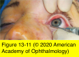
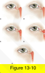

# 7.12.4. Lacrimal System: Acquired Lacrimal Drainage Obstruction (I)

## Images

## Hierarchy

- History
  - 2 groups
    - hypersecretion of tears (lacrimation)
    - impairment of drainage (epiphora)
  - questions
    - constant versus intermittent tearing
    - periods of remission versus no remission
    - unilateral versus bilateral condition
    - subjective ocular surface discomfort
    - history of allergies
    - use of topical medications such as glaucoma drops
    - history of probing during childhood
    - prior ocular surface infections such as conjunctivitis or herpes simplex
    - prior sinus disease or surgery, midfacial trauma, or nasal fracture
    - previous episodes of lacrimal sac inflammation
    - clear tears versus tears with discharge or blood
      - blood in the tear meniscus may indicate malignancy
- Diagnostic tests
  - dye disappearance test (DDT)
    - to assess presence or absence of adequate lacrimal outflow
      - especially in unilateral cases
      - especially in children
        - lacrimal irrigation is impossible without deep sedation!
    - technique
      - instill fluorescein into the conjunctival fornices of each eye
        - drop of sterile 2% fluorescein solution
        - moistened fluorescein strip
      - observe tear film with cobalt blue filter of slit lamp x 5 min
        - persistence of significant dye
          - indicate an obstruction
        - asymmetric clearance of dye
          - indicate an obstruction
        - If DDT result is normal, severe lacrimal drainage dysfunction is highly unlikely
          - intermittent causes of tearing, such as allergy, dacryolith, or intranasal obstruction, cannot be ruled out
        - Schirmer tests are also read at 5 minutes
  - Jones I test
    - primary dye test
    - instill fluorescein into conjunctival fornices
    - recover it in inferior nasal meatus by passing a cotton-tipped applicator into nose
      - at 2 and 5 minutes
  - Jones II test
    - following an unsuccessful Jones I test
      - flush residual fluorescein from conjunctival sac with clear saline
      - irrigate lacrimal system with clear saline using a cannula inserted into the canalicular system
        - clear solution suggests that tears never entered lacrimal outflow system
        - fluorescein-stained irrigant indicates partial obstruction
  - lacrimal drainage system irrigation
    - most frequently performed immediately after DDT
    - determines level of lacrimal drainage system occlusion
    - technique
      - instill topical anesthesia
      - lower eyelid punctum is dilated and any punctal stenosis is noted
      - irrigating cannula is placed in canalicular system
        - maintain lateral traction of the lower eyelid
        - canalicular stenosis or occlusion should be recorded and confirmed by subsequent diagnostic probing
      - once irrigating cannula has been advanced into horizontal canaliculus, clear saline is injected
    - interpretation
      - difficulty advancing irrigating cannula and inability to irrigate fluid
        - total canalicular obstruction
      - saline can be irrigated but it refluxes through upper canalicular system with no palpable distension of lacrimal sac
        - complete blockage of the common canaliculus
          - probing determines whether common canalicular stenosis is total or whether it can be dilated
      - mucoid material or fluorescein refluxes through the opposite punctum and lacrimal sac distension is palpable
        - complete NLDO
      - no canalicular reflux or fluid passing down the NLD but lacrimal sac become distended, causing patient discomfort
        - complete NLDO
        - functional valve of Rosenmüller, preventing reflux through the canalicular system
      - simultaneous saline reflux through the opposite canaliculus and saline irrigation through the NLD
        - partial NLDO
      - saline irrigation passes freely into the nose with no reflux through the canalicular system
        - patent nasolacrimal drainage system
          - a functional obstruction may still be present
          - dacryolith may also impair tear flow without blocking irrigation
      - Figure 13-10
  - diagnostic probing
    - topical anesthesia
    - small probe (size 00)
      - to detect any canalicular obstruction
        - probe is clamped at punctum before withdrawal, thereby measuring distance to obstruction
        - larger probe may be useful to determine extent of a partial obstruction
        - probe should not be forced through any area of resistance
    - upper system (puncta, canaliculi, and lacrimal sac)
    - diagnostic probing of the NLD has no place in adults
      - there are other means of diagnosing NLDO
      - probing in adults has limited therapeutic value
        - unlike infants
          - NLDO in infants results from occlusion by a thin membrane
        - NLDO in adults results from extensive fibrosis of duct itself
  - intranasal examination
    - nasal speculum and light source
    - diagnostic nasal endoscopy
  - contrast dacryocystography
    - dye injection into lacrimal system followed by computerized digital subtraction imaging
    - anatomical information
  - dacryoscintigraphy
    - radionucleotide eyedrops to follow tear flow
    - physiologic information
  - CT and MRI
    - indications
      - craniofacial injury
      - congenital craniofacial deformities
      - suspected neoplasia
    - CT is superior for the evaluation of suspected bony abnormalities
      - fractures
    - MRI is superior for the evaluation of suspected soft-tissue disease
      - malignancy
    - CT or MRI may be helpful in evaluating concomitant sinus or nasal disease
- Examination
  - Pseudoepiphora evaluation
    - pseudoepiphora
      - reflex hypersecretion of tears (lacrimation) caused by ocular surface irritation
    - Tear meniscus
      - size of lacrimal lake
      - presence of precipitated proteins and stringy mucus
    - Tear breakup time
      - fluorescein is placed in conjunctival cul-de-sac
      - patient is asked to open his/her eyes and refrain from blinking
      - examine tear film using a broad beam of slit lamp
      - normal
        - ≥ 10 seconds
      - <10 seconds may indicate poor function of mucin or meibomian layer despite a sufficient amount of tears
    - Evaluation of corneal and conjunctival epithelium
      - topical rose bengal and lissamine green
        - stain devitalized conjunctival/corneal epithelium
      - topical fluorescein
        - stains lost conjunctival/corneal epithelium
          - indicates more severe tear film malfunction
    - Basal tear secretion
      - topical anesthetic
      - inferior cul-de-sac is dried
      - Schirmer strip is bent at the notch and placed with the short end resting on the conjunctiva and the fold crease on the eyelid margin
        - at the lateral one-third of the lower eyelid
      - strip is left in place for 5 minutes
      - amount of wetting is recorded
      - normal
        - ≈10–15 mm
      - rapid saturation of strip signifies hypersecretion
        - excess secretion may occur in response to irritation from the measuring strips themselves
          - serial testing should be performed to confirm this assumption
      - Schirmer I and Schirmer II tests
        - Schirmer I test
          - like basal tear secretion test, but no topical anesthetic is used
          - to evaluate both basic and reflex tearing
        - Schirmer II test
          - to distinguish between fatigue block (when reflex secretion is suppressed because of chronic irritation) and a lack of function of the reflex secretors
          - no anesthetic
          - tear strip in place
            - cotton-tipped applicator is placed in the nostril and moved back and forth for 2 minutes
        - reserved for special diagnostic circumstances
    - Corneal irritation
      - trichiasis
      - entropion
      - allergy
      - chronic infection
      - contact lens–related disease such as giant papillary conjunctivitis
  - Lacrimal outflow examination
    - eyelid
      - malposition
        - tears might not reach the puncta
        - slit-lamp examination during blink cycle
      - weak/incomplete blink
        - poor lacrimal pump function
        - etiology
          - facial nerve dysfunction
    - conjunctiva/caruncle
      - enlarged caruncle
        - mechanical blockage of punctum
      - conjunctivochalasis
        - mechanical blockage of punctum
    - punctum
      - stenosis, occlusion, aplasia
    - lacrimal sac
      - reflux of mucoid or mucopurulent material with pressure on a distended lacrimal sac
        - confirms complete NLDO
          - no further diagnostic tests are needed if a lacrimal sac tumor is not suspected
    - nose
      - intranasal tumor
      - turbinate impaction
      - chronic allergic rhinitis
