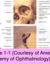
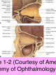
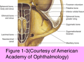

# 7.1.1. Orbital Anatomy (I)

## Images

## Hierarchy

- Dimensions
  - medial orbital walls are ≈ parallel
    - separated by 25 mm
  - widest dimension of orbit is ≈ 1 cm behind anterior orbital rim
  - redundancy of optic nerve allows the eye to rotate and move forward without damaging the nerve
- Apertures
  - Ethmoidal Foramina
    - medial orbital wall
      - along the frontoethmoidal suture
    - contents
      - anterior and posterior ethmoidal arteries
    - surgical landmark for the superior extent of medial wall surgery
      - disruption of medial wall above the level of the foramina may disrupt a plane superior to the cribriform plate
        - inadvertent entry into the cranial vault!
    - potential route of entry into orbit for infections and neoplasms from sinuses
  - Superior Orbital Fissure
    - separates the greater and lesser wings of the sphenoid bone
    - divided by annulus of Zinn into 2 parts
      - above the annulus
        - lacrimal nerve of CN V1
        - frontal nerve of CN V1
        - CN IV (trochlear nerve)
        - superior ophthalmic vein
          - drains into the cavernous sinus
      - LFTs
      - within the annulus
        - superior and inferior divisions of CN III (the oculomotor nerve)
        - nasociliary branch of CN V1
        - sympathetic roots of the ciliary ganglion
        - CN VI (the abducens nerve)
          - Standing Room Only
  - Inferior Orbital Fissure
    - bounded by
      - sphenoid
        - 3N3 iS 6
      - maxillary
      - palatine bones
    - transmits
      - second (maxillary) division of CN V
        - maxillary nerve (V2) exits the skull through the foramen rotundum
          - travels through the pterygopalatine fossa to enter the orbit at the infraorbital groove
          - after giving off the zygomatic branch, it becomes the infraorbital nerve
            - travels anteriorly in the infraorbital canal
              - emerges 1 cm below the inferior orbital rim
                - sensation from the lower eyelid, cheek, upper lip, upper teeth, and gingiva
        - zygomatic nerve
      - branches of the inferior ophthalmic vein
        - leading to the pterygoid plexus
  - Zygomaticofacial and Zygomaticotemporal Canals
    - transmit vessels and branches of the zygomatic nerve through the lateral orbital wall
      - to the cheek
      - to the temporal fossa
  - Nasolacrimal Canal
    - from the lacrimal sac fossa to the inferior meatus
    - transmits the nasolacrimal duct
  - Optic Canal
    - 8–10 mm long
    - in the lesser wing of the sphenoid bone
    - separated from the superior orbital fissure by the bony optic strut
    - transmits
      - optic nerve
      - ophthalmic artery
      - sympathetic nerves
    - optic foramen
      - orbital end of the canal
      - <6.5 mm in diameter
    - optic canal enlargement
      - optic nerve glioma
    - narrowing of the canal
      - fibrous dysplasia
    - blunt trauma
      - optic canal fracture
      - shearing of the nerve at the foramen
- Topographic Relationships
  - orbital septum
    - arises from the orbital rims anteriorly
  - paranasal sinuses
    - rudimentary or very small at birth
      - increase in size through adolescence
  - orbital walls are composed of 7 bones
    - ethmoid
    - frontal
    - lacrimal
    - maxilla (maxillary)
    - palatine
    - sphenoid
    - zygomatic
  - Roof of the Orbit
    - composed of
      - orbital plate of the frontal bone
      - lesser wing of the sphenoid bone
    - landmarks
      - lacrimal gland fossa
      - fossa for the trochlea of the superior oblique tendon
        - 5 mm behind the superior nasal orbital rim
      - supraorbital notch
        - transmits the supraorbital vessels and the supraorbital branch of the frontal nerve
    - located adjacent to
      - anterior cranial fossa
      - frontal sinus
  - Lateral Wall of the Orbit
    - composed of
      - zygomatic bone
      - greater wing of the sphenoid bone
        - separated from the lesser wing by the superior orbital fissure
    - landmarks
      - lateral orbital tubercle of Whitnall
        - lateral canthal tendon
        - lateral horn of the levator aponeurosis
        - check ligament of the lateral rectus
        - Lockwood ligament (the suspensory ligament of the globe)
        - Whitnall ligament
      - frontozygomatic suture
        - 1 cm above the tubercle
    - located adjacent to
      - middle cranial fossa
      - temporal fossa
    - extends anteriorly to the equator of the globe
    - thickest and strongest of the orbital walls
  - Floor of the Orbit
    - composed of
      - maxillary bone
      - palatine bone
      - orbital plate of the zygomatic bone
    - forms roof of the maxillary sinus
    - does not extend to the orbital apex
      - ends at the pterygopalatine fossa!
        - shortest of the orbital walls
    - landmarks
      - infraorbital groove
      - infraorbital canal
      - transmit infraorbital artery and maxillary division of trigeminal nerve
  - Medial Wall of the Orbit
    - composed of
      - orbital plate of the ethmoid bone
      - lacrimal bone
        - only the lacrimal bone exists wholly within the orbital confines
      - frontal process of the maxillary bone
      - lesser wing of the sphenoid bone
    - landmark
      - frontoethmoidal suture
        - approximate level of the cribriform plate
          - also part of orbital roof
        - roof of the ethmoids
        - floor of the anterior cranial fossa
        - entry of the anterior and posterior ethmoidal arteries into the orbit
    - located adjacent to
      - sphenoid sinus
      - ethmoid sinuses
      - nasal cavity
    - medial wall of the optic canal
      - lateral wall of the sphenoid sinus
        - lesser wing of the sphenoid bone
    - thinnest walls of the orbit
      - lamina papyracea
        - between the orbit and the ethmoid sinuses
        - infections of the ethmoid sinuses may extend through the lamina papyracea to cause orbital cellulitis
      - maxillary bone
        - particularly posteromedial portion
      - bones most frequently fractured as a result of indirect (blowout) fractures
