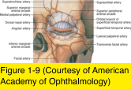
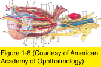
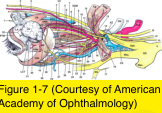
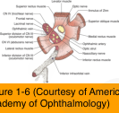
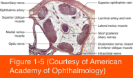

# 7.1.2. Orbital Anatomy (II)

## Images

## Hierarchy

- Intraorbital Optic Nerve
  - 4 mm in diameter
  - 30 mm long
    - longer than the orbit, allowing eye movement without traction on the nerve
  - surrounded by pia mater, arachnoid, and dura mater
    - continuous with the same layers covering the brain
    - at the orbital apex, dura mater
      - fuses with annulus of Zinn
      - is continuous with periosteum of optic canal
- Periorbita
  - periosteal covering of the orbital bones
  - at orbital apex, it fuses with dura mater of optic nerve
  - anteriorly, is continuous with orbital septum and the periosteum of the facial bones
    - line of fusion of these layers at the orbital rim
      - arcus marginalis
  - adheres loosely to the bone except at
    - orbital margin
    - sutures
    - fissures
    - foramina
    - tubercles
    - canals
    - subperiosteal fluid (pus or blood) is usually loculated within these boundaries
  - richly innervated by sensory nerves
- Vasculature of the Orbit
  - arterial supply
    - ophthalmic artery
      - origin
        - internal carotid artery
          - travels underneath the intracranial optic nerve through the dura mater
      - branches
        - branches to the extraocular muscles
        - central retinal artery
          - to the optic nerve and retina
        - posterior ciliary arteries
          - long to the anterior segment
          - short to the choroid
      - terminal branches of the ophthalmic artery form rich anastomoses with branches of the external carotid in the face and periorbital region
    - smaller contributions from the external carotid artery
      - internal maxillary artery
      - facial artery
  - venous drainage
    - superior ophthalmic vein
      - main venous drainage of the orbit
      - originates in superonasal quadrant of the orbit and extends posteriorly through the superior orbital fissure into the cavernous sinus
      - anastomoses anteriorly with veins of face and posteriorly with pterygoid plexus
- Extraocular Muscles and Orbital Fat
  - all EOMs, except the inferior oblique, originate at the orbital apex
    - 4 rectus muscles originate in the annulus of Zinn
    - levator palpebrae superioris arises above the annulus on the lesser wing of sphenoid bone
    - superior oblique muscle originates slightly medial to levator origin
      - trochlea on the superomedial orbital rim
        - turns posterolaterally
    - inferior oblique muscle originates in the anterior orbital floor lateral to the lacrimal sac
      - travels posterolaterally within the lower eyelid retractors
  - intermuscular septum
    - the membrane connecting the rectus muscles In the anterior portion of the orbit
    - divides the orbital fat into
      - intraconal fat
      - extraconal fat
  - orbit is further divided by many fine fibrous septa
    - unite and support the globe, optic nerve, and extraocular muscles
      - accidental/surgical trauma can disrupt this supporting system
      - entrapment of orbital connective tissue after fracture can cause restriction of eye movement
  - motor innervation
    - superior division of CN III
      - superior rectus
      - levator muscles
    - inferior division of CN III
      - inferior rectus
      - medial rectus
      - inferior oblique
    - CN IV
      - superior oblique
    - CN VI
      - lateral rectus
- Annulus of Zinn
  - fibrous ring formed by the common origin of the 4 rectus muscles
  - encircles the optic foramen and the central portion of the superior orbital fissure
  - separates the superior orbital fissure into 2 compartments
    - within the annulus (oculomotor foramen)
      - CN III (upper and lower divisions)
      - CN VI
      - nasociliary branch of the ophthalmic division of CN V (trigeminal)
    - outside the annulus
      - CN IV
        - only nerve that innervates an extraocular muscle and does not pass directly into the muscle cone
      - frontal and lacrimal branches of the ophthalmic division of CN V
      - superior ophthalmic vein
