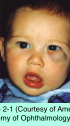

# 7.2.1. Evaluation of Orbital Disorders (I)

## Images

## Hierarchy

- 5 basic clinical patterns
  - (1) inflammatory
    - acute, subacute, and chronic
  - (2) mass effect
    - globe displacement with axial or nonaxial proptosis
  - (3) structural
    - congenital or acquired change in the bony orbital structure
  - (4) vascular
    - venous or arterial lesions with characteristic dynamic changes
  - (5) functional
    - sensory and/or motor dysfunction of neurovascular structures
- History
  - onset, course, and duration of symptoms and signs
    - pain
      - inflammatory or infectious lesions
      - orbital hemorrhage
      - malignant lacrimal gland tumors
      - invasion from adjacent nasopharyngeal carcinoma
      - metastatic lesions
    - progression
      - onset occurring over days to weeks
        - nonspecific orbital inflammation
        - scleritis
        - myositis
        - dacryoadenitis
        - orbital cellulitis
        - hemorrhage
        - thrombophlebitis
        - fulminant neoplasia
          - rhabdomyosarcoma
          - neuroblastoma
        - metastatic tumors
      - onset occurring over months to years
        - dermoid cyst
        - benign mixed tumor
        - neurogenic tumor
        - cavernous hemangioma
        - lymphoma
        - fibrous histiocytoma
        - fibrous dysplasia
        - osteoma
    - periorbital changes
      - ecchymosis of the eyelid skin
        - metastatic neuroblastoma
        - leukemia
        - amyloidosis
      - optociliary shunt vessels on the disc
        - "retinociliary venous collaterals"
        - meningioma
  - prior disease
    - thyroid eye disease
    - sinus disease
  - injury
    - head or facial trauma
  - systemic disease
    - especially cancer
  - family history
  - old photographs for establishing a timeline of the process
- Inspection
  - proptosis (exophthalmos)
    - forward displacement
    - asymmetry >2 mm suggests proptosis or enophthalmos
    - worm’s-eye view
      - proptosis best appreciated when the examiner looks up from below with the patient’s head tilted back
  - enophthalmos
    - retrodisplacement of the eye into the orbit
      - volume expansion of the orbit
        - fracture
      - orbital varix
      - sclerosing orbital tumors
        - metastatic breast carcinoma
  - exorbitism
    - angle between lateral orbital walls >90°
    - ± associated with shallow orbits
    - congenital or traumatic abnormalities
  - hypertelorism (telorbitism)
    - wider-than-normal separation between the medial orbital walls
    - congenital or traumatic abnormalities
  - telecanthus
    - abnormal increased distance between the medial canthi
  - hyperglobus or hypoglobus
    - vertical displacement
  - globe is usually displaced away from the site of the mass
    - axial displacement
      - intraconal mass behind the globe
        - cavernous hemangioma
        - glioma
        - meningioma
        - metastases
        - arteriovenous malformations
    - nonaxial displacement
      - lesion with a prominent component outside the muscle cone
        - superior displacement
          - maxillary sinus tumors invading the orbital floor
        - inferomedial displacement
          - orbital dermoid cysts
          - lacrimal gland tumors
        - inferolateral displacement
          - frontoethmoidal mucoceles, abscesses, osteomas
          - ethmoid sinus carcinomas
  - bilateral proptosis in adults
    - thyroid eye disease (TED)
      - most common cause
    - lymphoma
    - vasculitis
    - NSOI
    - metastatic tumors
    - carotid-cavernous fistulas
    - cavernous sinus thrombosis
    - leukemic infiltrates
  - unilateral proptosis in adults
    - most frequently caused by TED
  - bilateral proptosis in children
    - TED
    - NSOI
    - metastatic neuroblastoma
    - leukemic infiltrates
  - exophthalmometry
    - Hertel exophthalmometry
      - from the lateral orbital rim to the anterior corneal surface
    - Naugle exophthalmometer
      - uses the frontal and maxillary bones as its reference structure
        - useful in fracture patients when the lateral canthus has been displaced
  - globes are more prominent in
    - men
    - black patients
  - pseudoproptosis
    - simulation of abnormal prominence of the eye
      - asymmetric palpebral fissures
        - ipsilateral eyelid retraction
        - contralateral ptosis
        - facial nerve paralysis
    - true asymmetry that is not the result of increased orbital contents
      - asymmetric orbital size
      - enlarged globe
        - myopia
      - contralateral enophthalmos (silent sinus syndrome)
    - diagnosis should be postponed until a mass lesion has been ruled out
  - restriction of ocular motility
    - TED
      - inferior rectus is the muscle most commonly affected
        - limited globe elevation
        - may cause hypotropia in primary gaze
      - eyelid abnormalities are common
        - lid lag
          - highly suggestive of a diagnosis of TED
        - lid lag and retraction of upper and lower eyelids are the most common physical signs of TED
    - large or rapidly enlarging orbital mass
      - even in the absence of direct muscle invasion!
- Palpation
  - mass in the anterior orbit
    - palpable mass in the superonasal quadrant
      - mucocele
      - mucopyocele
      - encephalocele
      - neurofibroma
      - dermoid cyst
      - rhabdomyosarcoma
      - lymphoma
    - palpable mass in the superotemporal quadrant
      - prolapsed lacrimal gland
      - dermoid cyst
      - lacrimal gland tumor
      - lymphoma
      - NSOI
    - lesion behind the equator of the globe is usually not palpable
  - increased resistance to retrodisplacement of the globe
    - retrobulbar tumor
    - diffuse inflammation
      - TED
  - pulsations of the eye
    - abnormal vascular flow
      - arteriovenous communications
        - carotid-cavernous fistulas
    - transmission of normal intracranial pulsations through a bony defect
      - sinus mucoceles
      - surgical removal of bone
      - trauma
      - developmental abnormalities
        - encephalocele
        - meningocele
        - sphenoid wing dysplasia (associated with neurofibromatosis)
  - regional lymph nodes
- Auscultation
  - stethoscope over the globe or on the mastoid bone
  - may detect bruits
    - carotid-cavernous fistula
    - ± subjective audible bruit
    - often associated with tortuous dilated epibulbar vessels
