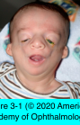
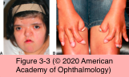

# 7.3.1. Congenital Orbital Anomalies

## Images

## Hierarchy

- Introduction
  - most significant congenital anomalies of the eye and orbit are apparent on ultrasonography before birth
  - the more profound the abnormality, the earlier in development it occurred
  - types
    - slowing/cessation of a normal stage of development
      - pure arrest
      - e.g. microphthalmia
    - superimposed aberrant growth following the original arrest
      - resulting deformity does not represent any previous normal stage of development
      - e.g. orbital cyst following incomplete closure of the fetal fissure
- Anophthalmia
  - total absence of tissues of the eye
  - primary anophthalmia
    - rare
    - usually bilateral
    - primary optic vesicle fails to grow out from the cerebral vesicle
  - secondary anophthalmia
    - rare
    - lethal
    - gross abnormality in the anterior neural tube
  - consecutive anophthalmia
    - secondary degeneration of the optic vesicle
  - orbital development is partially dependent on the size and growth of the globe
    - orbital bones, eyelids, and adnexal structures also fail to develop
- Microphthalmia
  - much more common than anophthalmia
    - most infants with a unilateral small orbit and no visible eye actually have a microphthalmic globe
  - small eye with axial length ≥2 standard deviations below the mean axial length for age
    - vary in size depending on the severity
  - types
    - isolated
    - part of a well-defined syndrome
      - multiple genetic mutations have been reported
        - developmental phenotype !
- Craniofacial Clefting and Syndromic Congenital Craniofacial Anomalies
  - developmental arrest or mechanical disruption of development
    - failure of neural crest cell migration
    - failure of fusion or movement of facial processes
  - skeletal facial clefts are distributed around the orbit and maxilla
  - soft tissue clefts are most apparent around the eyelids and lips
  - clefting syndromes affecting orbit and eyelids
    - oculoauriculovertebral spectrum
      - hemifacial microsomia
      - oculoauriculovertebral dysplasia (Goldenhar syndrome)
      - mandibulofacial dysostosis (Treacher Collins– Franceschetti syndrome
      - some forms of midline clefts with hypertelorism
  - craniosynostosis
    - premature closure of 1 or more sutures in the bones of the skull
    - types
      - isolated
      - syndromic
        - genetically heterogeneous disorder
          - fibroblast growth factor receptor 2 (FGFR2) genes
            - autosomal dominant
            - chromosome 10
        - frequently associated with
          - hypertelorism
          - proptosis
        - Crouzon syndrome (craniofacial dysostosis)
          - most common AD craniosynostosis syndrome
          - no syndactyly/polydactyly
        - Apert syndrome (acrocephalosyndactyly)
          - syndactyly > polydactyly
        - Pfeiffer syndrome
        - Saethre-Chotzen syndrome
          - TWIST gene
            - milder manifestations
            - chromosome 7
    - complications
      - various skeletal deformities
        - including orbital defects
      - ophthalmic problems
        - strabismus
        - astigmatism
        - ptosis
        - exophthalmos
        - nasolacrimal duct obstruction
        - amblyopia
      - secondary intracranial hypertension
  - intracranial contents can herniate through congenital clefts of skull or orbit
    - types
      - meningocele
      - encephalocele
      - meningoencephalocele
    - most commonly present anteriorly with subcutaneous protrusion near the medial canthus or over the bridge of the nose
      - straining or crying may increase the size of the mass
      - globe may be displaced temporally and downward (inferolaterally)
    - less commonly move into the posterior orbit
      - anterior displacement and pulsation of the globe
    - meningoceles/encephaloceles adjacent to the orbit are frequently associated with anomalies of the optic disc
      - morning glory disc
    - treatment
      - collaboration with a neurosurgeon
  - treatment
    - bony and soft tissue reconstruction
    - operations are staged and require a team approach
- Treatment of Anophthalmia/Microphthalmia
  - most microphthalmic eyes have no potential for vision
  - all children with microphthalmia have hypoplastic orbits
  - treatment focuses on achieving a cosmetically acceptable appearance that is reasonably symmetrical
  - treatment begins shortly after birth
  - techniques
    - socket expansion with progressively larger conformers
      - until the patient can be fitted with a prosthesis
      - enucleation is usually not necessary for the fitting of a conformer or an ocular prosthesis
        - enucleation should be avoided because it may worsen the bony hypoplasia
    - orbital volume augmentation with autogenous materials
      - dermis-fat grafts
        - may grow with the child, resulting in progressive socket expansion
      - synthetic implants
    - intraorbital tissue expanders
      - progressively inflated to enlarge the hypoplastic orbit
    - craniofacial techniques
      - severe bony asymmetry
      - severe microphthalmia or anophthalmia
      - older children with previously untreated microphthalmia
  - microphthalmia with orbital cyst
    - failure of the choroidal fissure to close in the embryo
    - usually unilateral
      - may be bilateral
    - orbital cyst may stimulate normal growth of involved orbital bone and eyelids
    - in some cases, orbital cyst may be removed for fitting of an ocular prosthesis
