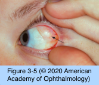
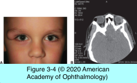

# 7.3.2: Congenital Orbital Tumors

## Images

## Hierarchy

- Hamartomas and Choristomas
  - hamartomas
    - anomalous growths of tissue consisting only of mature cells normally found at the involved site
      - infantile (capillary) hemangiomas
      - characteristic lesions of neurofibromatosis
  - Choristomas
    - tissue anomalies characterized by types of cells not normally found at the involved site
      - dermoid cysts
      - epidermoid cysts
      - dermolipomas
      - teratomas
- Dermolipoma
  - clinical presentation
    - benign
    - solid
    - located in and beneath the conjunctiva over the globe’s lateral surface
      - may have deep extensions to the levator aponeurosis and extraocular muscles
    - fine hairs
      - can be irritating
  - differential diagnosis
    - prolapsed orbital fat
    - prolapsed palpebral lobe of the lacrimal gland
    - lymphomas
  - treatment
    - require no treatment unless the lesion is ...
      - large
      - cosmetically objectionable
    - when possible, the overlying conjunctiva should be preserved
    - only the anterior, visible portion should be excised
    - avoid damage to
      - lacrimal gland ducts
      - extraocular muscles
      - levator aponeurosis
- Dermoid cyst
  - dermoid/epidermoid cysts are among the most common orbital tumors of childhood
  - congenital
    - enlarge progressively
  - superficial cysts usually become symptomatic in childhood
  - deep orbital dermoids may not become clinically evident until adulthood
  - histology
    - dermoid cyst
      - keratinizing epithelium
      - dermal appendages
        - hair follicles
        - sebaceous glands
      - contains oil and keratin
    - epidermoid cysts
      - epidermis only
        - no dermal appendages
      - usually filled with keratin
  - clinical presentation
    - palpable smooth, painless, oval mass
      - slow enlargement
      - freely mobile or fixed to periosteum
      - dermoids presenting in childhood are often superficial
    - location
      - lateral brow
        - adjacent to frontozygomatic suture
        - most common
      - medial upper eyelid
        - adjacent to frontoethmoidal suture
        - differential diagnosis
          - congenital encephaloceles
          - dacryoceles
          - vascular lesions
      - temporal fossa
        - rule out dumbbell dermoid cyst
          - pulsating proptosis with mastication
            - highly specific feature
    - deep dermoid cysts
      - situated posteriorly in the orbit
      - often are not palpable
      - do not present until adulthood
      - usually superior and temporal adjacent to bony sutures
      - globe and adnexa may be displaced
        - progressive proptosis
      - bone erosion or remodeling
        - long-standing dermoids
    - orbital inflammation
      - incited by leakage of oil and keratin from the cyst
      - may result in an orbitocutaneous fistula
      - may also occur following incomplete surgical removal
  - imaging
    - CT
      - margin
        - well defined
        - enhancing
        - partially calcified in most cases
      - nonenhancing lumen
    - magnetic resonance imaging
      - best appreciated on fat-suppression sequences
        - well-defined
        - variable size
        - round to ovoid
      - hypointense on T1-weighted images
      - relatively hyperintense on T2-weighted images
      - minimal enhancement
  - management
    - surgical excision
      - incision in the upper eyelid crease or directly over the lesion
      - cyst wall should be maintained during surgery
        - rupture of the cyst can lead to an acute inflammatory process if part of the cyst wall or any of the contents remain within the eyelid or orbit
          - if cyst wall is ruptured, the surgeon should remove the cyst contents
          - complete surgical removal may be difficult if cyst has leaked preoperatively and adhesions have developed
- Teratoma
  - rare
  - clinical presentation
    - severe unilateral proptosis at birth
      - may increase over the first few days or weeks
      - corneal exposure and vision loss
    - usually cystic
    - globe and optic nerve may be maldeveloped
      - when the lesion is smaller, the globe is often normal
  - histology
    - arise from all 3 germinal layers (ectoderm, mesoderm, and endoderm)
    - complex arrangement of various tissues
    - clear cysts lined by either epidermis or gastrointestinal or respiratory epithelium
    - Islands of
      - hyaline cartilage
      - cerebral tissue
      - epidermal cysts
      - choroid plexus
  - treatment
    - surgical excision
      - teratomas confined to the orbit are generally benign
        - teratomas in other parts of the body have been known to undergo malignant transformation
      - some cystic teratomas can be removed and ocular function preserved
    - exenteration
      - for malignant teratomas
