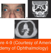

# 7.4.5. Non-infectious Orbital Inflammations (II)

## Images

## Hierarchy

- Polyarteritis nodosa
  - necrotizing vasculitis
    - small- & medium-sized arteries
      - necrosis of the muscularis layer
      - neutrophils
      - eosinophils
  - may affect orbital vessels but does not usually cause orbital disease
  - ophthalmic manifestations
    - retinal and choroidal infarction
- Giant cell arteritis (GCA)
  - affects the aorta and branches of the external and internal carotid arteries and vertebral arteries
    - orbital vessels are inflamed in GCA
      - generalized orbital ischemia is rare
    - usually spares the intracranial carotid branches
      - lack an elastic lamina
  - symptoms
    - vision loss
      - central retinal artery occlusion
      - ischemic optic neuropathy
    - diplopia
      - ischemic dysfunction of cranial motor nerves
    - headache
    - scalp tenderness
    - jaw claudication
    - malaise
  - diagnostic workup
    - elevated ESR
      - 90%
    - elevated CRP
    - elevated platelet count
    - temporal artery biopsy
      - provides a definitive diagnosis
      - bilateral biopsies are sometimes necessary
  - treatment
    - ophthalmic emergency
      - timely treatment with corticosteroids usually prevents an attack in the second eye
- IgG4 DISEASE
  - multiorgan disease with mass-forming lesions
  - infiltration of IgG4-expressing plasma cells with inflammatory T lymphocytes in various organs
    - dacryoadenitis
    - xanthogranuloma
    - orbital amyloidosis
    - nonspecific orbital inflammation
  - elevation in the levels of serum IgG4 and an acute-phase response
  - responds well to treatment with steroids
- Sarcoidosis
  - African or Scandinavian descent
  - multisystem disease
    - lungs are most commonly involved
  - orbit
    - lacrimal gland is most frequently affected
      - bilateral
    - extraocular muscles and optic nerve
      - very rare
    - sinus involvement with associated lytic bone lesions can invade the adjacent orbit
    - orbital sarcoidosis
      - Isolated orbital involvement
        - without associated systemic disease!
  - histology
    - noncaseating collections of epithelioid histiocytes in a granulomatous pattern
    - mononuclear inflammation at the periphery of the granuloma
  - diagnostic workup
    - Gallium scanning of the lacrimal glands
      - nonspecific
      - positive in 80% of patients with systemic sarcoidosis
        - 7% have clinically detectable enlargement of the lacrimal glands
    - biopsy
      - lacrimal gland
      - suspicious conjunctival lesion
        - random conjunctival biopsies have a low yield
    - chest radiography or CT
      - hilar adenopathy
      - pulmonary infiltrates
    - angiotensin-converting enzyme
    - serum lysozyme
    - serum calcium
    - bronchoscopy with washings and biopsy
  - acute sarcoidosis
    - <2 years duration
    - frequently with associated anterior uveitis in young patients
    - Löfgren syndrome
      - acute iritis
      - bilateral hilar adenopathy
      - febrile arthropathy
      - erythema nodosum
      - responsive to systemic corticosteroids
      - good long-term prognosis
    - Heerfordt syndrome (uveoparotid fever)
      - uveitis
      - parotitis
        - facial nerve palsy
      - fever
- Granulomatosis with polyangiitis (GPA)
  - Wegener granulomatosis
  - necrotizing granulomatous small-vessel vasculitis
    - ± giant cells
  - features
    - lesions of the upper respiratory tract
      - sinus mucosal involvement with bone erosion
    - lesions of the lower respiratory tract
      - tracheobronchial necrotic lesions
      - cavitary lung lesions
    - necrotizing glomerulonephritis
  - ocular disease
    - orbit and nasolacrimal drainage system involvement by extension from the surrounding sinuses
    - isolated orbital involvement
      - unilateral or bilateral
      - may lack frank necrotizing vasculitis
        - in the absence of respiratory tract and renal findings, may be difficult to diagnose
    - scleritis
  - limited forms of the disease
    - absent renal component
    - isolated orbital involvement
  - diagnostic workup
    - serum immunofluorescence
      - antineutrophil cytoplasmic antibody (ANCA)
        - C-ANCA
          - autoantibodies directed against proteinase-3
          - diffuse granular fluorescence within the cytoplasm
          - highly specific for GPA
          - may be negative early in the course of the disease
            - especially in the absence of multisystem involvement
          - can also be detected by ELISA
        - P-ANCA
          - fluorescence surrounding the nucleus
          - an artifact of ethanol fixation
            - can be caused by autoantibodies against many different target antigens
              - nonspecific
          - needs to be confirmed by ELISA for ANCA reacting with myeloperoxidase (MPO-ANCA)
            - MPO-ANCA testing has a high specificity for small-vessel vasculitis
        - absolute levels of ANCA do not define disease severity or activity
          - changing titers can give a general idea of disease activity
  - treatment
    - immunosuppression
      - cyclophosphamide
      - treatment with corticosteroids alone is associated with a significantly higher rate of mortality
    - long-term treatment with TMP-SMX appears to suppress disease activity in some patients
    - may have a fulminant, life-threatening course
