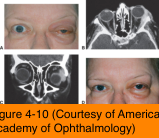

# 7.4.5. Non-infectious Orbital Inflammations (III): Nonspecific Orbital Inflammation (NSOI)

## Images

## Hierarchy

- pathogenesis
  - "orbital pseudotumor"
  - immune-mediated
  - often associated with systemic immunologic disorders
    - Crohn disease
    - systemic lupus erythematosus
    - rheumatoid arthritis
    - diabetes mellitus
    - myasthenia gravis
    - ankylosing spondylitis
  - rapid and favorable response to systemic corticosteroid
    - indicates a cell-mediated component
  - no known local or systemic cause
    - diagnosis of exclusion
- diagnostic workup
  - imaging
    - dacryoadenitis
      - diffuse enlargement of the lacrimal gland
    - myositis
      - thickening of the extraocular muscles
      - extraocular muscle tendons may be thickened in ≤50%
        - TED typically spares the muscle insertions
    - inflammatory infiltrate of the retrobulbar fat pad
    - tenonitis
      - contrast enhancement of the sclera
        - ring sign
      - acoustically hollow area corresponding to edematous Tenon capsule
  - peripheral blood eosinophilia
  - elevated ESR
  - elevated antinuclear antibody
  - mild cerebrospinal fluid pleocytosis
  - thorough systemic evaluation should be undertaken if there is any uncertainty regarding the diagnosis
- extraocular muscles (myositis)
  - most common
- histology
  - pleomorphic cellular infiltrate
    - lymphocytes
    - plasma cells
    - eosinophils
  - variable degrees of reactive fibrosis
    - becomes more marked as the process becomes more chronic
    - sclerosing subtype
      - predominance of fibrosis with sparse cellular inflammation
- clinical presentation
  - 5 orbital patterns
    - lacrimal gland (dacryoadenitis)
    - anterior orbit (eg, scleritis)
    - orbital apex
    - diffuse inflammation
    - may also extend into the adjacent sinuses or intracranial space
  - deep-rooted, boring pain
    - pain associated with ocular movement suggests myositis
  - extraocular muscle restriction
  - proptosis
  - conjunctival inflammation
  - chemosis
  - eyelid erythema
  - soft-tissue swelling
  - impaired vision
    - optic nerve involvement
    - posterior scleral involvement
  - some patients present with atypical signs and symptoms
    - atypical pain
    - limited inflammatory signs
    - fibrotic variant called sclerosing NSOI
    - more commonly require biopsy for diagnosis
  - simultaneous bilateral orbital inflammation in adults
    - r/o systemic vasculitis
  - children
    - ≈1/3 are bilateral
    - rarely associated with systemic disorders
    - 1/2 have
      - headache
      - fever
      - vomiting
      - abdominal pain
      - lethargy
    - more common in children
      - uveitis
      - elevated ESR
      - eosinophilia
- management
  - Biopsy
    - allows identification of
      - specific disease
      - possible systemic implications
        - 50% of biopsied inflammatory lacrimal gland lesions were associated with systemic disease
          - GPA
          - sclerosing inflammation
          - Sjögren syndrome
          - sarcoidal reactions
          - autoimmune disease
    - indications for orbital biopsy
      - incomplete therapeutic response
      - recurrent disease
      - many advocate biopsy of almost all infiltrative lesions, except for 2 clinical scenarios
        - orbital myositis
        - orbital apex syndrome
        - risk of biopsy may outweigh the risk of a missed diagnosis
  - systemic corticosteroids
    - initial therapy
    - adult dosage
      - 1 mg/kg of oral prednisone
        - taper as soon as the clinical response is complete
          - more slowly below 40 mg/day
          - very slowly below 20 mg/day
          - Rapid reduction of systemic steroids may allow a recurrence of inflammatory symptoms
      - pulse-dosed IV dexamethasone
        - followed by oral prednisone
        - may produce clinical improvement when oral prednisone alone fails
    - early/acute cases are more responsive to steroids than are advanced stages associated with fibrosis
      - abrupt resolution of the associated pain
    - prompt response to systemic steroids supports the diagnosis
      - inflammation associated with other orbital processes may also improve with systemic steroid administration
        - metastases
        - lymphoma
        - ruptured dermoid cyst
        - infections
  - sclerosing NSOI
    - responds poorly to steroids and to low-dose (2000 cGy) radiotherapy
    - typically requires more aggressive immunosuppression
      - cyclosporine
      - methotrexate
      - cyclophosphamide
