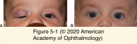
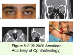

# 7.5.1. Orbital Neoplasms and Malformations (I): Vascular Tumors (I)

## Images

## Hierarchy

- Infantile (Capillary) Hemangioma
  - risk factors
    - female
    - low birth weight
    - prematurity
    - maternal chorionic villus sampling
  - natural course
    - present at birth or in the first few weeks of life
    - enlarge dramatically over 6–12 months
    - involute after the first year of life
      - 75% resolve during the first 3–7 years
  - clinical presentation
    - superficial (cutaneous)
      - bright red
      - soft
      - dimpled texture
    - subcutaneous
      - bluish
    - deep (within the orbit)
      - enlarging mass without overlying skin change
    - superonasal orbit & medial upper eyelid
      - most common
    - ± hemangiomas of other parts of the body
      - lesions involving neck can compromise airway
      - multiple large visceral lesions can produce thrombocytopenia
        - Kasabach-Merritt syndrome
  - ocular complications
    - amblyopia
    - strabismus
    - anisometropia
    - severe disfigurement
  - MRI
    - characteristic fine intralesional vascular channels and high blood flow
    - distinguish infantile hemangiomas from other vascular malformations
  - management
    - first line of management
      - observation
      - refractive correction
      - amblyopia therapy
      - treatment may be deferred until it is clear that the natural course will not lead to the desired result
    - indications for treatment
      - disruption of vision
      - severe disfigurement
    - β-blockers
      - initial therapy
      - topical timolol gel
        - for superficial tumors
        - limited systemic adverse effects
      - oral propranolol
        - for larger and deeper lesions
        - fewer adverse effects than systemic steroids
          - hypoglycemia
          - cardiovascular adverse effects
    - steroids
      - for lesions unresponsive to or showing limited improvement with β-blockers
      - topical
      - local injection
        - skin necrosis
        - subcutaneous fat atrophy
        - systemic growth retardation
        - retinal embolic vision loss
      - oral
    - surgical excision
      - for nodular lesions that are smaller, subcutaneous, or refractory to steroids
      - meticulous hemostasis
    - radiation therapy
      - cataract formation
      - bony hypoplasia
      - future malignancy
    - pulsed-dye laser therapy
      - superficial components of the hemangioma
    - sclerosing solutions
      - severe scarring
        - not recommended !
- Lymphatic Malformation
  - "lymphangiomas"
  - vascular dysgenesis
    - disruption of initially pluripotent vascular anlage leads to aberrant development and congenital malformation
  - clinical presentation
    - first or second decade of life
    - may also occur in
      - conjunctiva
      - eyelids
      - oropharynx
      - sinuses
    - noncontiguous intracranial vascular malformations
      - ≤25% of patients
      - low rate of spontaneous hemorrhage
        - not treated prophylactically
    - natural history
      - unpredictable
        - localized/slow progression
        - diffuse infiltrattion/inexorable enlargement
      - sudden spontaneous hemorrhage from interstitial capillaries
        - abrupt proptosis or mass lesion
      - may enlarge during upper respiratory tract infections
        - response of lymphoid tissues within lesion
  - histology
    - large, serum-filled channels lined by flat endothelial cells that have immunostaining patterns consistent with lymphatic capillaries
      - endothelial cells do not proliferate
        - not neoplasms!
    - contain both venous and lymphatic components
    - scattered follicles of lymphoid tissue
    - not encapsulated
      - infiltrative pattern
  - MRI
    - multiple grapelike cystic lesions with fluid–fluid layering of serum and red blood cells
      - pathognomonic
  - management
    - intralesional sclerosing agents
      - treatment of choice
        - lower adverse effects compared with surgical resection
      - successful in treating larger cystic components
        - reducing tumor bulk
      - technique
        - cyst is drained
        - extent is evaluated with contrast media
        - sodium morrhuate
          - introduced, withdrawn, and rinsed
        - absolute alcohol (other sclerosing agents)
          - introduced, withdrawn, and rinsed
        - .>1 treatment may be required
      - retained sclerosing foams of doxycycline and bleomycin
        - successful in treating the microcysts
    - surgical intervention
      - deferred unless vision affected
      - subtotal resection
        - to avoid sacrificing important structures
    - acute hemorrhage
      - indications for treatment
        - significant proptosis
        - optic neuropathy
        - corneal ulceration
      - mild hematomas may resolve spontaneously
      - ultrasound-guided aspiration of blood
      - open surgical exploration
- Hemangiopericytoma
  - uncommon
  - appear in midlife
  - resemble cavernous hemangiomas on CT and MRI
  - appear bluish intraoperatively
  - pathology
    - hypervascular
    - hypercellular
    - encapsulated
    - plump pericytes that surround a rich capillary network
    - no correlation between mitotic rate and clinical behavior
      - microscopically “benign” lesions may recur and metastasize
      - microscopically “malignant” lesions may remain localized
  - treatment
    - complete excision
      - may recur, undergo malignant degeneration, or metastasize
- Cavernous Hemangioma
  - most common benign neoplasm of the orbit in adults
  - F>M
  - clinical presentation
    - slowly progressive proptosis
    - strabismus
    - optic nerve compression
    - retinal striae
    - hyperopia
    - increased intraocular pressure (IOP)
    - growth may accelerate during pregnancy
  - orbital imaging
    - MRI
      - small intralesional vascular channels containing slowly flowing blood
    - well-encapsulated mass
    - homogeneously enhancing
    - radiodense phleboliths
      - chronic lesions
    - coronal imaging
      - important in determining the position of the cavernous hemangioma relative to the optic nerve
    - arteriography and venography
      - not useful because of limited communication with the systemic circulation
  - histology
    - encapsulated
    - large cavernous spaces containing red blood cells
    - walls of the spaces contain smooth muscle
  - surgical excision
    - indications
      - compromised ocular function
      - significant proptosis
      - significant growth
    - cavernous hemangiomas have surgical planes that allow easier separation from normal orbital tissues
  - rarely involute spontaneously
