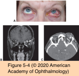
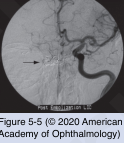

# 7.5.2. Orbital Neoplasms and Malformations (II): Vascular Tumors (II)

## Images

## Hierarchy

- Venous Malformation
  - "orbital varices"
  - vascular dysgenesis
    - low-flow
  - clinical presentation
    - enophthalmos at rest
    - proptosis
      - increases when the patient’s head is dependent or after a Valsalva maneuver
  - imaging
    - contrast-enhanced rapid spiral CT during a Valsalva maneuver
      - characteristic enlargement of the engorged veins
      - phleboliths
  - treatment
    - conservative
      - biopsy should be avoided because of the risk of hemorrhage
    - surgery
      - reserved for
        - significant pain
        - vision-threatening compressive optic neuropathy
      - complete surgical excision is difficult
        - lesions often intertwine with normal orbital structures
      - intra-operative embolization of the lesion may aid surgical removal
    - embolization with coils
      - to diminish symptoms
- Arteriovenous Fistula
  - introduction
    - abnormal direct communication between an artery and a vein
      - blood does not pass through an intervening capillary bed
    - etiology
      - trauma
      - degeneration
    - 2 forms of acquired arterial diversion that affect the cavernous sinus
      - direct carotid-cavernous fistulas
      - indirect (dural) carotid-cavernous fistula
  - direct carotid-cavernous fistulas
    - connection between the internal carotid artery and the cavernous sinus
      - high rate of blood flow
    - etiology
      - trauma
        - causes a tear or hole in a branch artery of the internal carotid
      - iatrogenic
        - during neurosurgical or neuroradiologic procedures
    - clinical presentation
      - tortuous epibulbar vessels
      - bruit
        - ± audible to the examiner and the patient
      - pulsatile proptosis
      - ischemic ocular damage
        - diversion of arterialized blood into the venous system
          - venous outflow obstruction
      - elevated IOP
      - choroidal effusions
      - blood in the Schlemm canal
      - nongranulomatous anterior uveitis
      - ocular motility abnormalities
        - congestion within the orbit
        - increased pressure in the cavernous sinus
          - compression of cranial nerves III, IV, or, most commonly, VI,
    - CT scans
      - diffuse enlargement of some or all of extraocular muscles
      - characteristically enlarged superior ophthalmic vein
  - indirect (dural) carotid-cavernous fistulas
    - connection between meningeal branches of internal or external carotid artery and cavernous sinus
      - lower rate of blood flow
    - degenerative process in older patients with
      - systemic hypertension
      - vascular disease
      - atherosclerosis
    - clinical presentation
      - insidious onset
      - orbital congestion
      - proptosis
      - pain
      - arterialization of the conjunctival veins
        - chronic red eye
      - increased episcleral venous pressure
        - IOP elevation on the ipsilateral side
          - glaucomatous optic disc damage
      - mild
  - diagnostic workup
    - magnetic resonance angiography (MRA)
      - not as sensitive as conventional angiography
    - conventional angiography
      - gold standard
      - stroke is a rare but possible adverse effect
  - treatment
    - endovascular treatment
      - coils
      - glue
    - direct carotid-cavernous fistula
      - usually requires intervention
      - transarterial approach
        - more common
      - transvenous approach by transcutaneous canalization of the superior ophthalmic vein
        - may require an orbitotomy to directly access the vein
    - indirect (dural) carotid-cavernous fistula
      - small dural carotid-cavernous fistulas often close spontaneously
        - may initially be observed
      - higher risk for intracranial hemorrhage
        - some investigators have recommended more aggressive management
      - transvenous access
- Arteriovenous Malformation (AVM)
  - vascular dysgenesis
    - high-flow
    - abnormally formed anastomosing arteries and veins without an intervening capillary bed
  - dilated corkscrew episcleral vessels
  - management
    - arteriography
    - selective occlusion of the feeding vessels
      - followed by surgical excision
        - exsanguinating arterial hemorrhage may occur
- Orbital Hemorrhage
  - etiology
    - trauma
    - surgery
    - vascular malformations
    - sudden increase in venous pressure (eg, Valsalva maneuver)
      - rare
      - spontaneous orbital hemorrhage almost always occurs in the superior subperiosteal space
  - treatment
    - observation
    - urgent drainage
      - if there is associated visual compromise
