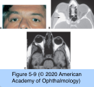
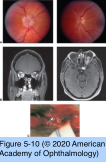

# 7.5.3. Orbital Neoplasms and Malformations (III): Neural Tumors (I)

## Images

## Hierarchy

- Neurofibroma
  - histology
    - proliferating Schwann cells within the nerve sheaths
    - axons
    - endoneural fibroblasts
    - mucin
  - types
    - plexiform neurofibromas
      - diffuse proliferations of Schwann cells within nerve sheaths
      - neurofibromatosis 1 (NF1)
      - well vascularized
      - infiltrative
        - complete surgical excision difficult
          - surgery is limited to tumors that compromise vision or produce disfigurement
    - discrete neurofibromas
      - less common
      - can usually be excised surgically without recurrence
  - neurofibromatosis 1
    - von Recklinghausen disease
    - autosomal dominant
      - incomplete penetrance
    - phakomatosis
      - characterized by the presence of hamartomas involving
        - skin
        - eye
        - central nervous system
        - viscera
      - most common phakomatous disorder
    - orbital features
      - plexiform neurofibromas involving the lateral aspect of the upper eyelid
        - S-shaped contour of the eyelid margin
      - pulsating proptosis secondary to sphenoid bone dysplasia
      - optic nerve glioma
- Meningioma
  - invasive tumors arising from the arachnoid villi
  - types of orbital meningioma
    - sphenoid wing meningioma with secondary orbital extension
      - through
        - bone
        - superior orbital fissure
        - optic canal
      - hyperostosis
      - hyperplasia of associated soft tissues
      - MRI
        - contrast enhancement
        - presence of a dural tail (reactive thickening of the dura adjacent to the meningioma)
          - helps distinguish a meningioma from fibrous dysplasia
    - primary optic nerve sheath meningioma
      - originates in the arachnoid of the optic nerve sheath
      - F>M
      - third or fourth decade of life
  - clinical presentation
    - related to the location of the primary tumor
      - near the sella and optic nerve
        - early visual field defects
        - papilledema or optic atrophy
      - near the pterion (posterior end of the parietosphenoid fissure, at the lateral portion of the sphenoid bone)
        - temporal fossa mass
        - proptosis or nonaxial displacement of the globe
        - eyelid edema (especially of the lower eyelid)
        - chemosis
    - symptoms
      - gradual, painless, unilateral loss of vision
    - relative afferent pupillary defect
    - proptosis
    - ophthalmoplegia
    - optic nerve head may appear
      - normal
      - atrophic
      - swollen
      - ± optociliary shunt vessels
    - occasionally, optic nerve sheath meningiomas occur bilaterally or meningiomas occur ectopically in the orbit
      - associated with neurofibromatosis
  - imaging characteristics
    - usually sufficient to allow diagnosis of optic nerve sheath meningiomas
    - diffuse tubular enlargement of the optic nerve with contrast enhancement
    - CT
      - ± calcification
        - tram-tracking
    - MRI
      - fine pattern of enhancing striations emanating from the lesion in a longitudinal fashion
        - striations represent the infiltrative nature of the tumor
      - MRI can show dural extension through the optic canal into the intracranial space
  - malignant meningioma
    - rare
    - rapid tumor growth
    - not responsive to
      - surgical resection
      - radiotherapy
      - chemotherapy
    - histologically, malignant meningiomas are indistinguishable from the more common benign group
  - management
    - sphenoid wing meningiomas
      - observed until they cause functional deficits
        - profound proptosis
        - compressive optic neuropathy
        - motility impairment
        - cerebral edema
      - resection
        - combined intracranial and orbital approach
        - complete surgical resection is not always a practical goal
          - goal of surgery is to reverse the compressive effects of the lesion
        - ± postoperative radiotherapy
          - to reduce the risk of further growth and spread of the residual tumor
        - follow up clinically and with serial MRI scans
    - optic nerve sheath meningiomas
      - individualized
        - extent of vision loss
        - presence of intracranial extension
      - observation
        - if vision is minimally affected and no intracranial extension is present
        - periodic MRI examination is used to carefully monitor for possible posterior or intracranial extension
      - radiation therapy
        - if tumor is confined to the orbit and vision loss is significant or progressive
        - fractionated stereotactic radiotherapy
        - stabilization or improvement of visual function
      - surgical excision
        - causes irreversible vision loss
        - surgery is reserved for patients with severe vision loss and profound proptosis
        - the optic nerve is excised with the tumor, from the back of the globe to the chiasm
- Schwannoma
  - neurilemoma
  - proliferations of Schwann cells
  - encapsulated by perineurium
    - can be excised with relative ease
      - similar to neurofibromas
  - biphasic pattern
    - solid areas with nuclear palisading
      - Antoni A pattern
    - myxoid areas
      - Antoni B pattern
  - hypercellular schwannomas
    - sometimes recur even after what is thought to be complete removal
    - seldom undergo malignant transformation
