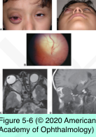

# 7.5.4. Orbital Neoplasms and Malformations (IV): Neural Tumors (II): Optic Nerve Glioma

## Images

## Hierarchy

- epidemiology
  - uncommon
  - children in the first decade of life
  - ≤ 1/2 of optic nerve gliomas are associated with neurofibromatosis
- clinical feature
  - vision loss
  - afferent pupillary defect
  - gradual, painless, unilateral axial proptosis
  - optic atrophy
  - optic disc swelling
  - nystagmus
  - strabismus
  - chiasm is involved in ≈ 1/2
  - intracranial involvement may be associated with
    - intracranial hypertension
    - decreased function of the hypothalamus and pituitary gland
- management
  - controversial
    - any treatment plan must be carefully individualized
      - tumor’s growth characteristics
      - extent of optic nerve and chiasmal involvement
      - vision of the involved and uninvolved eye
      - presence or absence of concomitant neurologic or systemic disease
      - history of previous treatment
  - observation
    - indications
      - characteristic radiographic features
      - good vision
      - tumor confined to the orbit
    - examinations and appropriate radiographic studies must be performed at regular intervals
      - preferably MRI
    - many patients maintain good vision and never require surgery
  - surgical excision
    - indications
      - tumor involves the prechiasmal intracranial portion of the optic nerve
        - to isolate the tumor from the optic chiasm
      - rapid intraorbital tumor growth
      - proptosis with corneal exposure
      - unacceptable cosmetic appearance
    - transcranial approach to obtain tumor-free surgical margins
      - complete excision is possible if the tumor ends 2–3 mm anterior to the chiasm
  - chemotherapy
    - combination chemotherapy
      - actinomycin D
      - vincristine
      - etoposide
    - indication
      - progressive chiasmal-hypothalamic gliomas
        - may delay the need for radiation therapy
    - long-term risks of blood-borne cancers
  - radiation therapy
    - indications
      - if the tumor cannot be resected (usually chiasmal or optic tract lesions)
      - if symptoms (particularly neurologic) progress after chemotherapy
      - postoperative radiation of the chiasm and optic tract
        - if subsequent growth of the tumor within the chiasm
        - if chiasmal and optic tract involvement is extensive
    - adverse effects
      - intellectual disability
      - growth retardation
      - secondary tumors within the radiation field
    - generally held as a last resort for children who have not completed growth and development
- pathology
  - smooth, fusiform intradural lesion
    - optic gliomas arising in patients with neurofibromatosis often proliferate in the subarachnoid space
    - optic gliomas in patients without neurofibromatosis usually expand within the optic nerve substance without invading the dura mater
  - juvenile pilocytic (hairlike) astrocytomas
    - benign
  - arachnoid hyperplasia
  - mucosubstance
  - Rosenthal fibers
- orbital imaging
  - fusiform enlargement of the optic nerve
  - stereotypical kinking of the nerve
  - MRI
    - cystic degeneration
    - more accurate in defining the extent of an optic canal lesion and intracranial disease
  - neuroimaging is frequently diagnostic
    - usually unnecessary to perform a biopsy
      - biopsy tissue from too peripheral a portion of the optic nerve may capture reactive meningeal hyperplasia
        - misdiagnosis of fibrous meningioma
      - biopsy of the optic nerve may produce additional loss of visual field or vision
- malignant optic nerve gliomas (glioblastomas)
  - very rare
  - adult males
  - severe retro-orbital pain
  - unilateral or bilateral vision loss
  - massive swelling and hemorrhage of the optic nerve head
  - treatment
    - high-dose radiotherapy and chemotherapy
  - usually result in death within 6–12 months
- natural course
  - most cases remain stable or progress very slowly
  - occasional case behaves aggressively
  - rare reports of spontaneous regression of optic nerve/visual pathway gliomas
  - cystic enlargement associated with sudden vision loss can occur without true cellular growth
