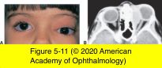
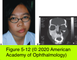

# 7.5.5. Orbital Neoplasms and Malformations (V): Mesenchymal Tumors

## Images

## Hierarchy

- Miscellaneous Mesenchymal Tumors
  - fibrous histiocytoma
    - most common
    - very firm
    - fibroblastic and histiocytic cells in a storiform (matlike) pattern
    - difficult to distinguish, clinically and histologically, from hemangiopericytoma
    - locally aggressive
    - <10% have metastatic potential
      - similar to embryonal RMS
    - Fibrous histiocytoma (fibroxanthoma)
      - adults
        - median age=43 years
          - 6 mo - 85 years
      - upper nasal orbit
      - histology
        - fibroblasts
          - storiform/whorly/matlike pattern
        - histiocytes
        - immunohistochemistry
          - CD45
          - CD68
      - clinical behavior
        - benign
          - most common
        - intermediate
        - malignant
          - high mitosis rate
            - .>1/HPF
          - nuclear pleomorphism
          - necrosis
          - <10% have metastatic potential
        - locally aggressive
      - difficult to distinguish, clinically and histologically, from hemangiopericytoma
  - part of hemangiopericytoma spectrum
  - solitary fibrous tumor
    - spindle-shaped cells
      - strongly CD34-positive
    - anywhere in the orbit
    - may recur
    - may undergo malignant degeneration
    - may metastasize if incompletely excised
  - fibrous dysplasia
    - benign developmental disorder of bone
    - may involve a single region or be polyostotic
    - CT
      - hyperostotic bone
    - MRI
      - lack of dural enhancement distinguishes this condition from meningioma
    - Albright syndrome
      - cutaneous pigmentation
      - endocrine disorders
      - fibrous dysplasia
    - resection or debulking
      - indications
        - disfigurement
        - vision loss due to stricture of the optic canal
  - osteomas
    - benign
    - can involve any of the periorbital sinuses
    - clinical presentation
      - proptosis
      - compressive optic neuropathy
      - orbital cellulitis secondary to obstructive sinusitis
      - slow-growing
    - CT
      - dense hyperostosis with well-defined margins
    - complete excision is advised for symptomatic tumors
  - malignant mesenchymal tumors
    - types
      - fibrosarcoma
      - liposarcoma
      - chondrosarcoma
      - osteosarcoma
        - destroy normal bone and have characteristic calcifications visible in radiographs and CT scans
    - rarely involve orbit
    - children with bilateral retinoblastoma are at higher risk for osteosarcoma, chondrosarcoma, or fibrosarcoma
      - even if they have not been treated with therapeutic radiation
- Rhabdomyosarcoma
  - epidemiology
    - most common primary orbital malignancy of childhood
    - average age of onset
      - 5–7 years
  - arises from undifferentiated pluripotential mesenchymal elements
    - not from the extraocular muscles
  - 4 categories
    - Embryonal
      - most common type
        - 80%
      - predilection for the superonasal quadrant of the orbit
      - loose fascicles of undifferentiated spindle cells
        - only a minority show cross-striations in immature rhabdomyosarcomas
          - trichrome staining
      - 94% 5-year survival
    - Alveolar
      - 9%
      - predilection for the inferior orbit
      - rounded rhabdomyoblasts either line up along the connective tissue strands or float freely in the alveolar spaces
      - most malignant form
        - 65% 5-year survival
    - Pleomorphic
      - least common
      - most differentiated
        - cross-striations are easily visualized with trichrome stain
      - straplike or rounded cells
      - best prognosis
        - 97% 5-year survival
    - Botryoid
      - rare variant of embryonal rhabdomyosarcoma
      - grapelike
      - not found in the orbit as a primary tumor
        - secondary invader from the paranasal sinuses or from the conjunctiva
  - clinical presentation
    - sudden onset and rapid progression of unilateral proptosis
    - less dramatic course in patients in their early teens
      - gradually progressive proptosis lasting weeks to > 1 month
    - edema & discoloration of eyelids
    - ptosis
    - strabismus
    - ± palpable mass
      - particularly in the superonasal quadrant of the eyelid
      - may be retrobulbar
      - may involve any quadrant of the orbit
      - may rarely arise from the conjunctiva
    - unrelated history of trauma can lead to delay in diagnosis and treatment
  - diagnostic workup
    - should proceed urgently
    - CT and MRI
      - to define the location and extent of the tumor
    - biopsy
      - anterior orbitotomy
      - often possible to completely remove a rhabdomyosarcoma if it has a pseudocapsule
        - the smaller the residual tumor, the more effective the combination of adjuvant radiation and chemotherapy in achieving a cure
      - in diffusely infiltrating tumors, a large biopsy specimen should be obtained so that adequate material is available for
        - frozen sections
        - permanent light-microscopy sections
        - electron microscopy
        - immunohistochemistry
      - cross-striations are often not visible on light microscopy
        - more readily apparent on electron microscopy
    - palpate the cervical and preauricular lymph nodes
      - to evaluate for regional metastases
    - chest radiography
    - bone marrow aspiration and biopsy
      - under anesthesia at the time of the initial orbital biopsy
    - lumbar puncture
  - management
    - Intergroup Rhabdomyosarcoma Study Group guidelines
    - radiation therapy
      - 4500 to 6000 cGy
      - x 6 weeks
      - adverse effects of radiation
        - common in children
        - radiation dermatitis
        - bony hypoplasia
        - cataract
    - systemic chemotherapy
      - to eliminate microscopic cellular metastases
    - exenteration
      - for recurrent cases
    - survival rate >90%
      - if the orbital tumor has not invaded or extended beyond the bony orbital walls
