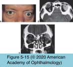

# 7.5.7. Orbital Neoplasms and Malformations (VII): Lacrimal Gland Tumors

## Images

## Hierarchy

- Introduction
  - classification
    - nonspecific inflammation (dacryoadenitis)
      - majority
      - present with acute inflammatory signs
      - usually respond to anti-inflammatory medication
    - non-inflammatory
      - lymphoproliferative disorders
        - majority
        - ≤50% of orbital lymphomas develop in the lacrimal fossa
      - epithelial neoplasms
        - minority
        - benign mixed tumors (pleomorphic adenomas)
          - 50%
        - carcinomas
          - 50%
            - adenoid cystic carcinomas
              - ≈ 50%
            - malignant mixed tumors
            - primary adenocarcinomas
            - mucoepidermoid carcinomas
              - ≈ %50
            - squamous carcinomas
  - orbital imaging
    - inflammatory and lymphoid proliferations
      - elongated mass
      - mold around the globe
      - no bony change due to a lymphoproliferative lesion
    - epithelial neoplasms
      - isolated globular mass
      - displace and indent the globe
      - bone of the lacrimal fossa is remodeled in response to a slowly growing benign epithelial lesion
- Epithelial Tumors of the Lacrimal Gland
  - Pleomorphic adenoma
    - benign mixed tumor
    - most common epithelial tumor of the lacrimal gland
    - 4th-5th decade of life
    - slightly more common in men
    - clinical presentation
      - progressive, painless downward and inward displacement of the globe with axial proptosis
      - symptoms usually present for >12 months
      - firm, lobular mass
        - palpated near the superolateral orbital rim
    - orbital imaging
      - well circumscribed mass
        - nodular configuration
      - enlargement or expansion of the lacrimal fossa
    - histology
      - benign epithelial cells
      - stroma composed of spindle-shaped cells
      - cartilaginous, mucinous, or even osteoid degeneration or metaplasia
      - pseudocapsule
    - management
      - complete removal of the tumor with its pseudocapsule and a surrounding margin of orbital tissue
      - no preliminary biopsy !
        - recurrence rate if capsule is incised for direct biopsy
          - 32%
          - risk of malignant degeneration in recurrences
            - 10% /decade
  - Adenoid cystic carcinoma
    - most common malignant tumor of the lacrimal gland
    - clinical presentation
      - highly malignant
      - rapid course
        - history of generally < 1 year
      - pain
        - perineural invasion
        - bone destruction
        - early onset of pain helps differentiate this malignant tumor from benign mixed tumor
      - usually extends into the posterior orbit
        - lack of true encapsulation
        - capacity to infiltrate
    - recurrence after resection is problematic
    - pathology
      - benign-appearing cells that grow in tubules, solid nests, or a Swiss-cheese pattern
        - basaloid
          - worse survival
        - cribriform
      - infiltration of the orbital tissues
      - perineural invasion
  - Malignant mixed tumor
    - histology
      - similar to benign mixed tumors
      - areas of malignant change
        - poorly differentiated adenocarcinomas
    - arise from
      - long-standing primary benign mixed tumor
        - change in growth rate is a hallmark of malignant degeneration
      - benign mixed tumor that has recurred following initial incomplete excision or violation of the pseudocapsule
  - Management of malignant lacrimal gland tumors
    - exenteration & radical orbitectomy
      - removal of
        - roof, lateral wall, and floor
        - overlying soft tissues and anterior portion of the temporalis muscle
      - no improvement in long-term survival
    - high-dose radiation therapy + surgical debulking
    - intracarotid chemotherapy + exenteration
      - duration of follow-up is not yet adequate to prove efficacy
    - prognosis
      - typical clinical course is that of multiple painful recurrences
        - occurring a decade or more after the initial presentation
      - perineural extension into the cavernous sinus often occurs
      - ultimate mortality from
        - intracranial extension
        - systemic metastases
          - less common
          - managed by local resection
- Nonepithelial Tumors of the Lacrimal Gland
  - most of the nonepithelial lesions of the lacrimal gland represent lymphoid proliferation or inflammations
  - lymphoproliferative conditions
    - ≤50% develop in the lacrimal gland
    - benign lymphocytic infiltrates
      - F>M
      - bilateral swelling of the lacrimal gland
        - insidiously or following a symptomatic episode of lacrimal gland inflammation
        - enlargement of the lacrimal glands may not be clinically apparent
      - dry eye syndrome
        - may improve with the use of topical cyclosporine
      - pathology
        - lymphocytic infiltration
        - proliferation of myoepithelial cells surrounding inner duct cells
          - epimyoepithelial islands
        - lymphoepithelial lesions
      - Sjögren syndrome
      - localized lacrimal gland and salivary gland lesion
        - Mikulicz syndrome
      - may develop into low-grade B-cell lymphoma
  - inflammatory conditions
    - nonspecific orbital inflammation
    - sarcoidosis
  - references
