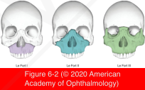
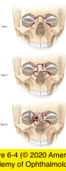

# 7.6.1. Orbital Trauma (I): Orbital Fractures (I)

## Images

## Hierarchy

- Orbital Apex Fractures
  - usually in association with other fractures of face, orbit, or skull
  - may involve optic canal, superior orbital fissure, and structures that pass through them
  - associated complications
    - damage to optic nerve
    - cerebrospinal fluid leak
    - carotid-cavernous sinus fistula
  - Indirect traumatic optic neuropathy
    - stretching, tearing, twisting, or bruising of the fixed canalicular portion of the nerve
  - thin-section computed tomography (CT)
- Midfacial (Le Fort) Fractures
  - involve the maxilla
    - often complex and asymmetric
    - extend posteriorly through the pterygoid plates
  - Le Fort I
    - low transverse maxillary fracture above the teeth with no orbital involvement
  - Le Fort II
    - pyramidal configuration and involve the nasal, lacrimal, and maxillary bones as well as the medial orbital floor
  - Le Fort III
    - cause craniofacial disjunction
      - entire facial skeleton is completely detached from the base of the skull
    - orbital floor and medial and lateral orbital walls are involved
  - treatment
    - dental stabilization with arch bars
    - open reduction of the fracture with rigid fixation using titanium plating systems
- Zygomatic Fractures
  - Zygomaticomaxillary complex (ZMC) fractures
    - "tripod" fractures
      - zygoma is usually fractured at 4 of its articulations with the adjacent bones !
        - frontozygomatic suture
        - inferior orbital rim
        - zygomatic arch
        - lateral wall of the maxillary sinus
  - clinical presentation
    - globe displacement
    - cosmetic deformity
    - diplopia
    - trismus (limitation of mandibular opening)
  - involve the orbital floor to varying degrees
  - treatment
    - observation
      - if the zygoma is not significantly displaced
    - open reduction and rigid plate fixation
      - best results
      - exact realignment and stabilization of the lateral maxillary buttress and the lateral orbital wall are essential
      - approach
        - sublabial or buccal sulcus incision
        - eyelid incision
          - if the lateral maxillary buttress is only mildly displaced
- Medial Orbital Fractures
  - naso-orbital-ethmoidal (NOE) fractures
    - frontal process of the maxilla
    - lacrimal bone
    - ethmoid bones
  - etiology
    - face striking solid surfaces
  - clinical presentation
    - depressed bridge of the nose
    - traumatic telecanthus
  - classification
    - type I
      - central fragment of bone attached to canthal tendon
    - type II
      - comminuted fracture of the central fragment
    - type III
      - comminuted tendon attachment or avulsed tendon
  - complications
    - cerebral damage
    - ocular damage
    - severe epistaxis
      - avulsion of the anterior ethmoidal artery
    - orbital hematoma
    - cerebrospinal fluid rhinorrhea
    - damage to the lacrimal drainage system
    - lateral displacement of the medial canthus
    - associated fractures of the medial orbital wall and floor
  - treatment
    - repair of the nasal fracture
    - plate stabilization
    - transnasal wiring of the medial canthus
      - used less frequently
      - miniplate fixation often allows precise bony reduction!
  - indirect (blowout) fractures
    - pathogenesis
      - extension of blowout fractures of the orbital floor
        - more common
      - Isolated blowout fracture of the medial orbital wall
    - indications for surgical intervention
      - muscle and associated tissue entrapment
      - enophthalmos
        - large, isolated medial wall fractures
        - higher risk when both the floor and the medial wall are fractured
    - treatment
      - medial orbital wall approach
        - continuing the exploration of the floor up along the medial wall
          - via the eyelid or transconjunctival approach
        - medial orbitotomy through a Lynch (frontoethmoidal) incision in the skin
        - transcaruncular approach
- Orbital Roof Fractures
  - pathogenesis
    - blunt trauma
      - in older patients, frontal trauma is partially absorbed by the frontal sinus
    - missile injuries
  - more common in young children
    - young children may develop nondisplaced linear roof fractures after fairly minor trauma
      - delayed ecchymosis of the upper eyelid
  - complications
    - intracranial
      - brain injury
      - cribriform plate fracture
      - cerebrospinal fluid rhinorrhea
      - pneumocephalus
    - orbital
      - subperiosteal hematoma
      - contusion
      - edema
      - entrapment of extraocular muscles
        - rare
      - pulsating exophthalmos
        - delayed complication
      - extraocular muscle imbalance
      - ptosis
  - treatment
    - most roof fractures do not require repair
    - indications for surgery
      - neurosurgical complications
  - team approach with a neurosurgeon and an orbital surgeon
