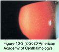
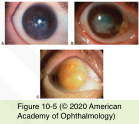
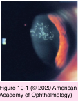
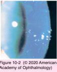
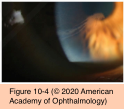

# 8.10.1. Corneal Dystrophies (I): Epithelial and Subepithelial Dystrophies

## Images

## Hierarchy

- Meesmann epithelial corneal dystrophy (MECD)
  - inheritance
    - autosomal dominant
      - 12q13
        - keratin K3 (KRT3)
      - 17q12
        - keratin K12 (KRT12)
  - pathology
    - epithelial microcysts
      - degenerated epithelial cell debris
        - PAS-positive
        - autofluorescent
        - electron-dense accumulation of granular and filamentary material
          - “peculiar substance”
    - epithelial cells
      - frequent mitoses
      - basal epithelial cells have increased glycogen
    - thickened basement membrane with projections into the basal epithelium
  - symptoms
    - mild irritation
    - slight decrease in vision
    - glare and light sensitivity
      - unlike EBMD
    - painful recurrent erosions
  - clinical presentation
    - appears very early in life
    - tiny bubble-like epithelial vesicles/blebs
      - most easily seen with retroillumination
      - most numerous in the interpalpebral area
        - extend out to the limbus
      - epithelium surrounding the cysts is clear
    - ± whorled and wedge-shaped epithelial patterns
    - ± slightly thinned cornea
    - ± reduced corneal sensation
  - management
    - most patients require no treatment
    - soft contact lens wear in patients with frequent symptoms
- Introduction
  - bilateral
  - symmetric
  - inherited
  - little or no relationship to environmental or systemic factors
  - begin early in life
    - may not become clinically apparent until later
      - slowly progressive
        - more pronounced with age
  - genetics
    - dystrophies that appear the same phenotypically may map to different chromosomes
    - dystrophies that map to the same gene may have different phenotypes
    - International Committee for the Classification of Corneal Dystrophies (IC3D)
      - category 1
        - well-defined corneal dystrophy in which the gene has been mapped
      - category 2
        - well-defined corneal dystrophy that has been mapped to one or more specific chromosomal loci, but the gene(s) remains to be identified
      - category 3
        - well-defined corneal dystrophy in which the disorder has not yet been mapped to a chromosomal locus
      - category 4
        - suspected new, or previously documented, corneal dystrophy, although the evidence for its being a distinct entity is not yet convincing
  - See Tables 10-1, 10-2, and 10-3
- similar to macular dystrophy & CHED2
- Gelatinous droplike corneal dystrophy (GDLD)
  - inheritance
    - autosomal recessive
      - locus 1p32
        - tumor-associated calcium signal transducer 2 (TACSTD2) gene
  - pathology
  - symptoms
    - significant decrease in vision
      - subepithelial and stromal amyloid deposits
      - similar to lattice dystrophy
    - photophobia
    - irritation
    - tearing
  - clinical presentation
    - onset in first to second decade of life
    - subepithelial lesions
      - similar to band keratopathy
      - groups of multiple small nodules (mulberry configuration)
      - larger nodular lesions (kumquat-like lesions) may develop
    - lesions are visible on fluorescein staining
    - ± superficial vascularization
  - treatment
    - superficial keratectomy
    - lamellar keratoplasty
    - penetrating keratoplasty
    - recurrence within a few years is seen in all patients
    - soft contact lenses
      - to decrease recurrences
  - references
- Epithelial basement membrane dystrophy (EBMD)
  - "Map-dot-fingerprint dystrophy"
  - epidemiology
    - 6%–18% of the population
    - more common after age 50 years
    - F>M
    - inheritance
      - sporadic (no documented inheritance)
  - histologic findings
    - a thickened basement membrane with extension into the epithelium
      - map/fingerprint lines
      - abnormal epithelial cells with microcysts (often with absent or abnormal hemidesmosomes)
    - fibrillar material between the basement membrane and Bowman layer
  - symptoms
    - recurrent epithelial erosions
      - 10% will have corneal erosions
      - more common after age 30 years
      - 50% of patients with recurrent epithelial erosions have evidence of EBMD
      - both eyes must be examined because evidence of dystrophy may be found in uninvolved eye
    - transient blurred vision
      - basement membrane changes in visual axis can cause irregular astigmatism
  - 4 kinds of corneal findings
    - fingerprint lines 1
      - several thin, relucent, hairlike lines arranged in a concentric pattern
    - map lines 2
      - thicker, more irregular, and surrounded by a faint haze
    - 3
      - dots or microcysts
        - intraepithelial spaces containing epithelial debris
        - discrete edges
    - 4
      - bleb or cobblestone-like pattern
    - best seen with sclerotic scatter, retroillumination, or a broad tangential beam
  - differential diagnosis
    - localized trauma
      - unilateral
    - corneal intraepithelial dysplasia
  - management
    - asymptomatic patients
      - no treatment
        - removed material should be submitted for histology!
    - irregular astigmatism
      - corneal debridement
- Lisch epithelial corneal dystrophy (LECD)
  - genetics
    - X-linked dominant
      - Xp22.3
  - pathology
  - symptoms
    - pain-free
      - diffuse cytoplasmic vacuolization of affected cells
        - in Meesmann dystrophy, such band-shaped, feathery lesions do not exist
    - decrease in vision
  - clinical presentation
    - discrete sectorial, gray, band-shaped, and feathery lesions in whorled patterns
      - in Meesmann dystrophy, corneal involvement is more diffuse
    - retroillumination
      - intraepithelial, densely crowded clear microcysts
  - treatment
    - corneal debridement can be attempted
      - often results in recurrence
    - contact lenses
      - may be helpful for more severe cases
