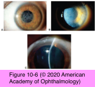
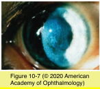

# 8.10.2. Corneal Dystrophies (II): Bowman Layer Dystrophies

## Images

## Hierarchy

- See Table 10-1
- Thiel-Behnke corneal dystrophy (TBCD)
  - autosomal dominant
    - 5q31
      - TGFBI
        - similar to Reis-Bucklers
    - 10q24
      - unknown gene
  - pathology
    - Bowman layer is replaced by fibrocellular material
      - pathognomonic wavy, “saw-toothed” pattern
    - thickening of epithelial layer
      - allows for ridges and furrows in underlying stroma
    - focal absences of the epithelial basement membrane
  - electron microscopy
    - curly fibers (9–15 nm) distinguish this dystrophy from RBCD
  - clinical presentation
    - onset is in the first or second decade of life
      - immunopositive for the TGFBI protein keratoepithelin associated with the 5q31 genetic locus
      - similar to Reis-Bucklers
    - symptoms
      - reduced vision
      - discomfort and pain
      - clinically distinguishing TBCD from RBCD is difficult
    - symmetric subepithelial reticular (honeycomb) opacities
      - initially spare the peripheral cornea
        - may progress to deep stromal layers and corneal periphery
        - unlike granular dystrophy
          - similar to Reis-Bucklers
    - recurrent erosions
    - corneal opacification
      - erosions in TBCD are less frequent and less severe than those with RBCD
  - treatment
    - similar to that used in RBCD
- Reis-Bücklers corneal dystrophy (RBCD)
  - genetics
    - autosomal dominant
      - 5q31
        - gene TGFBI
          - TGFBI protein keratoepithelin
  - pathology
    - Bowman layer is disrupted or absent
      - replaced by a sheetlike connective tissue layer
  - electron microscopy
    - electron-dense, rod-shaped bodies
      - granular Masson trichrome-red deposits
  - electron microscopy is needed to histologically distinguish RBCD from Thiel- Behnke corneal dystrophy, which has curly fibers
  - clinical presentation
    - appears in the first few years of life
    - confluent, irregular, and coarse geographic opacities with varying densities
      - mainly affects the Bowman layer
      - mostly centrally
        - with time, opacities extend to limbus and deeper stroma
          - unlike granular dystrophy
    - stromal scarring can lead to surface irregularity
  - symptoms
    - begin in first or second decade of life
      - painful recurrent epithelial erosions
        - occur less often over time
          - usually more severe and frequent than those in Thiel-Behnke corneal dystrophy
    - decreased vision
      - anterior scarring with surface irregularity
      - anterior stromal edema
  - treatment
    - treat recurrent erosions
    - technique
      - superficial keratectomy
      - LK
      - PTK
      - PK
    - recurrence in the graft is common
