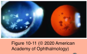
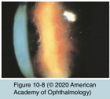
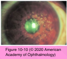
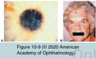

# 8.10.3. Corneal Dystrophies (III): TGFBI Stromal Corneal Dystrophies

## Images

## Hierarchy

- Stromal Corneal Dystrophies (TGFBI Dystrophies)
  - See Table 10-4
- similar to Reis-Buckler & Thiel-Behnke
- also subepithelial
  - poor epithelial–stromal adhesion
- Granular corneal dystrophy type 2 (granular-lattice) (GCD2)
  - "Avellino corneal dystrophy"
  - autosomal dominant
    - 5q31
      - TGFBI gene
  - pathology
    - hyaline deposits
      - Masson trichrome stain
    - amyloid deposits
      - Congo red stain
    - deposits extend from basal epithelium to deep stroma
  - clinical presentation
    - lattice lesions in addition to granular lesions
    - clinical findings differ from those of GCD1
      - stellate-shaped, snowflake-like, and icicle-like opacities appear between the superficial stroma and midstroma
    - lattice lines are also seen deeper than the snowflake opacities
    - mild corneal erosions
      - older patients have anterior stromal haze between deposits, which reduces vision
  - treatment
    - LK or PK
    - PTK
      - may result in increased opacification and is not recommended
- Lattice corneal dystrophy (LCD)
  - classic lattice corneal dystrophy (LCD1)
    - genetics
      - autosomal dominant
        - 5q31
          - gene TGFBI
    - pathology
      - amyloid deposits
        - light microscopy
          - staining
            - Congo red dye
              - rose to orange-red
                - polarized light microscopy
                  - birefringence
                    - apple green
                  - dichroism
                    - green to orange
            - crystal violet dye
              - metachromasia
          - most heavily in anterior stroma
          - epithelial atrophy and disruption
          - focal thinning or absence of the Bowman layer
          - eosinophilic layer between epithelial basement membrane and Bowman layer
        - electron microscopy
          - extracellular masses
            - fine 8–10-μm fibrils
            - should be differentiated from those seen in infection with fungal hyphae
      - confocal microscopy
        - characteristic linear images
      - increase progressively with age
    - clinical presentation
      - relatively common
        - corneal deposits caused by monoclonal gammopathy may resemble lattice lines
      - glasslike branching lines in the stroma
        - best seen against a red reflex or with retroillumination
        - start centrally and superficially and spread centrifugally and deeper
      - central subepithelial ovoid white dots
        - stroma can take on a ground-glass appearance
          - peripheral cornea remains clear
      - decreased vision
        - recurrent epithelial erosions
        - stromal haze and epithelial surface irregularity
    - treatment
      - recurrent erosions
        - therapeutic contact lenses
        - superficial keratectomy
        - PTK
      - severe cases with vision loss
        - deep anterior lamellar keratoplasty (DALK)
        - PK
        - high recurrence rate after corneal graft
          - recurs more frequently than granular or macular dystrophy
  - gelsolin type (LCD2)
    - "Meretoja syndrome"
    - not a true corneal dystrophy
    - genetics
      - autosomal dominant
        - 9q34
          - gelsolin (GSN) gene
    - pathology
      - light microscopy
        - amyloid in lattice lines as a discontinuous band under the Bowman layer and within the sclera
        - mutated gelsolin
          - does not stain for type AA or AP!
          - deposited in
            - conjunctiva
            - ciliary body
            - sclera
            - along the choriocapillaris
            - ciliary nerves and vessels
            - optic nerve
            - extraocularly
              - amyloid is detected in arterial walls, peripheral nerves, and glomeruli
      - confocal microscopy
    - clinical presentation
      - combines lattice corneal changes with coexisting systemic amyloidosis
      - third to fourth decade of life
      - ocular features
        - corneal sensation is reduced
          - lattice lines are less numerous and more peripheral than LCD1
            - spread centripetally from the limbus
              - central cornea is relatively spared
        - ± increased risk of open-angle glaucoma
        - dermatochalasis
        - lagophthalmos
        - late in life
          - dry eye
          - recurrent erosions
            - characteristic facial mask
      - extraocular features
        - pendulous ears
        - cranial and peripheral nerve palsies
        - dry, lax skin with amyloid deposition
- intervening clear areas
- Granular corneal dystrophy type 1 (GCD1)
  - autosomal dominant
    - 5q31
      - TGFBI
  - most common stromal dystrophy
  - pathology
    - hyaline deposits
      - Masson trichrome stain
        - bright red
      - noncollagenous protein
        - may derive from corneal epithelium and/ or keratocytes
  - clinical presentation
    - onset occurs early in life
      - slowly progressive
    - granular crumblike opacities in superficial cornea
      - white on direct illumination
      - do not extend to the limbus
      - can extend anteriorly through focal breaks in Bowman layer
    - symptoms
      - glare
      - photophobia
      - recurrent erosions
      - decreased vision
        - as opacities become more confluent
          - visual acuity rarely drops to 20/200 after age 50
        - most patients maintain good vision
  - treatment
    - no treatment
      - early disease
    - recurrent erosions
      - therapeutic contact lenses
      - superficial keratectomy
      - PTK
        - may work transiently
    - when vision is affected
      - DALK
      - PK
      - recurrence in graft (anteriorly and peripherally) may occur after many years
