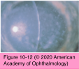
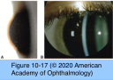
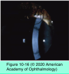
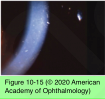
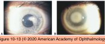
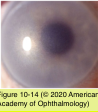

# 8.10.4. Corneal Dystrophies (IV): Non-TGFBI Stromal Corneal Dystrophies

## Images

## Hierarchy

- Macular corneal dystrophy (MCD)
  - autosomal recessive
    - also gelatinous drop-like CD & CHED 2
    - 16q22
      - carbohydrate sulfotransferase 6 (CHST6) gene
  - pathology
    - glycosaminoglycans (GAGs; acid mucopolysaccharide)
      - stain
        - Alcian blue
        - colloidal iron
          - not in lysosomal vacuoles, as seen in systemic mucopolysaccharidoses
      - accumulate in the endoplasmic reticulum
        - Granular>Lattice>Macular
  - clinical presentation
    - least common of the 3 classic stromal dystrophies
  - clinical presentation
    - corneal cloudiness begins between ages of 3 and 9
      - earliest age of presentation
        - Macular<Lattice<Granular
    - focal, gray-white, superficial stromal opacities
      - progress to involve full stromal thickness and extend to the corneal periphery
      - indefinite edges
      - cornea guttae
        - stroma between the opacities is diffusely cloudy
      - ± central corneal thinning and hypoesthesia
    - symptoms
      - decrease in vision
        - between 10-30 years
      - ± epithelial erosions
    - 3 variants
      - type I macular dystrophy
        - most prevalent form
        - lack antigenic keratan sulfate (AgKS) in their cornea, serum, and cartilage
        - normal synthesis of dermatan sulfate– proteoglycan
      - type IA macular dystrophy
        - keratocytes manifest AgKS reactivity
        - no AgKS in extracellular material
        - no AgKS in serum
      - type II macular dystrophy
        - synthesize a normal ratio of keratan sulfate and dermatan sulfate–proteoglycans
        - total synthesis is 30% below normal
        - dermatan sulfate–proteoglycan chains are 40% shorter than normal
    - ELISA measures sulfated keratan sulfate
  - differences with other corneal dystrophies
    - autosomal recessive inheritance
    - involves the entire corneal stroma
    - involves corneal periphery
    - may involve corneal endothelium
  - treatment
    - treat recurrent erosions
    - photophobia
      - tinted contact lenses
    - symptomatic anterior macular dystrophy
      - PTK
        - risk of recurrence: Reis-Buckler>lattice>granular>macular
    - definitive treatment
      - PK
        - recurrences may be seen
- Pre-Descemet corneal dystrophy (PDCD)
  - no definite pattern of inheritance
    - no identified gene
  - pathology
    - large keratocytes in posterior stroma
      - contain vacuoles and intracytoplasmic inclusions
        - lipid-like material
  - electron microscopy
    - membrane-bound intracellular vacuoles containing electron-dense material
  - clinical presentation
    - onset is usually after age 30
      - reported in children as young as 3 years
    - focal, fine, gray opacities
      - deep stroma anterior to Descemet membrane
        - unlike diffuse, gray-white, sheetlike opacity of PACD
    - normal vision
  - similar opacities have been described in
    - pseudoxanthoma elasticum
    - X-linked and recessive ichthyosis
    - keratoconus
    - PPCD
    - EBMD
  - treatment
    - none is indicated
- Posterior amorphous corneal dystrophy (PACD)
  - autosomal dominant
    - no identified gene
  - pathology
    - irregular stromal architecture anterior to the Descemet membrane
    - focal attenuation of endothelial cells
  - clinical presentation
    - presents in first decade of life
    - diffuse, gray-white, sheetlike opacity of the cornea
      - usually posteriorly
    - flat cornea (<41 D)
      - associated hyperopia
    - thin cornea (as low as 380 μm)
    - focal endothelial abnormalities
    - prominent Schwalbe line
    - fine iris processes
    - pupillary remnant
    - iridocorneal adhesions
    - corectopia
    - pseudopolycoria
      - unlike PPCD
    - no associated glaucoma
    - vision is only mildly affected
      - slowly progressive or nonprogressive
  - treatment
    - usually no treatment required
  - references
- Schnyder corneal dystrophy (SCD)
  - autosomal dominant
    - 1p36
      - UbiA prenyltransferase domain-containing protein 1 (UBIAD1) gene
  - pathology
    - unesterified and esterified cholesterol and phospholipids
    - Oil red O stain
    - normal process of embedding tissue in paraffin dissolves cholesterol and other fatty substances
    - electron microscopy
      - lipid and dissolved cholesterol in epithelium, Bowman layer, and throughout stroma
  - clinical presentation
    - rare
    - symptoms
      - decreased vision
        - disproportionately reduces photopic vision
          - central corneal opacification
            - <23 years
            - can affect the entire corneal stromal thickness
            - dense corneal arcus lipoides
              - ± subepithelial crystals
                - 50%
              - 3rd decade
      - glare
    - apparent as early as the first year of life
      - diagnosis is usually made by the second or third decade
        - similar to macular corneal dystrophy
    - slowly progressive changes on the basis of age
      - midperipheral corneal opacification
        - affects entire corneal stromal thickness
        - 4th decade
      - decreased corneal sensation
  - management
    - corneal transplantation
      - needed in most patients >50 years
      - can recur after PK
    - PTK
      - to treat decreased vision from subepithelial crystal
    - fasting lipid profile
      - most patients have elevated serum cholesterol levels
        - management of abnormal serum lipids does not affect the progression of corneal dystrophy
      - unaffected family members may also have an abnormal lipid profile
  - references
- Fleck corneal dystrophy (FCD)
  - autosomal dominant
    - 2q35
      - phosphatidylinositol-3-phosphate/ phosphatidylinositol 5-kinase type III (PIP5K3) gene
  - pathology
    - affected keratocytes are vacuolated and contain 2 abnormal substances
      - glycosaminoglycan
        - Alcian blue
        - colloidal iron
      - lipids
        - Sudan black B
        - oil red O
  - clinical presentation
    - discrete, flat, gray-white, dandruff-like opacities throughout stroma to its periphery
    - asymmetric or unilateral
      - epithelium, Bowman layer, Descemet membrane, and endothelium are not involved
    - symptoms are minimal
      - vision is usually not reduced
    - decreased corneal sensation
  - associations
    - limbal dermoid
    - keratoconus
    - central cloudy dystrophy
    - punctate cortical lens changes
    - pseudoxanthoma elasticum
    - atopy
  - treatment
    - none indicated
  - references
- nonprogressive
- Congenital stromal corneal dystrophy (CSCD)
  - autosomal dominant
    - 12q21.33
      - decorin (DCN) gene
  - pathology
    - stromal lamellae are separated from each other in a regular manner
      - sometimes with areas of amorphous deposition
    - electron microscopy
      - collagen fibril diameter is about half the normal size
      - keratocytes and endothelium are normal
      - epithelial cells are normal
      - ± absence of anterior banded zone of Descemet membrane
  - clinical presentation
    - congenital diffuse, bilateral corneal clouding
    - flakelike, whitish opacities is found throughout the stroma
    - corneas are thickened
    - nonprogressive or slowly progressive
    - moderate to severe vision loss
  - treatment
    - PK
      - in advanced cases
  - references
