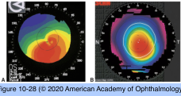
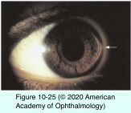
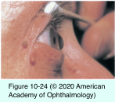
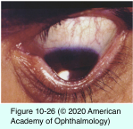
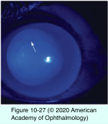

# 8.10.6. Ectatic Disorders (I): Keratoconus

## Images

## Hierarchy

- epidemiology
  - common disorder
    - prevalence of ≈ 1/2000
  - genetics
    - positive family histories have been reported in 6%–8%
      - hereditary pattern is not prominent or predictable
        - multiple chromosomal loci have been reported
        - no specific genes have been identified
    - clinically unaffected first-degree relatives have a higher incidence of subclinical topographic abnormalities
  - environmental risk factors
    - eye rubbing
    - inflammation
    - atopy
    - hard contact lens wear
    - oxidative stress
  - increased prevalence of keratoconus
    - Down syndrome
    - atopy
    - floppy eyelid syndrome
    - Leber congenital hereditary optic neuropathy
    - numerous congenital anomalies of the eye
    - vernal keratoconjunctivitis (VKC)
    - Ehlers-Danlos syndrome type VI
    - xeroderma pigmentosum
      - mitral valve prolapse
- Marfan syndrome
- evaluation
  - computerized videokeratography
    - shows inferior steepening in the power map
    - useful for
      - detecting early keratoconus
        - algorithms to diagnose forme fruste, or subclinical, keratoconus
      - following progression
      - fitting contact lenses
  - pachymetry mapping
    - shows the thin zone to be paracentral
      - not at the steepest point!
    - ultrasonic pachymetry
      - more accurate
  - scanning slit and other elevation-based systems
- pathology
  - fragmentation of the Bowman layer
  - folds or breaks in the Descemet membrane
  - thinning of the stroma and overlying epithelium
  - variable amounts of diffuse scarring
- management
  - glasses
  - rigid or gas-permeable contact lenses
    - far more helpful in all but the mildest cases
      - able to neutralize irregular corneal astigmatism
    - central subepithelial scar can, on occasion, be removed (nodulectomy) allowing continued wear of contact lenses
  - intrastromal rings & collagen crosslinking
    - flatten and centralize the cone
      - improve vision
      - facilitate use of contact lenses
    - stabilize progression
  - corneal transplantation
    - indications
      - contact lens intolerance even with good vision
      - poor vision even with a comfortable contact lens fit (usually due to scarring)
      - unstable contact lens fit (even with good vision and tolerance)
      - progressive thinning to the periphery approaching the limbus, requiring a very large graft (with increased risk)
    - PK
      - most widely performed surgical procedure
      - prognosis is excellent
    - DALK
      - wound integrity with DALK is superior
        - leaves host’s endothelium untouched, decreasing rejection episodes
  - hydrops
    - topical hypertonic agents
    - patching or a soft contact lens
    - cycloplegic agent
    - aqueous suppressants
    - x several months
      - intracameral injection of gas
    - not an indication for immediate surgery
- clinical presentation
  - bilateral
    - ± asymmetrical
      - less affected eye may show
        - high astigmatism
        - enantiomorphism (a mirror image) on videokeratoscopy
        - mild steepening
  - early signs of keratoconus
    - scissoring of the red reflex on ophthalmoscopy or retinoscopy
    - Rizzutti sign
      - conical reflection on the nasal cornea when a penlight is shone from the temporal side
  - tends to progress during adolescence and mid-20s - 30s
    - central or paracentral cornea undergoes progressive thinning and bulging
      - cornea takes on the shape of a cone
      - extreme degrees of irregular astigmatism can develop
        - focal ruptures and flecklike scars in Bowman layer
  - Munson sign
    - protrusion of the lower eyelid upon downgaze
  - Fleischer ring
    - brown iron deposit ring within the epithelium around base of cone
    - best seen with cobalt blue filter
  - Vogt lines
    - fine, relucent, and roughly parallel striations of posterior stroma
  - spontaneous perforation
    - extremely rare
  - acute hydrops
    - tear in Descemet membrane
      - sudden development of corneal edema
      - usually heals spontaneously in 6–12 weeks
        - corneal edema disappears
          - ± stromal scarring
  - no associated inflammation
