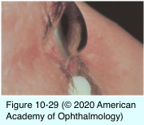
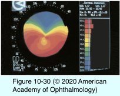
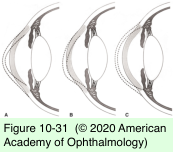

# 8.10.7. Ectatic Disorders (II)

## Images

## Hierarchy

- Pellucid Marginal Degeneration
  - uncommon
  - nonhereditary
    - similar to keratoconus & keratoglobus
  - clinical presentation
    - bilateral
    - diagnosis between 20-40 years of age
    - inferior, peripheral corneal thinning
      - inferior corneal steepening
        - Similar to KCS
        - “lobster claw” pattern
    - decreased vision
      - high irregular astigmatism
    - ± posterior stromal scarring within thinned area
    - absence of inflammation
    - no vascularization or lipid deposition
    - acute hydrops
      - has been reported
    - spontaneous corneal perforation
      - rare
    - at times, a clear distinction between pellucid marginal degeneration and keratoconus is not possible
      - keratoconus
        - protrusion is at the point of maximal thinning
      - pellucid marginal degeneration
        - protrusion is above area of maximum thinning
  - treatment
    - contact lenses
      - hybrid (gas-permeable contact lenses with a soft lens “skirt”)
        - lens fitting is more difficult in pellucid marginal degeneration than in keratoconus
      - scleral lenses
    - PK
      - grafts tend to be large and close to the limbus
        - technically more difficult
        - graft more prone to rejection
    - wedge resection
    - lamellar tectonic grafts
    - collagen crosslinking
- Keratoglobus
  - epidemiology
    - very rare
      - similar to keratoconus & PMD
    - not hereditary
    - associations
      - blue sclerae
        - Ehlers-Danlos syndrome type VI
      - may represent a defect in collagen synthesis
      - unlike keratoconus, keratoglobus is not associated with atopy and hard contact lens wear
  - pathology
    - absent/fragmented Bowman layer
    - thinned stroma with normal lamellar organization
      - in contrast to keratoconus and pellucid marginal degeneration
        - in contrast to keratoconus, which has maximal thinning at or near the apex of the protrusion
    - thin Descemet membrane
  - clinical presentation
    - present at birth
    - bilateral
    - globular corneal deformation
      - generalized thinning
        - especially in midperiphery
      - steep cornea
        - corneal curvature may be as steep as 50–60 D
    - very deep anterior chamber
    - corneal diameter may be slightly increased
      - iron lines/Fleischer rings, stress lines, and anterior scarring are not seen
    - corneal hydrops
      - can occur
      - spontaneous rupture of the Descemet membrane
    - spontaneous corneal rupture
      - has been reported
  - treatment
    - spectacles
      - for high myopia
        - to prevent amblyopia
    - contact lenses
      - scleral lenses
    - PK
      - prognosis for PK is much poorer in keratoglobus than in other ectasias
    - lamellar tectonic graft followed by PK
    - protective eyewear
