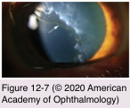
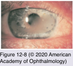
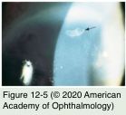
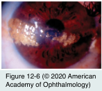

# 8.12.2. Degenerative Changes in the Cornea (I): Epithelial and Subepithelial Degenerations

## Images

## Hierarchy

- Iron deposition
  - related to abnormalities of tear pooling due to surface irregularities
    - See Table 12-3
  - red-free or cobalt blue illumination before instilling fluorescein
    - Fleischer ring
      - keratoconus
    - Hudson-Stähli line
      - useful in the diagnosis of mild or early cases of keratoconus
      - junction of the upper two-thirds and lower one- third of the cornea
    - tear star
      - keratorefractive surgery
        - centrally in approximately 80% of patients
- Age-Related (Involutional) Changes
  - cornea gradually becomes
    - thinner
      - flatter in the vertical meridian
    - slightly less transparent
  - refractive index increases
  - Descemet membrane becomes thicker
    - 3 μm at birth to 10 μm in adults
  - occasional peripheral endothelial guttae
    - Hassall-Henle bodies
  - attrition of corneal endothelial cells
    - loss of about 100,000 cells during the first 50 years of life
      - 4000 cells/mm2 at birth
      - 2500–3000 cells/mm2 in older adults
      - 0.6% decrease per year
- Coats white ring
  - area of discrete gray-white dots
    - small (1 mm or less in diameter)
    - circle or oval-shaped
      - superficial stroma
  - iron-containing fibrotic remnants of a metallic foreign body
  - once these lesions mature they do not change
    - therapy with corticosteroids/anti-inflammatory agents is not indicated
- Calcific band keratopathy
  - clinical presentation
    - fine, dustlike, basophilic deposits in the Bowman layer
    - peripherally in the 3- and 9-o’clock positions
      - can progress to horizontal band of dense calcific plaques across the interpalpebral zone of the cornea
    - fibrous pannus
      - lucid interval
      - if silicone oil is responsible
  - types
    - idiopathic
    - secondary
      - chronic ocular disease (inflammatory, phthisis bulbi)
      - hypercalcemia (hyperparathyroidism, vitamin D toxicity, milk-alkali syndrome, sarcoidosis, or other systemic disorders)
      - hereditary transmission (primary hereditary band keratopathy)
      - elevated serum phosphorus level with normal serum calcium (renal failure)
      - chronic exposure to mercurial vapors or to mercurial preservatives (phenylmercuric nitrate or acetate) in ophthalmic medications
        - mercury causes changes in corneal collagen that result in the deposition of calcium
      - silicone oil instillation in an aphakic eye
  - deposition of urates in the cornea
    - brown, unlike the gray-white calcific deposits
    - gout or hyperuricemia
  - management
    - workup
      - serum electrolytes
        - high calcium or high phosphorus
      - urinalysis
    - underlying conditions should be treated
    - chelation with neutral solution of disodium ethylenediaminetetraacetic acid (EDTA)
      - 0.5%–1.5%
      - remove overlying epithelium
      - warm to speed up the chemical chelation
      - cylindrical tube
        - acting as a reservoir to confine the chelating solution to the desired treatment area
      - gentle surface agitation
      - scraping should be gentle so as to prevent damage to the Bowman layer
      - can recur
        - neither EDTA nor scraping will remove fibrous pannus
    - PTK using an excimer laser is not advised
      - could produce a severely irregular surface
      - for residual opacification after initial EDTA
- Spheroidal degeneration
  - translucent, golden brown, spheroidlike deposits
    - cornea +- conjunctiva
    - subepithelium, Bowman layer, or superficial stroma
  - types
    - primary spheroidal degeneration
      - unrelated to the coexistence of other ocular disease
      - bilateral
      - nasal and temporal cornea
        - with age, can extend onto the conjunctiva in the interpalpebral zone
    - secondary spheroidal degeneration
      - ocular injury or inflammation
        - rarely extends across the interpalpebral zone of the cornea
          - noncalcific band-shaped keratopathy
      - near corneal scarring or vascularization
  - extracellular, proteinaceous, hyaline deposits with characteristics of elastotic degeneration
  - management
    - no medical therapy is of much value
      - composition is not lipid!
    - lubrication
    - central involvement
      - superficial keratectomy
      - phototherapeutic keratectomy
        - excimer laser
    - recurrence after conjunctival resection is common
