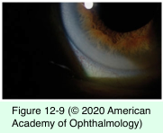
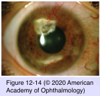
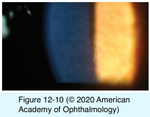

# 8.12.3. Degenerative Changes in the Cornea (II): Stromal Degenerations (I)

## Images

## Hierarchy

- Senile furrow degeneration
  - older persons
  - appearance of peripheral thinning in the lucid interval of a corneal arcus
  - usually more apparent than real
- Crocodile shagreen
  - anterior crocodile shagreen
    - bilateral
      - level of Bowman layer
        - bowman layer is thrown into ridges and may be calcified
    - central corneal opacity
      - mosaic, polygonal, gray opacities
      - separated by clear zones
  - posterior crocodile shagreen
    - deep stroma near descemet membrane
- White limbal girdle of Vogt
  - 2 types
    - type I
      - along the limbus in the palpebral fissure
        - narrow, concentric, whitish superficial band
          - chalklike opacities and small clear areas
      - lucid interval
    - type II
      - older patients
        - early calcific band keratopathy
      - nasal and temporal limbus
        - small, white, flecklike, and needlelike deposits
      - no lucid interval
      - elastotic degeneration of collagen +- particles of calcium
- Polymorphic amyloid degeneration
  - bilaterally symmetric
  - appears late in life
  - slowly progressive
  - mid- to deep stroma
  - axial
  - stellate flecks or irregular filaments (polymorphic)
    - usually one predominates
    - gray to white
    - somewhat refractile
    - appear translucent in retroillumination
      - intervening stroma appears clear
  - visual acuity is usually normal
  - amyloid
  - acquired (secondary localized) corneal amyloidosis
    - etiology
      - corneal inflammation (eg, trachoma, leprosy [hansen disease], phlyctenulosis)
      - intraocular disease (eg, uveitis, retinopathy of prematurity)
      - keratoconus
        - trauma
        - advanced cases
    - raised, yellow-pink nodular masses
  - conjunctival amyloidosis
- Corneal arcus
  - etiology
    - involutional change (modified by genetic factors)
      - most common
    - hyperlipoproteinemia (low-density lipoproteins)
      - especially <40 years
        - prognostic factor for coronary artery disease in this age group
    - congenital anomaly (arcus juvenilis)
      - only a sector of peripheral cornea
      - not associated with abnormalities of serum lipid
  - prevalence
    - 50-60 years
      - Schnyder corneal dystrophy
      - 60%
    - 80 years
      - 100%
    - higher in the black population
  - clinical presentation
    - starts at the inferior and superior poles
      - can involve entire circumference
    - hazy white appearance
    - sharp outer border
    - indistinct central border
    - denser superiorly and inferiorly
    - lucid interval
    - adjacent to Bowman layer & Descemet membrane
    - unilateral arcus
      - rare
        - contralateral carotid artery disease
      - ocular hypotony
- Lipid keratopathy
  - yellow or cream-colored lipid deposition in superficial or deeper cornea
    - cholesterol
    - neutral fats
    - glycoproteins
  - etiology
    - primary lipid keratopathy
      - rare
    - secondary lipid keratopathy
      - after prolonged corneal inflammation with scarring and corneal vascularization
  - treatment
    - indications
      - compromised cosmetic appearance
      - decreased vision
    - reduce corneal neovascularization and lipid deposition
      - argon laser treatment with and without fluorescein
      - photodynamic therapy with verteporfin
      - also causes corneal arcus
  - differential diagnosis
    - Schnyder corneal dystrophy
      - rare
        - subconjunctival and topical bevacizumab
        - autosomal dominant
      - bilateral corneal opacification resulting from accumulation of cholesterol and lipid
- Cornea farinata
  - involutional change
  - autosomal dominant
  - many subtle dot-shaped and comma-shaped opacities
    - best seen in retroillumination
  - deep corneal stroma
  - lipofuscin
  - does not affect vision
