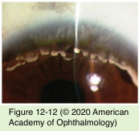
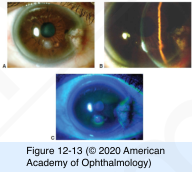

# 8.12.4. Degenerative Changes in the Cornea (III): Stromal Degenerations (II)

## Images

## Hierarchy

- bilateral
- Corneal keloid
  - white, superficial, glistening corneal mass
  - eventually involves the entire corneal surface
  - etiology
    - congenital or primary
      - Congenital Corneal Keloid
        - failure of normal differentiation of corneal tissue
        - associated systemic conditions
          - Lowe disease (oculocerebrorenal syndrome)
          - cataracts
            - ACL syndrome (acromegaly, cutis gyrata, cornea leukoma syndrome)
              - autosomal dominant inheritance
        - associated ocular findings
          - aniridia
          - glaucoma
        - histology
          - thick collagen bundles haphazardly arranged
          - focal areas of myofibroblastic proliferation
      - in association with many congenital conditions
        - Lowe syndrome
    - acquired
      - fibrotic response to corneal injury or chronic ocular surface inflammation
  - differential diagnosis
    - hypertrophic scars
    - Salzmann degeneration
    - dermoids
  - treatment
    - superficial keratectomy
    - penetrating or lamellar keratoplasty
- Terrien marginal degeneration
  - noninflammatory
  - clinical presentation
    - unilateral or asymmetrically bilateral
    - slowly progressive
      - second or third decade of life
        - equal between the sexes
    - thinning of the peripheral cornea
      - localized or involves extensive portions of the peripheral cornea
        - begins superiorly, spreads circumferentially
      - central wall is steep
      - peripheral wall slopes gradually
    - epithelium remains intact
    - fine vascular pannus
      - line of lipid deposits at the leading edge of the pannus
    - spontaneous perforation is rare
      - can occur with minor trauma
    - ruptures in descemet membrane
      - interlamellar fluid
  - corneal topography
    - flattening of the peripheral thinned cornea
      - corneal cyst
    - steepening 90° away from the midpoint of the thinned area
    - high against-the-rule or oblique astigmatism
  - differential diagnosis
    - Fuchs superficial marginal keratitis
      - inflammatory
      - children and young adults
      - progressive thinning without epithelial ulceration
  - management
    - indications for surgical correction
      - perforation is imminent
        - can lead to perforation
    - crescent-shaped lamellar or full-thickness corneoscleral patch grafts
      - marked astigmatism
      - arrest the progression of astigmatism for up to 20 years
    - annular lamellar keratoplasty grafts
- Salzmann nodular degeneration
  - noninflammatory
  - middle-aged-older women
  - +- bilateral
  - etiology
    - idiopathic
    - late sequela to old long-term keratitis
      - phlyctenulosis
      - trachoma
      - interstitial keratitis
      - may not appear until years after the active keratitis
  - gray-white or blue-white nodules
    - elevated
    - roughly circular configuration
    - central or paracentral cornea
    - recurrent erosion
      - at the ends of vessels of a pannus
  - histology
    - localized replacement of Bowman layer with hyaline and fibrillar material
  - confocal microscopy
    - elongated basal epithelial cells
    - activated keratocytes
  - treatment
    - lubrication
      - subbasal nerves and tortuous stromal nerve bundles
    - manual superficial keratectomy
      - decreased vision secondary to irregular astigmatism
