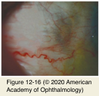
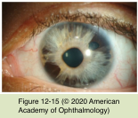

# 8.12.5. Degenerative Changes in the Cornea (IV)

## Images

## Hierarchy

- Scleral Degenerations
  - decrease in scleral hydration
  - decrease in scleral mucopolysaccharide
  - calcium deposition
    - diffuse
    - (focal) senile plaques
      - anterior to the horizontal rectus muscle insertions
      - ovoid or rectangular zones of grayish translucency
      - rarely extrude
        - midportion of involved sclera contains a focal calcified plaque
          - surrounded by relatively acellular collagen
      - may be visualized on CT scan
  - increase in scleral rigidity
  - subconjunctival fat deposition
    - gives the sclera a yellowish appearance
- Endothelial Degenerations
  - Iridocorneal endothelial syndrome
    - endothelial cells take on the ultrastructural characteristics of epithelial cells
      - progressive endothelialization
        - anterior chamber angle
          - peripheral anterior synechiae
            - glaucoma
        - iris surface
          - iris changes
    - herpesvirus DNA has been identified in cornea & aqueous humor
    - middle-aged females
    - almost always unilateral
    - clinical variations
      - Chandler variant
        - disease is confined to the inner corneal surface
          - corneal edema from subnormal endothelial pump function
      - essential iris atrophy variant
        - abnormal endothelium spreads onto the surface of the iris
          - iris atrophy
          - corectopia
          - polycoria
      - Cogan-Reese variant (iris nevus syndrome)
        - membrane grows on the anterior iris surface
          - pinches off islands of the normal iris stroma
            - nodular/nevus-like appearance
              - tan pedunculated nodules or diffuse pigmented lesions on the anterior iris surface
    - treatment
      - penetrating keratoplasty
      - endothelial keratoplasty
      - control of intraocular pressure
  - Peripheral cornea guttae (Hassall-Henle bodies
    - normal aging change
    - small, wartlike excrescences of Descemet membrane
      - protrude toward the anterior chamber
    - slit lamp exam
      - small, dark dimples within the endothelial mosaic
    - best seen by specular reflection
    - increase steadily in number with age
      - rarely < age 20
    - in the central cornea, they are pathologic
      - "cornea guttae"
      - associated with progressive stromal and eventually epithelial edema
        - Fuchs endothelial dystrophy
  - Melanin pigmentation
    - Krukenberg spindle
      - pigment dispersion syndrome
      - pigment on the corneal endothelium
        - vertically oriented
