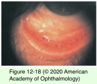

# 8.12.6. Drug-Induced Deposition and Pigmentation

## Images

## Hierarchy

- introduction
  - most drug-induced deposition is not symptomatic
    - does not require cessation of the medication
  - +- decreased vision, photosensitivity, or ocular irritation
  - See Table 12-4
- Stromal and Descemet Membrane Pigmentation
  - also causes corneal verticillata
  - chlorpromazine
    - phenothiazine family
    - 1/3 of patients on long-term therapy
    - through the aqueous
    - brown opacities
      - first in the posterior stroma, descemet membrane, and endothelium
        - spreads to the anterior stroma and epithelium
      - can also deposit on the anterior lens capsule
  - clofazimine
    - anterior stromal opacities or crystalline deposition
  - isotretinoin
    - fine, diffuse gray deposits in the central and peripheral cornea
  - silver compounds (argyriasis)
    - after inadvertent excessive application of silver nitrate for the treatment of superior limbic keratoconjunctivitis
    - slate-gray or silver discoloration of the bulbar and palpebral conjunctiva
  - gold salts
    - dosages >1 g
      - high % of patients
        - can be permanent
  - See Table 12-3
    - posterior stromal deposits that spare descemet membrane and endothelium
- Corneal Epithelial Deposits
  - cornea verticillata
    - whorl-like pattern of golden brown or gray deposits
    - inferior interpalpebral portion of the cornea
    - medications bind with the cellular lipids of the basal epithelial layer
    - rarerly result in reduction of vision or ocular symptoms
      - reduced vision with
        - amiodarone or tamoxifen
          - r/o optic neuropathy
        - chloroquine family or tilorone hydrochloride
          - r/o retinal toxicity
    - resolve with discontinuation of the responsible agents
    - medications
      - amiodarone
        - most common cause of cornea verticillata
      - chloroquine, hydroxychloroquine
      - indomethacin
      - PICA
    - differential diagnosis
      - phenothiazines
      - Fabry disease
  - epithelial cysts
    - drugs that inhibit DNA synthesis
      - cytarabine
        - punctate keratopathy
        - refractile epithelial microcysts
        - pain, photophobia, foreign-body sensation, and reduced vision
  - ciprofloxacin deposits
    - chalky white plaque
    - crystalline pattern
      - ciprofloxacin crystals within an epithelial defect
    - resolve after discontinuation of the medication
  - adrenochrome deposits
    - Long-term administration of
      - epinephrine compounds (adrenochrome)
      - tetracycline
      - minocycline
    - black or very dark brown deposits
      - cornea or contact lenses
        - between basement membrane and Bowman
      - conjunctiva
        - in conjunctival cysts and concretions
    - harmless
    - misdiagnosed as conjunctival melanoma
- Endothelial Manifestations
  - rifabutin
    - antibiotic used in the prevention/ treatment of Mycobacterium avium-intracellulare infection
    - anterior & posterior uveitis
      - +- hypopyon
        - reversible
    - stellate, refractile endothelial deposits
      - initially in the periphery; may extend to the central cornea
