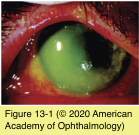
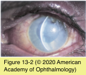
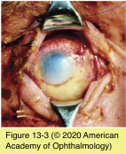

# 8.13.2. Toxic & Traumatic Injuries (II): Chemical Injuries

## Images

## Hierarchy

- Alkali Burns
  - pathogenesis
    - saponification of fatty acids in cell membranes
      - cellular disruption
    - destruction of proteoglycan ground substance and collagen fibers of stroma
  - clinical presentation
    - limbal epithelial damage
      - limbal “blanching”
        - ischemia of the limbus and anterior segment
      - “conjunctivalization” of the cornea
        - poor epithelial adhesion
        - recurrent breakdown
        - vascularization
        - chronic inflammation
    - anterior chamber penetration
      - severe tissue damage
        - cataract formation
        - secondary glaucoma
        - phthisis
      - intense inflammation
  - most unfavorable visual prognosis
    - extensive limbal epithelial damage
    - intraocular chemical penetration
    - the most severe chemical injuries are caused by strong alkalis and, to a lesser extent, acids
  - classfication
    - See Table 13-1
- Management of Chemical Injuries
  - immediate and copious irrigation of the ocular surface
    - water or balanced saline solution
      - any other generally nontoxic and unpolluted solutions
    - initiated at the site of the chemical injury and continued until an ophthalmologist evaluates the patient
    - eyelid should be immobilized with a retractor or eyelid speculum
    - topical anesthetic
    - continue until the pH of the conjunctival sac normalizes
      - urinary pH strip
    - particulate chemicals should be removed
      - eversion of the upper eyelid
        - “overtreat” for prolonged periods of irrigation than to “guess” that the pH has normalized
      - fornices should be swept with an applicator
  - decreasing inflammation
    - corticosteroids
      - inhibit PMN function
        - intense PMN leukocyte infiltration of the corneal stroma
          - release of proteolytic enzymes
            - dissolve corneal stromal collagen and ground substance
      - intensive topical corticosteroid administration for the acute phase (first 10–14 days)
        - dosage should be markedly reduced after 10– 14 days
    - oral tetracyclines/topical 10% sodium citrate
      - chelators of extracellular calcium
        - inhibit PMN-induced collagenolysis
          - deficiency of calcium in the plasma membrane of PMNs inhibits their ability to degranulate
    - topical cycloplegics
  - monitoring intraocular pressure
    - oral carbonic anhydrase inhibitors
    - topical therapies if corneal epithelium is healing normally
  - limiting matrix degradation
    - high-dose ascorbic acid
      - alkali burns reduce aqueous humor ascorbate levels to one-third of normal levels
        - corneal stromal ulceration and perforation
      - 1–2 g of vitamin C per day
        - promotes collagen synthesis
    - topical 1% medroxyprogesterone
      - patients with compromised renal function are not good candidates
      - suppresses collagen breakdown
  - promoting reepithelialization of the cornea
    - intensive nonpreserved lubricants
    - debridement of necrotic corneal epithelium
    - bandage contact lens
      - risk of corneal infection
      - may not be retained easily
    - temporary tarsorrhaphy
    - rotational tarsoconjunctival graft from the adjacent eyelid
      - avascular sclera will usually not epithelialize until revascularization occurs
      - for scleral melting
    - amniotic membrane transplantation
      - in the early postinjury phase
      - helpful in
        - suppressing inflammation
        - promoting reepithelialization
        - prevention of symblepharon formation
    - limbal stem cell transplantation
      - if no signs of corneal reepithelialization
      - uninvolved fellow eye
      - prognosis is better when the eye is not very inflamed
        - as soon as 2 weeks after chemical injury
    - corneal transplantation
      - prognosis is improved if the ocular surface inflammation has resolved
        - months to years
          - waiting until the acute inflammation has subsided is helpful
        - stromal vascularization in the host bed is associated with a much higher risk of rejection
    - keratoprosthesis surgery
- Acid Burns
  - denature and precipitate proteins
  - cause less severe tissue damage than alkaline solutions
    - buffering capacity of tissues
    - barrier to penetration formed by precipitated protein.
    - do not cause direct loss of proteoglycan ground substance
  - can incite severe inflammation and damage to the corneal matrix
- except hydrofluoric acid
