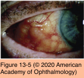

# 8.13.3. Toxic & Traumatic Injuries (III): Toxic Keratoconjunctivitis

## Images

## Hierarchy

- introduction
  - one of the most toxic ingredients is the preservative
    - benzalkonium chloride
    - loss of microvillae
      - residual amounts of preservatives are detectable in the epithelium days after a single topical application
  - toxic effects on the epithelium include
    - plasma membrane disruption
    - subsequent cell death
  - topical anesthetics can be toxic if used for prolonged periods
    - frank epithelial loss
    - stromal edema
    - ring infiltrate
    - focal infiltrate
    - corneal opacities
    - even a single application of a topical anesthetic may cause transient epithelial irregularity
- chronic follicular conjunctivitis
  - both the upper and lower palpebral conjunctivae
    - most prominent on the inferior tarsus and fornix
  - bulbar follicles are uncommon but highly suggestive of a toxic etiology
  - +- inferior punctate epithelial erosions
  - medications
    - cycloplegics
      - atropine, homatropine
    - miotics
      - pilocarpine
    - α-agonists
      - epinephrine (including dipivefrin)
      - apraclonidine
      - α2-adrenergic agonists (brimonidine)
    - vasoconstrictors
    - sulfonamides
    - antiviral agents
- pathogenesis
  - See Table 13-2
  - punctate staining or erosive changes of conjunctival and corneal epithelium
  - conjunctival reaction
    - follicular response
    - papillary reaction
  - immune response
    - subepithelial corneal infiltrates
- general clinical features
  - generally after long-term use (weeks to months)
    - sooner in individuals with delayed tear clearance
      - aqueous tear deficiency
      - tear drainage obstruction
  - infrequently, the reaction occurs in only 1 eye even though the medication has been applied to both
  - generalized injection of the tarsal and bulbar conjunctiva
  - papillary reaction of the tarsal conjunctiva
  - mucopurulent discharge
    - may be severe and mimic bacterial conjunctivitis
- drug-induced cicatricial pemphigoid
  - increased number of chronic inflammatory cells and fibroblasts in conjunctiva
    - asymptomatic subconjunctival fibrosis is not uncommon
  - small minority will develop progressive severe subconjunctival scarring
    - contraction of the conjunctival fornix
    - symblepharon formation
    - corneal pannus formation
  - most common with the long-term use of miotics
    - toxic reactions can lead to irreversible changes
- management
  - discontinuation of topical medications
    - may take months to resolve completely
      - failure of symptoms and signs to resolve within days to a few weeks is not inconsistent with a toxic etiology
  - nonpreserved topical lubricant drops or ointment
  - drug-induced pemphigoid
    - conjunctival biopsy
      - diffuse, nonlinear immunofluorescent staining
    - discontinue offending medication
      - lag of weeks-months before progressive scarring can be stabilized
        - if progression despite discontinuation of the medication, chemotherapy may be necessary
- toxic keratitis
  - mild form
    - punctate epithelial erosions of the inferior cornea
  - more severe form
    - diffuse punctate epitheliopathy
      - occasionally in a whorl pattern (vortex or hurricane keratopathy)
  - most severe form
    - corneal epithelial defect of the inferior or central cornea
    - stromal opacification
    - neovascularization
    - limbal stem cell deficiency
      - effacement of the palisades of vogt
  - different type of toxic keratitis
    - peripheral corneal infiltrates (epithelium and anterior stroma)
      - clear zone between infiltrates and limbus
  - medications
    - prolonged use of preservative-containing medications
      - benzalkonium chloride
      - thimerosal
    - aminoglycoside antibiotics
    - antiviral agents
    - antifibrotic agents (eg, topical mitomycin c drops)
      - have radiomimetic effect on surrounding cells
      - even when used in correct dosages for brief periods
      - localized application of mitomycin (cellulose surgical sponge)
        - lower risk than more widespread topical administration!
