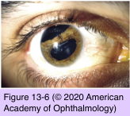
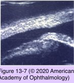

# 8.13.5. Toxic & Traumatic Injuries (V)

## Images

## Hierarchy

- Traumatic Iritis
  - within 24 hours after injury
  - photophobia
  - tearing
  - ocular pain
  - diminished vision
  - perilimbal conjunctival injection
  - anterior chamber reaction can be surprisingly minimal
  - treatment
    - topical cycloplegia
    - topical corticosteroids
      - if significant inflammation
      - taper slowly to prevent rebound iritis
- Subconjunctival Hemorrhage
  - etiology
    - spontaneous
      - usually not associated with an underlying systemic disease
        - uncontrolled hypertension
        - diabetes mellitus
        - bleeding diathesis
      - Valsalva maneuver
        - vomiting
        - coughing
    - trauma
      - damage to deeper structures of the eye must be ruled out
    - Table 13-3
  - management
    - reassurance
      - resolves in 7–12 days
      - hemorrhage might spread around the circumference of the globe
      - may change in color from red to yellow
    - medical evaluation
      - repeated episodes of spontaneous subconjunctival hemorrhage
    - dellen may occur
      - intensive topical lubrication
        - possible bleeding diathesis (easy bruising, frequent bloody noses)
      - patching
- Corneal Changes
  - abrasions
  - edema
  - tears in Descemet membrane
  - corneoscleral lacerations
    - at the limbus
  - traumatic corneal endothelial rings (traumatic posterior annular keratopathy)
    - disrupted and swollen endothelial cells
    - whitish gray
    - directly posterior to the traumatic impact
    - appear within several hours of a contusive injury
      - disappear within a few days
- Iridodialysis and Cyclodialysis
  - Iridodialysis
    - separation of the iris root from the ciliary body
    - +- anterior segment hemorrhage
    - small iridodialysis
      - requires no treatment
    - large dialysis
      - polycoria
        - monocular diplopia
      - surgical repair
  - Cyclodialysis
    - gonioscopy
      - separation of the ciliary body from the scleral spur
      - cleft at the junction of the scleral spur and the ciliary body band
        - sclera may be visible through the disrupted tissue
    - ultrasound biomicroscopy
      - increased uveoscleral outflow
    - aqueous hyposecretion
      - chronic hypotony
        - macular edema
    - treatment
      - topical cycloplegia
      - argon laser
      - diathermy
      - cryotherapy
      - direct suturing
        - after the resolution of the hyphema
- Traumatic Mydriasis and Miosis
  - traumatic mydriasis
    - associated with iris sphincter tears
  - traumatic miosis
    - less common
    - associated with anterior chamber inflammation (traumatic iritis)
  - pupillary reactivity may be sluggish in both situations
  - cycloplegia
    - to prevent formation of posterior synechiae
