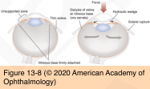
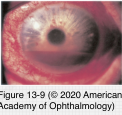
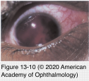
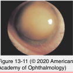

# 8.13.6. Toxic & Traumatic Injuries (VI): Traumatic Hyphema

## Images

## Hierarchy

- young males
- pathogenesis
  - posterior displacement of the lens–iris interface
  - scleral expansion in the equatorial zone
  - disruption of the major iris arterial circle, arterial branches of the ciliary body, or recurrent choroidal arteries
- medical management
  - protective shield
  - restriction of physical activity
  - elevation of the head of the bed
  - daily observation
    - outpatient basis
    - if satisfactory home care and outpatient observation cannot be ensured, hospitalization may be required
  - nonaspirin analgesics
    - nonsteroidal anti-inflammatory medications can increase the risk of rebleeding
  - long-acting topical cycloplegic agents
  - topical corticosteroids
    - control anterior chamber inflammation
    - prevent synechiae formation
    - may play a role in preventing rebleeding
  - oral corticosteroids
    - facilitate the resolution of severe inflammation
    - prevent rebleeding
  - elevated IOP may require treatment
    - to reduce the risk of corneal blood staining and optic atrophy
    - topical antihypertensives (β-blockers and α- agonists)
    - intravenous or oral hyperosmotic agents
  - antifibrinolytic agents (aminocaproic acid [Amicar], tranexamic acid, prednisone)
    - reduced the incidence of rebleeding
      - failed to show a statistical improvement in visual outcome
    - may produce significant adverse effects
      - nausea, vomiting, postural hypotension, muscle cramps, conjunctival suffusion, nasal stuffiness, headache, rash, pruritus, dyspnea, toxic confusional states, and arrhythmias,
      - risk of increased IOP on discontinuation
    - rarely used today
- gross hyphema
  - can be seen on penlight examination
- microscopic hyphema
  - few circulating RBC on slit-lamp examination
- hyphema is frequently associated with
  - corneal abrasion
  - iritis
  - mydriasis
  - significant injuries to the angle structures, lens, posterior segment, and orbit
- Spontaneous hyphema
  - rubeosis iridis
  - clotting abnormalities
  - herpetic disease
  - intraocular lens problems
  - Juvenile xanthogranuloma
  - retinoblastoma
  - leukemia
- Surgery
  - indications
    - at the earliest definitive detection of blood staining
      - irreversible corneal blood staining
    - IOP>35 mmHg x 7 days
      - if the IOP averages >25 mm Hg for 5 days with a total hyphema
      - optic atrophy from persistently elevated IOP
      - IOP>60 mm Hg x 2 days
    - See Table 13-4
  - require earlier intervention
    - preexisting optic nerve damage
    - sickle hemoglobinopathies
      - sickle cell complications
        - sickle cell patients and carriers of sickle cell trait
        - African American patient
          - sickle cell workup
        - pathogenesis
          - sickling of RBCs in the anterior chamber
            - restricted outflow through the trabecular meshwork
              - increased IOP
          - optic nerve appears to be at greater risk of damage in sickle cell patients
        - all efforts must be made to normalize IOP in these patients
          - carbonic anhydrase inhibitors
        - indications of surgical intervention
          - average IOP remains 25 mm Hg or higher after the first 24 hours
            - osmotic agents
              - must be used with caution
                - reduce pH and lead to hemoconcentration
                  - may exacerbate sickling
          - repeated, transient elevations, with IOP higher than 30 mm Hg for 2–4 days
  - techniques
    - anterior chamber irrigation with BSS through a paracentesis
      - remove circulating red blood cells
      - can be repeated
        - removal of the entire clot is neither necessary nor wise
    - I/A handpiece
    - cutting instrument
    - intraocular diathermy
  - complications of surgical intervention
    - iris damage
    - lens injury
    - endothelial cell trauma
    - additional bleeding
- rebleeding
  - <5%
  - may complicate any hyphema, regardless of size
  - most frequently between 3 and 7 days after injury
  - an important indicator of poor visual outcome
  - complications
    - glaucoma
      - 50%
    - optic atrophy
    - corneal blood staining
      - pathogenesis
        - elevated IOP
        - endothelial dysfunction
        - hemoglobin penetrates posterior corneal stroma
          - converted to hemosiderin within the keratocytes
            - keratocyte death
      - early blood staining
        - yellow granular changes
        - reduced fibrillar definition in the posterior corneal stroma
        - reduction in corneal transparency
          - may be permanent
      - slowly clears in a centripetal pattern starting in the periphery
- prognosis
  - not dependent on the size of the hyphema!
  - good in patients who do not develop complications
