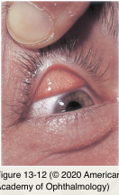
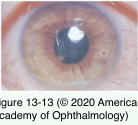

# 8.13.7. Toxic & Traumatic Injuries (VII)

## Images

## Hierarchy

- Conjunctival Foreign Body
  - location
    - inferior cul-de-sac
    - conjunctival surface under the upper eyelid
      - evert the upper eyelid
      - double evert the upper eyelid with a Desmarres retractor or a bent paper clip
        - if several foreign bodies are suspected or particulate matter is present
      - topical fluorescein
        - fine, linear, vertical corneal abrasions are characteristic of retained foreign bodies on the eyelid margin or superior tarsal plate
  - difficult to see foreign bodies
    - glass particles
    - cactus spines
    - insect hairs
  - management
    - moistened cotton-tipped applicator
      - for superficial foreign material
      - foreign body is suspected but not seen
    - saline lavage of the cornea or cul-de-sac
      - for debris that is not embedded
      - foreign body is suspected but not seen
    - sterile, disposable hypodermic needle
      - for foreign matter embedded in tissue
    - fine-tipped jeweler’s forceps or blunt spatula
      - for glass or particulate matter
- Conjunctival Laceration
  - physician must make certain that
    - the deeper structures of the eye have not been damaged
    - no foreign body is present
  - management
    - explore under slit-lamp examination
      - topical anesthetic
      - sterile forceps or cotton-tipped applicators
    - performing a peritomy in the operating room to better explore the injured area
    - in general, conjunctival lacerations do not need to be sutured
- Corneal Abrasion
  - symptoms
    - pain
    - foreign-body sensation
    - tearing
    - discomfort with blinking
  - “clean” corneal abrasion
    - sharply defined edges
    - little to no associated inflammation
  - differential diagnosis
    - true corneal ulcer
      - inflammation-mediated breakdown of the stromal matrix
    - Herpes simplex virus keratitis
  - management
    - evert the upper eyelid
    - patching is not necessary for most abrasions
      - may be uncomfortable
    - antibiotic ointment
    - topical cycloplegia
    - topical nonsteroidal anti-inflammatory agents
      - have anesthetic properties
      - may be used for the first 24–48 hours for pain relief
      - can cause local toxicity
    - oral pain management for the first 24–48 hours
    - therapeutic contact lens
      - antibiotic prophylaxis
      - reserved for patients being closely observed
    - abrasions caused by organic material require close follow-up
    - contact lens–associated epithelial defects
      - topical antibiotic drops or ointment
        - should never be patched or have a therapeutic contact lens
    - abrasions caused by fingernail or the edge of paper
      - more prone to developing recurrent erosions
      - antibiotic ointment should be used nightly for ≥1 month after the abrasion has healed
- Corneal Foreign Body
  - identify the probable composition of foreign body
  - history of exposure to high-speed metallic foreign bodies
    - grinding tools
      - increased risk of infection associated with vegetable matter!
    - metal-on-metal hammering
    - r/o occult intraocular foreign bodies!
      - computed tomography
  - assess the depth of corneal penetration
    - if anterior chamber extension is present or suspected
      - remove in a sterile operating-room environment
      - aggressive attempts to remove deeply embedded foreign bodies at the slit lamp may result in leakage of aqueous humor (corneal perforation)
        - tissue adhesive
        - surgical repair
          - therapeutic bandage contact lens
  - several glass foreign bodies
    - exposed fragments should be removed
    - careful gonioscopic evaluation
      - deeply embedded fragments in the cornea are often inert and can be left in place
      - r/o iris/angle retained glass particles
  - iron foreign body embedded in the cornea for >few hours
    - orange-brown “rust ring”
    - corneal iron foreign bodies and rust rings can usually be removed at the slit lamp
      - topical anesthesia
      - disposable (25- or 26-gauge) hypodermic needle
      - battery-powered dental burr with a sterile tip
    - metallic foreign body that enters the corneal stroma beyond the bowman layer
      - always results in scar formation
        - in the visual axis
          - glare
          - decreased vision from irregular astigmatism
  - multiple, very small foreign bodies in the deep stroma without inflammation or infection
    - monitor closely
  - therapy following removal of a corneal foreign body
    - topical antibiotics
    - cycloplegia
    - firm pressure patch or bandage contact lens
      - risk of infection is increased
        - closely monitor
